# C++对C的扩展

## 作用域运算符：：

 :: 作用域运算符 描述的是归属的问题

```c++
std::cout  //描述的是：cout 是输入std 中的
```

```c++
int num=20;  //此时num是全局变量
void test(){
    int num=10;  //此时num是局部的
    cout << "局部的num" << num << endl;  //10
    cout << "全局部的num" << ::num << endl; //  20
}
```

## 命名空间 namespace

命名空间的本质 防止命名冲突，给是符号常量、变量、函数、结构、枚举、类和对象加一 个外壳（命名空间）

### 命名空间的定义方式

命名空间只能全局范围内定义

```c++
namespace A {
    int data = 10;
    void func()
    {
        cout<<"A 中的 func 函数"<<endl;
    }
}
void test02()
{
    cout<<"A 中的 data ="<<A::data<<endl;  //10
    A::func();   //A 中的 func 函数
}       

```

###  命名空间可以嵌套

```c++

namespace A{
    int data = 10;
    void func()
    {
        cout<<"A 中的 func 函数"<<endl;
    }
    namespace B{
        int data = 50;
    }
}
void test02()
{
    cout<<"B 中的 data ="<<A::B::data<<endl;  //50
}  
```

### 命名空间的声明和实现分离（针对的是成员函数）

```c++
//声明函数说明该成员函数是属于命名空间E的
namespace A{
    void fun1(void);
}
//定义的时候也必须说明该函数数属于命名空间E的
void A::test01()
{   
}  

void test(){
    A::fun1();
}
```

### 无名命名空间

意味着命名空间中的标识符只能在本文件内访问，==相当于给这个标 识符加上了 static==，使得其可以作为**内部连**。

```c++
//没有命名空间名字
namespace {
    int a=10;
    void fun1(void){
        
    }
}


void test(){
    cout<<"值等于"<<::a<<endl;
}
```

### 命名空间取别名

```c++
namespace A{
    int a=10;
    void fun1(void){

    }
}


void test(){
    namespace A=B;
    cout<<"B 中的 data ="<<B::a<<endl;
}
```

###  using 声明指定的某个成员

- using 声明某一个成员 容易和 全局变量 产生命名冲突，不会和局部变量发生冲突
- 如果命名空间的成员和局部变量同名优先选择局部变量
- 与全局变量同名报错

```c++
namespace A{
    int a=10;
    int b=20;
}
//声明:可以直接通过b使用A::a
using A::a;

void test(){
    cout<<"B 中的 data ="<<a<<endl;
}
```

### using 声明某个成员函数 遇到 函数重载

```c
namespace A{
    void fun1(void){
        cout<<"1"<<endl;
    };
    void fun1(int a){
        cout<<"2"<<endl;
    };
    void fun1(int a,char b){
        cout<<"3"<<endl;
    };
}
//声明:可以直接通过b使用A::a
using A::fun1;

void test(){
    fun1();        //1
    fun1(10);      //2
    fun1(10,'q');  //3
}
```

### using 声明整个命名空间

- 声明整个命名空间可用
- 声明==下方==如果有**不识别的变量可以从声明的命名空间中寻找**。

```c++
namespace A{
    int a=10
}
//声明:可以直接通过b使用A::a
using namespace A;

void test(){
    cout<<"3"<<a<<endl;
}
```

## 全局变量类型增强

```c
int num=10;  //c语言会将赋值的当作定义，不赋值的当作声明
int num; //这里C语言中会看成声明编译通过

```

```c++
int num=10;  
int num;  //C++中会看成定义编译报错

//只能显式的声明
extern int num
```

### 更严格的类型转换

c++中不允许为枚举变量赋值

```c++
enum testEnum
{
      a,
      b,

};

void main(int argc, char *argv[])
{

      enum testEnum ab;  //枚举不初始化默认使用第一个值
      ab=100; //C语言允许枚举变量赋其他值C++不支持

}
```

### C++的struct增强

- C++中定义结构体变量不需要加struc

  - ```c++
    struct stu
    {
        int num;
        char name[32];
    };
    //C 语言定义变量的时候 必须加struct 比如：
        struct stu lucy;
    //C++定义变量的时候 不用加struct 比如：
        stu lucy;
    ```

- C++的结构体中可以定义函数

- <span style="color:red">在结构体中声明函数，在定义结构体变量时，其他的值是各自存储，但是函数却只有一份，独立开辟空间存储</span>.

  - ```c++
    struct stu
    {
        int num;
        char name[32];
        void fun(void){
            
        }
    };
    
    test(void){
        struct stu a={12,'a'};
        struct stu b={12,'b'};
    }
    ```

- 可以定义公有和私有

  - ```c++
    struct stu
    {
        public:
        int num;
        char name[32];
        void fun(void){
    
        }
    };
    ```

    

### 新增”bool 类型关键字

bool 类型定义的变量 只能赋值true真 false假

```c++
bool data;
test(void){
    data=true;
}
```

### 三目运算符功能增强

```c++
int a=0;
int b=1;
test(void){
    (a>b?a:b)=100;
    //C语言报错整个表达式的结果是b的值不是b变量所以不能被赋值
    //C++不报错整个表达式的结果是b变量，所以可以给b赋值为100

}
```

## C++中const增强

- c 语言的const：修饰变量为只读，用户不能通过变量给空间赋值。
  - 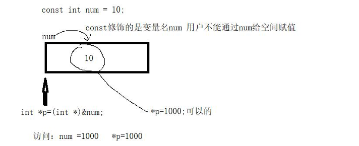

而在c++中获得了增强：

- const 修饰变量 **如果以==常量==初始化 ==变量不会立即开辟空间==而是==放入符号常量表中==**。

-  如果对const修饰的变量 取地址 ==系统立即给num开辟空间==,

  - ```c++
    test(void){
        const int num=10;
        int *p=(int *)&num;
        *p=1000;
        printf("%d,%d",num,*p)//10,1000
    }
    ```

    

  - 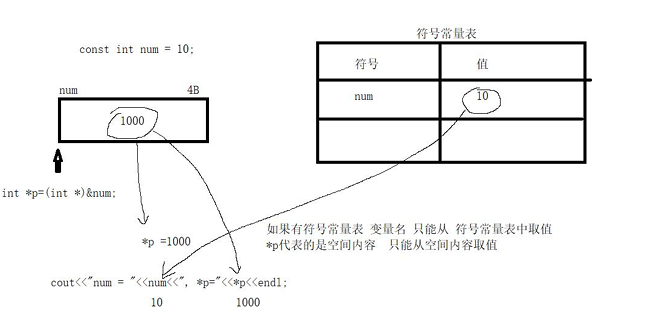

- 如果使用<span style="color:red">变量</span> 初始化 const修饰的变量 立即开辟空间 没有符号常量表

  - ```c++
    test(void){
         int data=10
        const int num=data;
        int *p=(int *)&num;
        *p=1000;
        printf("%d,%d",num,*p)//1000,1000
    }
    ```

    

### const替换无参的宏

```c++
//预处理阶段 Max被1024替换 然后进行编译，如果出错 编译器会告知1024出问题，而不是Max(导致用户不能立即定位错误的位置)

//#define Max 1024

//Max 本质是变量 编译阶段 如果有问题 编译器会告知Max出问题（用户就立即知道Max 出问题）
const int Max=1024;
void test02()
{
    Max=100;
}
```

### const和无参的宏的区别

- 无参的宏：无类型、在预处理阶段展开、<span style="color:red">没有作用域的限制</span> 、==不能成为类的一部分==。 

  - ```c++
    namespace A{
        #define Max 1024
    }
    
    test(void){ 
        cout << A::Max << endl;  //报错，因为Max不属于命名空间A
        cout << Max << endl;  //不报错
    }
    ```

    

- const 修饰的变量：有类型、编译器检查错误、有作用域的限制 能成为类的一部分。

## 引用

引用的本质：就是给已有的"变量"，取别名。

### 引用的定义方式

- 定义的时候,引用必须初始化

- &和别名结合 代表取别名
-  给谁取别名，就先定义谁
-  从上往下 整体替换

```c++
int num=10;
int &data=num;  //data就是引用，引用必须初始化
cout<<&num<<endl;  // 0x64124
cout<<&data<<endl; // 0x64124
cout<<num<<endl;  //10
cout<<data<<endl;  //10

//给数组int arr[5]取个别名。
int arr[5]={10};
int (&myArr)[5]=arr;
for(int i;i<5;i++){
    cout<<myArr[i]<<endl;
}

//给指针变量p取别名
int num=10;
int *p=&num;
int * &myP=p;
cout <<*p<<","<<*myP<<endl;  //10,10

//函数的别名
void func(void){
    cout<<"hans"<<endl;
}

void test(void){
    void (&myFun)(void)=func;
    myFun(); //hans
}
```

### 引用作为函数参数

函数内部 **可以通过 ==引用== 对外部变量进行读写**。

```c++
void setNum02(int *p)  //通过指针
{
    *p =100;
}
//推荐
void setNum03(int &a)//int &a=num  通过引用
{
    //函数内部a代表外部num的别名，给a赋值 等价 给num赋值
    a=100;
}
void test05()
{
    int num = 10;
    //定义一个函数 给num赋值
    //setNum02(&num);
    setNum03(num);
    cout<<"num = "<<num<<endl;  //100
}
```

### 引用和指针变量作为函数参数的不同点

- 实参：引用不需要取地址 ；指针变量需要取外部变量的地址 
- 形参：引用是别名 不占空间 ； 但是指针变量 需要占空间
- 函数内部：操作引用就是等价操作外部变量 ； 但是*指针变量才等价外部变量 
- 建议：函数的形参少用指针变量 ==尽量使用引用==

### 常引用

常引用不占空间函授内部不能通过别名修改外部变量的值

```c++
//常引用a不占空间函授内部不能通过别名a修改外部变量的值
void test(const int &a){
    //a=100;不可以修改
    cout <<a<<endl;
    int b=10;
    const int &c=b;
    //c=100;  不可以修改
}
```

#### 为常量定义引用【取别名】

```c++
void test(void){
    int &num=10;  //报错
    const int &num=10;  //为常量定义了引用
    cout << num <<endl;  //10
}
```

### 引用作为函数的返回类型

```c++
//int&返回值类型为引用，整个函数运行结果为别名就是return后面的变量的别名
int &getNum(void){
    static int num=10;  //让变量不被释放
    return num;
}

void test(void){
    getNum()=1000;     //getNum()本质上是num的引用
    cout<<getNum()<<endl;  //1000
}
```

### 返回值作为引用 一般用于 链式操作。

```c++
struct Print{
    Print& myPrintf(Print &ob,char str){
        cout << str;
        return ob;
    }
}

void test(void){
    Print obj;
    obj.myprintf(obj,"hello").myprintf(obj,"world")
}
```

## 内联函数

### 内联函数的概述

**==关键字inline== 修饰的函数** 成为内联函数。（注意：定义函数的时候 加inline）

**在c中经常把一些短并且执行频繁的计算写成宏，而不是函数，这样做的理由是为了执行效率**【因为避免频繁的调用函数，也就是出入栈的操作，因为宏在编译阶段就完成了替换而不用调用函数】，宏可以避免函数调用的开销，这些都由预处理来完成。

在c++中，预定义宏的概念是用内联函数来实现的，而内联函数本身也是一个真正的函数。内联函数具有普通函数的所有行为。唯一不同之处在于内联函数会在适当的地方像预定义宏一样展开，所以不需要函数调用的开销。因此应该不使用宏，使用内联函数。

```c++
inline int myAdd(int a ,int b){
    return a+b;
}

int test(void){
    cout<<myAdd(100,200)<<endl;  //300  相当于在编译阶段展开成了 100+200
    cout<<myAdd(200,200)<<endl;  //400
}
```

### 内联函数的注意点

- ==函数是否为内联函数 是**编译器决定**的==。
- **inline修饰只是建议编译器将该函数 认为是内联函数**。 
- 类中成员函数 就算不加inline 也默认是内联函数。
- **内联仅仅只是给编译器一个建议，编译器不一定会接受这种建议**，
- 如果没有将函数声明为内联函数，那么编译器也可能将此函数做内联编译。
- 一个好的编译器将会内联 **小的、简单**的函数。

### 成为内联函数的条件

- **不能存在**任何形式的**循环语句**
-  **不能存在**过多的条件判断语句
-  函数体**不能**过于**庞大**
-  **不能**对函数进行**取址**操作

### 内联函数和宏函数的区别

- 宏函数： 
  - 宏函数的参数 没有类型 不能保证参数的完整性。 
  - 宏函数 是在 **预处理阶段** 展开。 
  - <span style="color:red">宏函数 没有作用域的限制 不能作为类的成员函数</span>。 
- 内联函数：
  -  内联函数的参数 有类型 能保证参数的完整性。
  -  内联函数 是在 **编译阶段** 展开。
  -  <span style="color:red">内联函数 有作用域的限制 能作为类的成员函数</span>。

## 函数的默认参数

- 定义函数 和 声明函数都可以设置函数的默认参数，建议是声明函数的时候。
- 某一个参数设置了默认参数，那么他**右边的所有参数必须设置默认参数**。

```c++
int a(int a=10,int b=20){
    return a+b;
}
```

## 函数的占位参数

- 主要用于++ 或--的运算符重载。
- 占位参数：只有形参类型 没有形参名 
- 占位参数使用不了外部的实参，但是你必须传实参

- 占位参数也可以有默认值。

```c++
int a(int a=10,int b=20,int){
    return a+b;
}

//报错
a(1,2,3);

int b(int a=10,int b=20,int=30){
    return a+b;
}
b(1,2); //不会报错
```

## 函数重载（静态多态）

### 函数重载的概述

**函数重载**：

- **同一作用域，函数名相同**，==参数顺序、类型、个数不同==，就可以重载。
- 但是函数的**返回值类型不能作为重载条件**。

```c++
void func04(int a)
{
    cout<<"int"<<endl;
}
void func04(int a, char b)
{
    cout<<"int char"<<endl;
}
void func04(char a, int b)
{
    cout<<"char int"<<endl;
}
void func04(float a)
{
    cout<<"float"<<endl;
}
void test04()
{
    func04(10);
    func04(3.4f);
    func04(10,'a');
    func04('a',10);
}
```

### 函数重载实现原理

C++中函数名 不能作为函数的入口地址。函数名和参数 共同决定函数的入口地址

```c++
//不同的编译器可能会产生不同的内部名。
void func(){};
void func(int x){};
void func(int x,char y){};
//以上三个函数在 linux 下生成的编译之后的函数名为:
//_Z4funcv   //v 代表 void,无参数
//_Z4funci   //i 代表参数为 int 类型
//_Z4funcic  //i 代表第一个参数为 int 类型，第二个参数为 char 类
```

### 函数重载和默认参数同时出现容易产生二义性

```c++
void func04(int a=10)
{
    cout<<"int"<<endl;
}
void func04(int a=10,int b=20)
{
    cout<<"int char"<<endl;
}


void test(void){
    fun04();   //err
    fun04(100); //err
    fun04(100,200); //100,200
}
```

## C和C++混合编程

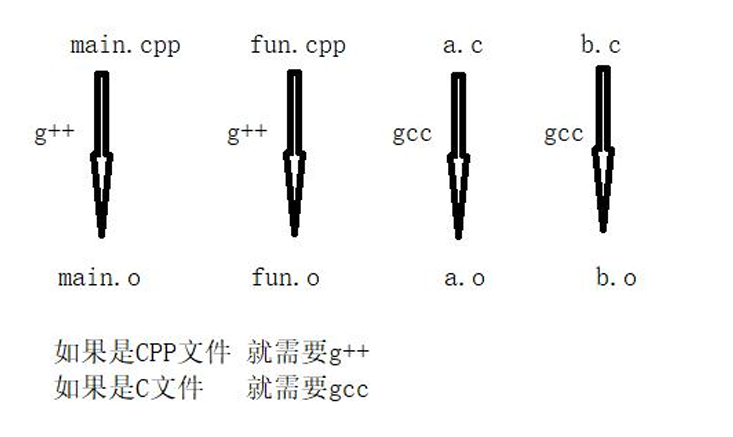

### 案例

注意:

- **__cplusplus**是一个预处理器宏，它在 C++ 编译环境下会被定义。这个宏的主要作用是用于判断当前的编译环境是否为 C++
- `extern "C"` 是 C++ 中的一种链接规范，用于告诉编译器按照 C 语言的规则进行函数名的修饰和链接
- 当你在 C++ 代码中使用 `extern "C"` 时，你实际上是在告诉编译器，这个函数是在 C 环境下编译的

fun.h:

```c++
#ifndefFUN_H
#defineFUN_H
//如果是G++编译器extern"C"说明{}之间的函数全是c语言的函数

#ifdef __cplusplus   //这里其实就是说如果处于c++编译环境 就告诉编译器应该使用c语言规则编译，c编译环境下则不需要
extern"C"{
#endif
    
    extern int my_add(int a,int b);
    extern int my_sub(int a,int b);
    extern int my_mul(int a,int b);
    extern int my_div(int a,int b);
    
#ifdef __cplusplus
}
#endif

#endif//FUN_H
```

fun.h:

```c
int my_add(int a,int b)
{
    return a+b;
};
int my_sub(int a,int b)
{
    return a-b;
};
int my_mul(int a,int b)
{
    return a*b;
};
int my_div(int a,int b)
{
    return a/b;
}
```

main.cpp:

```c++
#include<iostream>
#include"fun.h"
int main(int argc,char*argv[])
{
    cout<<my_add(100,200)<<endl;
    cout<<my_sub(100,200)<<endl;
    cout<<my_mul(100,200)<<endl;
    cout<<my_div(100,200)<<endl;
    return 0;
}
```

# 类与对象

## 类的引入

类的封装：将数据和方法封装在一起加以权限区分用户只能通过公共方法访问私有数据

**在c语言中**：

```c++
#include<iostream>
struct Dog
{
    char name[32];
};
struct Person
{
    char name[32];
};
void dogEating(Dog *p)
{
    cout<<p->name<<"吃狗粮"<<endl;
}
void personEating(Person *p)
{
    cout<<p->name<<"吃饭"<<endl;
}
int main(int argc,char*argv[])
{
    //在c语言中由于数据与方法是分开存储的，导致在使用方法时 不仅仅要注意参数的类型，而且可能存在参数传递混乱的问题
    Dog dog={"旺财"};
    Person per={"老王"};
    dogEating(&dog);
    person Eating(&per);
    dogEating((Dog*)&per); //这里就将狗的方法使用到了结构体人上
    return 0;
}
```

所以c++是将数据和方法封装在一 起

## 类的封装

- **关键字** ：
  - **class**
- **权限**：
  - **public**：公有数据，修饰的数据和方法类外可以直接访问
  - **protected**：保护数据，修饰的数据和方法类外不可以访问
  - **private**：私有数据，修饰的数据和方法类外不可以访问
  - **注意**：如果没有涉及继承， private和protected没有任何区别

- 在类中public、 private、 protected没有任何区别。（类的内部没有权限之分）
- 一般建议：数据为私有、方法为公有

```c++
#include<iostream>
//定义一个类
class Person
{
    //类中
    private:
    int a;
    protected:
    int b;
    public:
    int c;
    void initPerson(int a1,int b1,int c1)
    {
        a=a1;
        b=b1;
        c=c1;
    }
    void showPerson()
    {
        cout<<"a="<<a<<",b="<<b<<",c="<<c<<endl;
    }
};
//类外
void test01()
{
    //类定义变量的过程叫做：类实例化对象
    Person lucy;//lucy叫做对象
    lucy.initPerson(10,20,30);
    //cout<<lucy.a<<endl;//err
    //cout<<lucy.b<<endl;//err
    cout<<lucy.c<<endl;
    //用户只能通过公共方法间接访问私有数据
    lucy.showPerson();
}

```

可以在类外写类内部的函数体

```c++
class Person
{
    //类中
    private:
    int a;
    protected:
    int b;
    public:
    int c;
    void initPerson(int a1,int b1,int c1);
};


void Person::initPerson(int a1,int b1,int c1){
    a=a1;
    b=b1;
    c=c1;
}
```

## 构造函数

### 构造函数的概述

- 构造函数类实例化对象的时候自动调用。（重要） 
- 构造函数的本质功能就是初始化对象中的数据成员。（重要

### 构造函数的定义

- **构造函数名和类名称相同**，没有返回值类型，连void都不可以，可以有参数，可以重载， 权限为public。
- 如果不提供任何构造函数编译器会为类**提供一个默认的无参的空的构造函数**。
-  如果**用户提供任何一个构造函数都会屏蔽默认无参的构造函数**。

```c++
class Data
{
    private:
    inta;
    intb;
    public:
    //构造函数
    Data()
    {
        cout<<"Data的无参构造函数"<<endl;
    }
    Data(int a1,int b1)
    {
        a=a1;
        b=b1;
        cout<<"Data的构造函数调用了a="<<a<<",b="<<b<<endl;
    }
};
void test01()
{
    Data ob1;
    Data ob2(10,20);
}
```

### 构造函数的调用形式

```c++
class Data
{
    private:
    inta;
    intb;
    public:
    //构造函数
    Data()
    {
        cout<<"Data的无参构造函数"<<endl;
    }
    //如果构造函数只有一个参数容易产生构造函数的隐式转换
    Data(int a1)
    {
        a=a1;
        b=0;
        cout<<"Data的一个参数构造函数a="<<a<<",b="<<b<<endl;
    }
    Data(int a1,int b1)
    {
        a=a1;
        b=b1;
        cout<<"Data的构造函数调用了a="<<a<<",b="<<b<<endl;
    }
};
void test01()
{
    //1、隐式调用无参构造(推荐)
    Data ob1;
    //2、显示调用无参构造
    Data ob2=Data();
    //3、隐式调用有参构造（推荐）
    Data ob3(10,20);
    //4、显示调用有参构造
    Data ob4=Data(30,40);
    //5、隐式调用一个参数的构造(推荐)
    Data ob5(50);
    //6、显示调用一个参数的构造
    Data ob6=Data(60);
    //7、一个参数的构造的隐式转换(强烈不推荐)
    Data ob7=100;//相当于Data ob7(100);
    //8、如果隐式调用无参构造对象名后不要加（）
    //此处ob8不是对象ob8是函数名
    Data ob8();//此处是ob8的函数声明Data为返回值类型
    //9、匿名对象 当前语句结束 立即释放
    Data();
    Data(10);
    Data(10,20);
}
```

## 析构函数

**构造函数**：

- 先为对象开辟空间 然后调用构造函数完成初始化 
- ==**当对象生命结束的时候 系统自动调用析构函数，完成对象的清理工作**==。

 **析构函数**：

- **==~== 类名称**为析构函数名。
- 没有返回值类型，连void都不可以，不能有参数，不能被重载。 
- 先调用析构函数 然后释放对象自身的空间。

```c++
~Data()
{
    cout<<"析构函数 a="<<a<<", b="<<b<<endl;
}
```

### 析构的顺序

同级别的对象 先创建的 后释放。

### 析构函数的注意点

- 如果不提供析构函数 系统会自动提供一个空的析构函数。
- 析构函数 并不是清理对象自身的空间（由系统自动释放），==而是清理指针成员指向的 堆区空间==（避免内存泄漏）。 
- ==**<span style="color:red">如果类中有指针成员且指向堆区，必须实现析构函数手动释放堆区空间</span>**==。（重要，重 要，重要）

## 拷贝构造函数

### 拷贝构造函数的定义形式

- 如果用户没有提供 拷贝构造函数 ==系统会提供默认拷贝构造函数（是浅拷贝，足够用）==。
- 如果==**类中有指针成员且指向堆区， 必须实现拷贝构造函数（需要完成深拷贝）**==。

### 拷贝构造函数的调用时机

**旧对象 给 新对象 初始化 就会调用拷贝构造函数**。

```c++
//拷贝构造函数的定义形式
class Data2{
    public:
    int a;
    int b;
    Data2(int a,int b){
        a=a;
        b=b;
    }

    Data2(const Data2 &ob)  //const 必须有
    {
        a=ob.a;
        b=ob.b;
        cout<<"Data2 的拷贝构造函数"<<endl;
    }
}

void test(){
    Data2 obj1(10,20);
    Data2 obj2=obj1;  //此时触发拷贝构造
}
```

**普通对象做函数的参数 会调用拷贝构造**

```c++
//拷贝构造函数的定义形式
class Data2{
    public:
    int a;
    int b;
    Data2(int a,int b){
        a=a;
        b=b;
    }

    Data2(const Data2 &ob)  //const 必须有
    {
        a=ob.a;
        b=ob.b;
        cout<<"Data2 的拷贝构造函数"<<endl;
    }
}

void fun(Data2 obj){ 
 //在调用的一瞬间 这里相当Data2 obj=obj1;因此会触发拷贝构造
    
} 

void test(){
    Data2 obj1(10,20);
    fun(obj1); //发生拷贝构造
}
```

### 普通对象作为函数的返回值类型 （visualstudio 会发生拷贝构造，Qt 不会发生）

```c++
Data2 fun(){ 
    Data2 obj(10,20);
    return obj;

} 

void test(){
    Data2 obj1=fun(); 
}
```

### 无参构造、有参构造、拷贝构造的关系

- 如果用户提供了 有参构造或拷贝构造 会屏蔽 默认的无参构造。
-  用户提供有参构造或无参构造 不会屏蔽 默认拷贝构造。 
- 只有用户提供拷贝构造 才会屏蔽 默认拷贝构造。

- 如果类中有指针成员且指向堆区， 必须实现析构函数、拷贝构造函数（深拷贝）。
- 构造函数分类：无参构造、有参构造、拷贝构造 
- 构造函数实例化对象 自动调用（先开辟空间，后调用构造函数）， 可以重载。 
- 析构函数 对象结束的时候 自动调用（先调用析构函数， 后释放对象自身空间），不能重载

## 初始化列表

### 对象成员

一个类的对象 作为另一个类的成员。假如A为类。

```c++
class A{
    public :
    int a;
    A(){
        a=0;
        cout<<"A 的无参构造"<<endl
    }
    A(int a1){
        a=a1;
        cout<<"A 的有参构造"<<endl
    }
    ~A(){
        cout<<"A的析构构造"<<endl
    }
}
class B{
    public :
    int b;
    A ob;  //对象成员
    B(){
        b=0;
        cout<<"B的无参构造"<<endl
    }
    B(int a1){
        b=a1;
        cout<<"B的有参构造"<<endl
    }
    ~B(){
        cout<<"B的析构构造"<<endl
    }
}
```

### 对象成员的构造和析构顺序

据以上代码

```c++
void test(){
    B obj1;
}

test();
//打印结果：
//A 的无参构造
//B的无参构造
//B的析构构造
//A的析构构造
```

- 先对象成员构造---->自身构造。
-  先自身析构----->对象成员析构。
- ==**默认调用的是对象成员的无参构造**==。

### 调用对象成员的有参构造（必须使用初始化列表）

哪怕在B类的有参构造中使用：

```c++
    B(int a1){
        b=a1;
        ob.a ;  //尽管如此 依旧调用的是A类的无参构造
        cout<<"B的有参构造"<<endl
    }
```

如果想要把A的构造函数放入B 实例化的对象中去，必须先得 B 的实例化对象已经开辟了空间，然后才能触发构造函数【一定得先有空间，才能触发构造函数】，由于一定是先对象成员的构造，因此A ob触发构造函数的调用时，B的构造函数还没有触发，所以无法放入

### 初始化列表

```c++
// 格式：
       //:对象成员名(参数)
```

```c++
class A{
    public :
    int a;
    A(){
        a=0;
        cout<<"A 的无参构造"<<endl
    }
    A(int a1){
        a=a1;
        cout<<"A 的有参构造"<<endl
    }
    ~A(){
        cout<<"A的析构构造"<<endl
    }
}
class B{
    public :
    int b;
    A ob;  //对象成员
    B(){
        b=0;
        cout<<"B的无参构造"<<endl
    }
    //初始化列表:对象成员名(参数)
    B(int a1):ob(a1){  //此时完成初始化列表
        b=a1;
        cout<<"B的有参构造"<<endl
    }

    //b=a1的赋值其实也可以通过初始化列表完成
    //    B(int a1):ob(a1),b(a1){  
    //       cout<<"B的有参构造"<<endl
    //   }

    ~B(){
        cout<<"B的析构构造"<<endl
    }
}
```

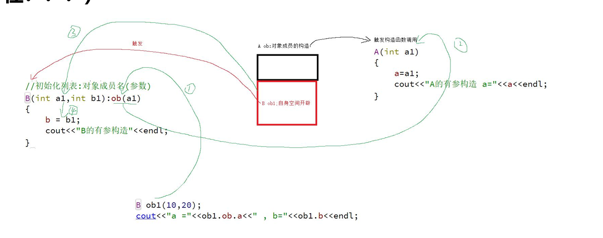

## explicit关键字

explicit 防止构造函数隐式转换。 

构造函数的隐式转换：当类有一个参数的构造函数时 容易发生构造函数隐式转换。 

```c++
explicitData2 ob7=100;//隐式转换 -> 等价 Data2 ob7(100);
//  使用explicit 防止构造函数隐式转换
class Data2{
    public:
    int a;
    explicit Data(int a1){
        a=a1;
    }
}
Data2 ob7=100;//使用explicit后 报错 不允许隐式转换
```

 如果explicit 修饰一个参数的构造函数 那么就无法发生隐式转换。

## 动态对象创建

其实就是堆区对象的创建

### malloc 和free的缺点

- 一个对象的创建需要做两件事：申请空间、调用构造函数。 
- 一个对象的释放需要做两件事：调用析构函数、释放空间。 
- malloc 只能申请空间，**无法调用对象的构造函数**。
- free 只是释放空间 **无法调用对象的析构函数**。
- 所以**C++提供新的new和delete来申请和释放空间**。（重要）

## new 申请堆区空间

#### new 和 delete操作基本类型

```c++
void test02()
{
    //1、申请int空间
    int* p1=new int;
    *p1=100;
    cout<<"*p1="<<*p1<<endl;
    delete p1;
    //2、申请int空间并初始化
    int* p2=new int(100);   //这里的100相当于是给int类的构造函数的实参
    cout<<"*p2="<<*p2<<endl;   //100
    delete p2;
    //3、申请int数组有5个元素
    int* arr1=new int[5];
    int i=0;
    for(i=0;i<5;i++)
    {
        cout<<arr1[i]<<"";
    }
    cout<<endl;
    //如果申请的时候有[]释放的时候必须有[]
    delete [] arr1;//必须加[]
    //4、申请int数组有5个元素并初始化
    int* arr2=new int[5]{10,20,30,40,50};
    for(i=0;i<5;i++)
    {
        cout<<arr2[i]<<"";
    }
    cout<<endl;
    //如果申请的时候有[]释放的时候必须有[]
    delete [] arr2;//必须加[]
}
```

#### new和delete操作对象

- new会创建空间并调用构造函数
- delete调用析构函数并释放空间（重要）

```c++
class A{
    public :
    int a;
    A(){
        a=0;
        cout<<"A 的无参构造"<<endl
    }
    A(int a1){
        a=a1;
        cout<<"A 的有参构造"<<endl
    }
    ~A(){
        cout<<"A的析构构造"<<endl
    }
}

void test(){
    A *p1=new A;
    cout<<"a="<<p1->a<<endl;
    delete p1;

    A *p1=new A(100);
    cout<<"a="<<p1->a<<endl;
    delete p1;
}
```

## 对象数组

对象数组：

- 本质是数组数组的每个元素为对象

- 数组的每个元素都会调用构造和析构函数

```c++
class A
{
    public:
    int a;
    public:
    A()
    {
        a=0;
        cout<<"A的无参构造"<<endl;
    }
    explicit A(int a1)
    {
        a=a1;
        cout<<"A的有参构造a="<<a<<endl;
    }
    ~A()
    {
        cout<<"A的析够函数a="<<a<<endl;
    }
    void showData()
    {
        cout<<a<<"";
    }
};
void test04()
{
    //对象数组每个元素默认调用的是无参构造
    A arr1[5];
    //让对象数组的每个元素调用有参构造
    //arr2 数组的每个元素 发生了构造函数的隐式转换
    //A arr2[5]={10,20,30,40,50};
    A arr3[5]={A(10),A(20),A(30),A(40),A(50)};//推荐这种初始化
    int i=0;
    for(i=0;i<5;i++)
    {
        arr3[i].showData();
    }
    cout<<endl;
}
```

### new和delete操作对象数组

```c++
void test04()
{
    A *arr1=new A[5]{A(10),A(10),A(10),A(10),A(10)}
    for(int i=0;i<5;i++){
        arr1[i].showData()
    }
    cout<<endl;
    delete [] arr1
}
```

## delete 释放void *会出问题。

- void *如果是基本类型的地址 delete释放没有问题。
- delete 释放void *的时候无法调用 类的析构函数。

## 类中有指针成员

如果类中有指针成员 必须释放拷贝构造函数（深拷贝），析构函数、重载赋值运算符。

```c++
class Person
{
    private:
    int num;
    char *name;
    float score;
    public:
    Person();
    Person(int num1, char *name1, float score1);
    Person(const Person &ob);//深拷贝
    ~Person();
    void showPerson();
}
//name(NULL) 如果这里name不赋值null会导致name成为野指针
Person::Person():num(0),name(NULL),score(0.0f)
{
    cout<<"Person的无参构造"<<endl;
}
Person::Person(int num1,char *name1,float score1):num(num1),score(score1)
{
    //为name申请堆区空间
    name=new char[strlen(name1)+1];
    strcpy(name,name1);
    cout<<"Person的有参构造"<<endl;
}
Person::Person(const Person &ob)//深拷贝
{
    num=ob.num;
    score=ob.score;
    //让name指向独立的空间
    name=new char[strlen(ob.name)+1];  //使用new申请空间，并strcpy深拷贝
    strcpy(name,ob.name);
    cout<<"拷贝构造函数"<<endl;
}
Person::~Person()
{
    if(name != NULL)  //判断name是否为随机指针，防止释放随机空间，发生段错误
    {
        delete [] name;
        name=NULL;
    }
    cout<<"析构函数"<<endl;
}
void Person::showPerson()
{
    cout<<"学号:"<<num<<", 姓名:"<<name<<", 分数:"<<score<<endl;
}
```

```c++
int main(inta rgc,char*argv[])
{
    Person lucy(100,"lucy",99.9f);
    lucy.showPerson();
    Person arr1[5]={Person(100,"lucy",99.9f),
                    Person(101,"bob",88.9f),
                    Person(102,"tom",77.9f),
                    Person(103,"德玛",66.9f),
                    Person(104,"小法",55.9f)};
    for(int i=0;i<5;i++)
    {
        //arr1[i].showPerson();
        (arr1+i)->showPerson();
    }
    return0;
}
```

## 静态成员

类中的成员 被static修饰成为静态成员。 

分类：

- 静态成员数据。
- 静态成员函数。

- **静态成员数据 在定义类的时候 就已经存在，他是所有对象共享的数据，所以不占类的空 间大小**。
- 静态成员数据 是属于类 而不是对象。 
- 静态成员数据 必须类中定义，类外初始化【因为类的成员不允许初始化】。

```c++
class Data{
    public:
    int a;
    static int b;   //静态成员数据(类中定义)
}

int Data::b=10; //类外初始化(不要加static)
```

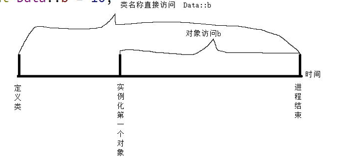

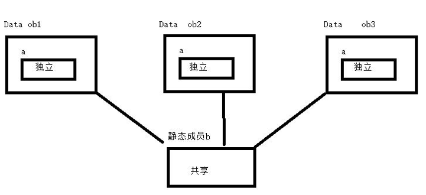

### 静态成员数据的访问

```c++
class Data{
    public:
    int a;
    static int b;   //静态成员数据(类中定义)
}

int Data::b=10; //类外初始化(不要加static)
void test(){
    cout <<"b="<<Data::b<<endl;  //10
    Data obj1;
    cout <<"b="<<obj1.b<<endl;  //10
    obj1.b=100;
    cout <<"b="<<obj1.b<<endl;  //100
    Data obj2;
    obj2.b=300;
    cout <<"b="<<obj1.b<<endl;  //300
}
```

### 静态成员函数

- 静态成员函数 可以直接通过类名称访问。
- 静态成员函数的目的:  就是**访问私有的静态成员数据**。
- **静态成员函数 不能操作非静态成员数据**。

```c++
class Data{
    public:
    int a;
    static int getB(){
        return b;
    }

    private:
    static int b;   //静态成员数据(类中定义)
}

int Data::b=10; //类外初始化(不要加static)

void test(){
    cout<<Data::getB()<<endl;
}
```

### 静态成员数据的应用

#### 静态成员用于统计类实例化对象的个数

```c++
class Data3
{
    private:
    static int count;
    public:
    Data3()
    {
        count++;
    }
    Data3(const Data3 &ob)
    {
        count++;
    }
    ~Data3()
    {
        count--;
    }
    static int showCount()
    {
        returncount;
    }
};
intData3::count=0;
voidtest04()
{
    Data3ob1;
    Data3ob2;
    {
        Data3ob3;
        Data3ob4;
        cout<<Data3::showCount()<<endl;//4
    }
    cout<<Data3::showCount()<<endl;//2
}

```

#### 单例模式

单例模式：该类只能实例化一个对象。

```c++
class Singleton
{
    //1、构造函数私有化保证在类外无法实例化对象，此时在类外使用 singleton obj;将会报错
    private:
    Singleton(){}
    Singleton(const Singleton &ob){
        *this=ob;
    }
    ~Singleton(){}//防止类外释放唯一地址
    private:
    //2、定义一个静态的指针变量用来保存唯一对象的地址
    static Singleton *p;
    public:
    //4、通过静态成员函数获取唯一的实例地址
    static Singleton *getSingleton()
    {
        return p;
    }
    //5、单例模式的核心任务
    void doWork(char*str)
    {
        cout<<"打印了:"<<str<<endl;
    }
};
//3、实例化唯一的对象
Singleton *Singleton::p=new Singleton;
int main(intargc,char*argv[])
{
    //先获取唯一实例地址
    Singleton *p1=Singleton::getSingleton();
    p1->doWork("入职证明1");
    p1->doWork("离职证明1");
    p1->doWork("薪资流水1");
    p1->doWork("体检证明1");
    Singleton*p2=Singleton::getSingleton();
    p2->doWork("入职证明2");
    p2->doWork("离职证明2");
    p2->doWork("薪资流水2");
    p2->doWork("体检证明2");
    return0;
}

```


## 类的大小

- 类的大小 一般指 类实例化对象 对象占空间大小。 
- 成员函数、静态成员函数、静态成员数据 不占类的空间大小。

```c++
class Data2{
    public :
    int a;
    char b;
    short c;
    static int d;
    public:
    Data2(){}
    void showData2(){};
}

int Data2::d=0;
void test(){
    cout << sizeof(Data2)<<endl;  //8
}
```

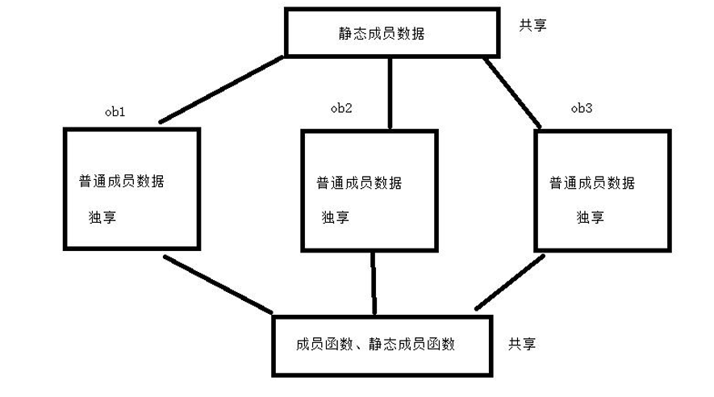

## this指针

### 概述

- 普通成员函数 内部自带一个this指针，当对象调用成员函数的时候 该this就保存这个对象的地址
- this 指针的目的：**保存 调用成员函数对象的地址** .
- 注意：**静态成员函数 没有this指针**。

### 如果函数的形参和成员名同名 可以使用this区分

```c++
class Data{
    public :
    int a;
    char b;
    public:
    Data(int a){
        this->a=a;
    }
    void showData2(){};
}

void test(){
    Data obj(10)
        cout << obj.a<<endl;  //8
}
```

### 成员函数返回*this 完成链式操作

this代表的是对象的地址，*this 代表的是对象

```c++
class Data{
    public :
    int a;
    char b;
    public:
    Data(int a){
        this->a=a;
    }
    Data& showData(char *str){
        cout<<str;
        return *this;
    };
}

void test(){
    Data obj(10);
    obj.showData("hello").showData("sss");
    Data().showData("hello") // Data()这里是匿名对象
}
```

## const修饰成员函数

const 修饰的成员函数 不能对成员数据进行写操作（mutable修饰的成员数据 除外）

```c++
class Data{
    public :
    int a;
    mutable   int b;
    public:
    Data(int a){
        this->a=a;
    }
    // 成员函数为只读在const修饰的成员函数中不能修改成员数据的值
    showData() const 
    {
        a=1000;//报错
        b=100; // 正常赋值
    };
}
```

## 友元

如果 ==某个函数 为类的友元 那么这个函数 就可以直接访问该类的私有数据==。（破坏类的封装性）。 

友元的分类：

- 普通全局函数作为友元
- 类的某个成员函数作为友元
- 整个类作为友元

 友元使用的关键字：friend

### 普通全局函数作为友元

```c++
class Room
{
    //Room 将visitingRoom01 声明成友元
    friend void visitingRoom01(Room &room);
    private:
    string bedRoom; //卧室
    public:
    string visitRoom;//客厅
    Room(){}
    Room(string bedRoom, string visitRoom)
    {
        this->bedRoom = bedRoom;
        this->visitRoom = visitRoom;
    }
};
//普通全局函数
void visitingRoom01(Room& room)
{
    cout<<"蒙帅访问了"<<room.bedRoom<<endl;
    cout<<"蒙帅访问了"<<room.visitRoom<<endl;
}
void test01()
{
    Room room("大伟的卧室","大伟的客厅");
    visitingRoom01(room);
}
```

### 类的某个成员函数作为另一个类的友元

如果将A类中的成员函数设置为B类的友元。 

- 第一步：先定义A类，并且A类的成员函数在类外（A和B类的下方）实现。 
- 第二步：向前声明B类。
-  第三步：在B类使用friend声明A的成员函数为友元。

```c++
class Room;//类型向前声明只能告知编译器Room存在但是不知道里面的成员
class Good
{
    private:
    string name;
    public:
    Good(){}
    Good(string name)
    {
        this->name=name;
    }
    voidvisittingRoom01(Room&ob);
    voidvisittingRoom02(Room&ob);
};

class Room
{
    friend void Good::visittingRoom01(Room &ob);
    private:
    string bedRoom;//卧室
    public:
    string visitRoom;//客厅
    Room(){}
    Room(string bedRoom,string visitRoom)
    {
        this->bedRoom=bedRoom;
        this->visitRoom=visitRoom;
    }
};

void test01()
{
    Room room("大伟的卧室","大伟的客厅");
    Goody good("蒙帅");
    good.visittingRoom01(room);
    good.visittingRoom02(room);
}

int main(int argc,char*argv[])
{
    test01();
    return 0;
}

void GoodGay::visittingRoom01(Room& ob)
{
    cout<<name<<"访问了"<<ob.bedRoom<<endl;
    cout<<name<<"访问了"<<ob.visitRoom<<endl;
}
void GoodGay::visittingRoom02(Room& ob)
{
    //cout<<name<<"访问了"<<ob.bedRoom<<endl;//err
    cout<<name<<"访问了"<<ob.visitRoom<<endl;
}

```

### 整个类作为另一个类的友元

```c++
class Room;//类型向前声明只能告知编译器Room存在但是不知道里面的成员
class Good
{
    private:
    string name;
    public:
    Good(){}
    Good(string name)
    {
        this->name=name;
    }
    void visittingRoom01(Room&ob);
    void visittingRoom02(Room&ob);
};
class Room
{
    friend class Good;
    private:
    string bedRoom;//卧室
    public:
    string visitRoom;//客厅
    Room(){}
    Room(string bedRoom,string visitRoom)
    {
        this->bedRoom=bedRoom;
        this->visitRoom=visitRoom;
    }
};
void test01()
{
    Roomroom("大伟的卧室","大伟的客厅");
    Good good("蒙帅");
    good.visittingRoom01(room);
    good.visittingRoom02(room);
}
int main(int argc, char *argv[])
{
    test01();
    return 0;
}
void Good::visittingRoom01(Room &ob)
{
    cout<<name<<"访问了"<<ob.bedRoom<<endl;
    cout<<name<<"访问了"<<ob.visitRoom<<endl;
}
void Good::visittingRoom02(Room &ob)
{
    cout<<name<<"访问了"<<ob.bedRoom<<endl;//err
    cout<<name<<"访问了"<<ob.visitRoom<<endl;
}
```

### 总结

- 友元关系不能被继承。 
- 友元关系是单向的，类 A 是类 B 的朋 友，但类 B 不一定是类 A 的朋友。
-  友元关系不具有传递性。类 B 是类 A 的朋 友，类 C 是类 B 的朋友，但类 C 不一 定是类 A 的朋友

## 数组类

```c++
class Array{
    private:
    int *arr;  //数组首地址
    int size;  //数组大小
    int capacity; //数组最大存放个数
    public :
    Array();
    Array(int capacity);
    Array(const Array &ob);
    ~Array();
    void push_back(int ele); //插入数据
    void pop_back(void); //删除尾部数据
    void printArray(void); //遍历数组
}
```

类的函数体：

```c++
Array::Array(){
    this->size=0;
    this->capacity=5;
    this->arr=new int[this->capacity];
}

Array::Array(int capacity){
    this->size=0;
    this->capacity=capacity;
    this->arr=new int[capacity];
}

Array::Array(const Array &ob){
    this->size=ob.size;
    this->capacity=ob.capacity;
    this->arr=new int[this->capacity];
    memcpy(this->arr,ob.arr,sizeof(int)*this->capacity);
}

Array::~Array(){
    if(this->arr!=NULL){
        delete [] arr;
        this->arr=NULL;
    }
}

void Array::push_back(int ele){
    //判断数组是否已经存放满
    if(this->size==this->capacity){
        //开辟更大的空间
        int *temArr=new int[2*this->capacity];
        memcpy(temArr,this->arr,sizeof(int)*this->capacity);
        //释放旧空间
        delete [] this->arr;
        arr=temArr;
        //更新容量
        this->capacity=2*this->capacity;
    }
    this->arr[this->size]=ele;
    this->size++;
    return;
}

void Array::pop_back(){
    if(this->size==0){
        cout<<"数组没有元素"<<endl;
        return;
    }
    this->size--;  //单纯的减少size的值，以后可以通过插入来覆盖掉值
    return;
}

void Array::printArray(){
    for(int i=0;i<this->size;i++){
        cout<<this->arr[i]<<endl;
    }
}

int Array::Size(){
    return this->size;
}

int Array::Capacity(){
    return this->capacity;
}
```

## 运算符重载[operator]

运算符重载，就是对已有的运算符重新进行定义，赋予其另一种功能，以适应不同 的数据 类型。

**关键字：operator** 

- 比如重载+运算符，其函数名operator +。
-  一元：运算符需要的运算对象是一个。i++ --i 
- 二元：运算符需要的运算对象是二个。a+b

### 重载运算符的步骤

- 第一步：必须明确 运算符左边的运算符对象 是自定义对象还是其他。
- 第二步：如果左边是其他，必须使用全局函数完成运算符重载。（全局函数必须是友元）
- 第三步：如果左边是自定义对象，就可以使用成员函数或全局函数 完成运算符重载。（推荐用成员函数实现）

**注意**：

- 如果使用成员函数 可以少一个参数（运算符左边的运算对象） 
- 如果使用全局函数 不可以少参数，必须把全局函数设置友元。

### 全局函数  重载 << 运算符

```c++
class Person{
    public:
    int num;
    string name;
    float score;
    Person(){};
    Person(int num,string name,float score){/...}
}

void test(){
    Person luck(100,"luck",99.9f);
    cout << luck //此时会报错，因为找不到输出的方式
}
```

重载 " << "运算符：

```c++
class Person{
    friend void operator <<(ostream &out,Person &ob); //设置为类的友元函数
    public:
    int num;
    string name;
    float score;
    Person(){};
    Person(int num,string name,float score){/...}
}

//void operator <<(ostream &out,Person &ob){
//    out<<ob.num<<" "<<ob.name<<" "<<ob.score;
return;
//}

//这样还可以完成链式调用
ostream & operator <<(ostream &out,Person &ob){
    out<<ob.num<<" "<<ob.name<<" "<<ob.score;
    return out;
}

void test(){
    Person luck(100,"luck",99.9f);
    Person XXk(100,"XXX",99.9f);
    cout << luck // 100 luck 99.9
        cout << luck<<XXk // 100 luck 99.9 100 XXX 99.9
        //其实这里就相当于operator( cout ,luck)其实就是想要普通函数重载一样，通过不同的参数条件去调用不同的函数
}
```

### 重载输入运算符

```c++
//注意：要在类中设置友元
istream & operator <<(istream &in,Person &ob){
    in>>ob.num>>ob.name>>ob.score;
    return in;
}

void test(){
    Person tom;
    cin>>tim  //此时输入 100 tom 11.1 可以正常为对象赋值
}
```

### 全局函数重载+运算符设置友元

```c++
operator +(Person ob1,Person ob2){
    Person tmp;
    tmp.num=ob1.num+ob2.num;
    tmp.name=ob1.name+ob2.name;
    tmp.score=ob1.score+ob2.score;
    return tmp;
}

void test(){
    Person luck(100,"luck",99.9f);
    Person XXk(100,"XXX",99.9f);
    luck+XXk;  //此时输入 100 tom 11.1 可以正常为对象赋值
}
```

### 成员函数重载+运算符

**全局函数重载会与成员函数重载冲突**，只能二选一，优选选择成员函数重载

```c++
class Person{
    public:
    int num;
    string name;
    float score;
    Person(){};
    Person(int num,string name,float score){
        //...
    };
    Person    +(Person ob2){  
        Person tmp;
        tmp.num=this.num+ob2.num;
        tmp.name=this.name+ob2.name;
        tmp.score=this.score+ob2.score;
        return tmp;
    };
}
void test(){
    Person luck(100,"luck",99.9f);
    Person XXk(100,"XXX",99.9f);
    luck.operator+XXk;  //此时输入 100 tom 11.1 可以正常为对象赋值
}
```

### 重载++--运算符

- 当编译器看到++a(前置++)，它就调用operator++(a),先++后使用
- 当编译器看到a++（后置++），它就会去调用operator++(a,int).先使用后++

#### 重载前置++

```c++
Person& operator++()
{
    //先++
    this.num++;
    this.name=this.name+this.name;
    this.score++;
    //后使用
    return *this;
}
void test04()
{
    Person lucy(100,"lucy",99.9f);
    Person bob;
    bob=++lucy;//调用成员operator++()
    cout<<"bob:"<<bob<<endl;   101 luckluck 100.9
    cout<<"lucy:"<<lucy<<endl; 101 luckluck 100.9
}
```

#### 重载后置++

```c++
Person operator++(int)
{
    //先使用
    Person old=*this;
    //后++
    this.num++;
    this.name=this.name+this.name;
    this.score++;
    return old;
}
void test05()
{
    Person lucy(100,"lucy",99.9f);
    Person bob;
    bob=lucy++;//调用成员函数operator++(int)
    cout<<"bob:"<<bob<<endl;
    cout<<"lucy:"<<lucy<<endl;
}
```

### 重载函数调用运算符

重载（），就叫重载函数调用运算符。 

如果**对象和（）结合**会触发重载**函数调用运算符**执行。

```c++
//仿函数、函数对象
class Print
{
    public:
    //重载函数调用运算符
    Print& operator()(char*str)
    {
        cout<<str;
        return*this;
    }
};
void test06()
{
    Print ob;
    //对象和()结合触发operator()调用
    ob("hello world");
    Print ob1;
    ob1("xixixixi")("hahahaha");
    cout<<endl;
    Print()("啦啦啦啦啦")("嘻嘻嘻嘻嘻")("哈哈哈哈哈哈");//Print() 是一个匿名对象
}
```

### 不建议重载&&||

不要重载&& ||因为用户无法实现&&或||的“短路特性”。

### 不能重载的运算符 

- **.**   。
- **::**   。
- **.***  。
- **?:**  。
- **sizeof**    。


## 实现MyString类

如果类中有指针成员且指向了堆区，必须实现拷贝构造（深拷贝），必须实现析构函数 （释放指针指向的堆区空间）,必须重载=运算符（深拷贝

### MyString.h

```c++
#ifndef MYSTRING_H
#define MYSTRING_H
#include <iostream>
using namespace std;
class MyString
{
    friend ostream & operator <<(ostream &out ,MyString ob);
    friend istream & operator >>(istream &in,MyString &ob);
    private:
    char *str;
    int size;
    public:
    MyString();
    MyString(char *str);
    MyString(const MyString &ob);
    ~MyString();
    int Size();
    char&  operator [](int pos);
    MyString& operator=(MyString&ob);
    MyString& operator=(char *str);
    booloperator>(MyString&ob);
    booloperator>(char*str);
};

#endif // MYSTRING_H

```

### MyString.cpp

```c++
#include "mystring.h"
#include <string.h>
MyString::MyString()
{
    this->size=0;
    this->str=NULL;
}

MyString::MyString(char *str){
    this->size=strlen(str);
    this->str=new char[size+1]; //申请空间
    strcpy(this->str,str);
}

MyString::MyString(const MyString &ob){
    this->size=ob.size;
    this->str=new char[ob.size+1];
    strcpy(this->str,ob.str);
}

MyString::~MyString(){
    if(this->str!=NULL){
        delete [] str;
        this->str=NULL;
    }
}


char& MyString:: operator [](int pos){
    if(this->str==NULL){
        cout<<"当前字符串为空"<<endl;
        exit(-1); //结束进程
    }else{
        if(!(pos>=0&&pos<this->size)){
            cout<<"取值越界"<<endl;
            exit(-1); //结束进程
        }
    }
    return str[pos];
}

MyString &MyString::operator=(MyString &ob)
{
    if(this->str!=NULL){
        delete [] this->str;
        this->str=NULL;
    }

    this->size=ob.size;
    this->str=new char[this->size+1];

    strcpy(this->str,ob.str);

    return *this;
}

MyString &MyString::operator=(char *str)
{
    if(this->str!=NULL){
        delete [] this->str;
        this->str=NULL;
    }

    this->size=strlen(str);
    this->str=new char[this->size+1];

    strcpy(this->str,str);

    return *this;
}

bool MyString::operator>(MyString &ob)
{
    //判断是否存在空字符串
    if(this->str==NULL||ob.str==NULL)
    {
        cout<<"存在空字符串,无法比较"<<endl;
        exit(-1);
    }
    if(strcmp(this->str,ob.str)>0)
    {
        return true;
    }
    return false;
}
bool MyString::operator>(char *str)
{
    if(this->str==NULL||str==NULL)
    {
        cout<<"存在空字符串,无法比较"<<endl;
        exit(-1);
    }
    if(strcmp(this->str,str)>0)
    {
        return true;
    }
    return false;
}


int MyString::Size()
{
    return this->size;
}


ostream & operator <<(ostream &out ,MyString ob){
    out<<ob.str;
}


istream & operator >>(istream &in,MyString &ob){
    if(ob.str!=NULL){
        delete [] ob.str;
        ob.str=NULL;
    }
    char buf[1024]="";
    in>>buf;

    ob.size=strlen(buf);
    ob.str=new char[ob.size+1];
    strcpy(ob.str,buf);
    return in;
}
```


## 智能指针

```c++
#include<iostream>
using namespace std;
class Data
{
    private:
    int num;
    public:
    Data()
    {
        cout<<"Data的无参构造"<<endl;
    }
    Data(int num)
    {
        this->num=num;
        cout<<"Data的有参构造num="<<num<<endl;
    }
    void showData()
    {
        cout<<"num="<<num<<endl;
    }
    ~Data()
    {
        cout<<"Data的析构函数"<<endl;
    }
};
class SmartPoint
{
    private:
    Data*sp;
    public:
    SmartPoint():sp(NULL){}
    SmartPoint(Data*sp)
    {
        this->sp=sp;
    }
    SmartPoint(const SmartPoint &ob)
    {
        this->sp=new Data;
        *sp=*ob.sp;
    }
    ~SmartPoint()
    {
        delete sp;
    }
    Data *operator->()
    {
        returnsp;
    }
    Data &operator*()
    {
        return *sp;
    }
};
int main(int argc, char *argv[])
{
    //本质上sp是一个SmartPoint 局部对象
    //但是 用户想在宏观上 把bp看成Data*的指针变量(sp)
    SmartPoint bp(new Data(100));
    //bp.operator->()->showData();
    bp->showData();
    //bp.operator *().showData();
    (*bp).showData();
    return 0;
}
```

# 派生与继承

## 概述

继承：描述的是类和类的关系，如果A类继承于B类，那么A类拥有B的数据和方法，A 类可以新增自己的数据和方法。

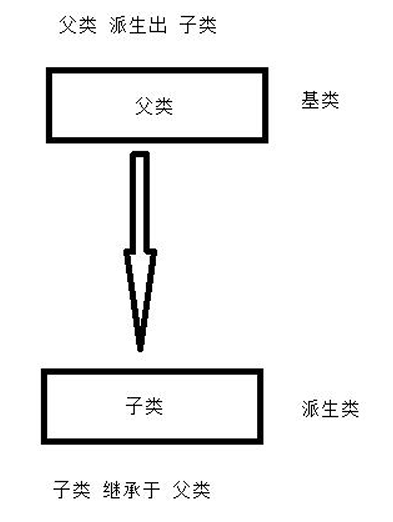

## 继承的方式

```c++
class 子类:继承方式 父类名
{
 //新增数据和方法
}；
注意：继承方式 public、protected、private
```

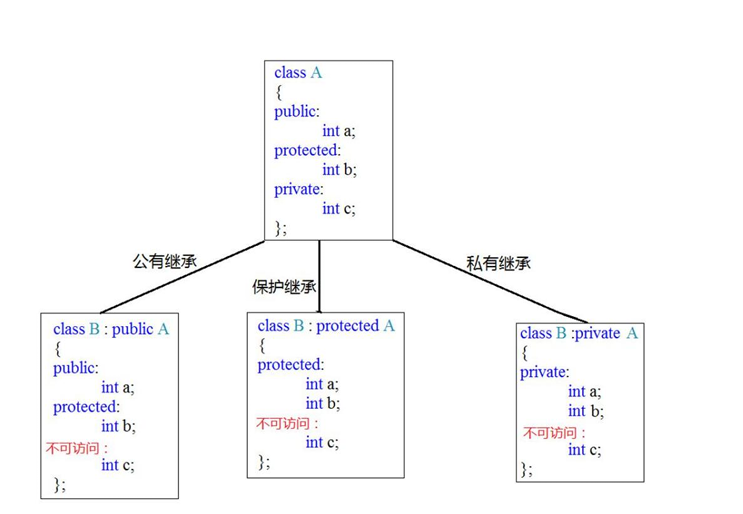

不管任何继承:

- 父类的私有数据在子类中不可见。
- 公共继承保持不变，
- 保护继承变保护，
-  私有继承变私有。

## 继承中构造和析构的顺序

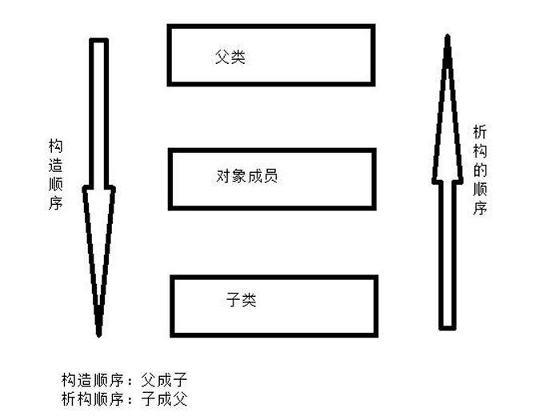

```c++
class Base
{
    public:
    Base()
    {
        cout<<"Base的构造"<<endl;
    }
    ~Base()
    {
        cout<<"Base的析构"<<endl;
    }
};
class Other
{
    public:
    Other()
    {
        cout<<"Other的构造"<<endl;
    }
    ~Other()
    {
        cout<<"Other的析构"<<endl;
    }
};
class Son:private Base
{
    public:
    Other ob;
    Son()
    {
        cout<<"Son的构造"<<endl;
    }
    ~Son()
    {
        cout<<"Son的析构"<<endl;
    }
};
void test01()
{
    Sonob1;
}
int main(intargc,char*argv[])
{
    test01();
    return0;
}


//Base的构造
//Other的构造
//Son的构造
//Son的析构
//Other的析构
//Base的析构
```

## 调用对象成员、父类的有参构造必须使用初始化列表

- 调用对象成员的有参构造，在初始化列表时必须使用对象名。
-  调用父类的有参构造，在初始化列表时必须使用父类名称。

```c++
class Base
{
    //..
};
class Other
{
    //.....
};
class Son:public Base
{
    public:
    int c;
    public:
    Other ob;
    Son()
    {
        cout<<"Son的构造"<<endl;
    }
    Son(int a,int b,int c):ob(b),Base(a),c(c)
    {
        //this->c=c;
        cout<<"Son的有参构造"<<endl;
    }
    ~Son()
    {
        cout<<"Son的析构"<<endl;
    }
};

```

## 继承中同名成员的处理方法

- 使用作用域是最直接、有效、安全的方法。 
- **如果父类和子类成员同名默认使用子类成员**。可以加父类作用域强制访问父类的同名成员。

```c++
class Base
{
    public:
    int a
};

class Son:private Base
{
    public:
    int a
};

void test(){
    Son obj(10,20);
    cout<<"子类的a"<<obj.a<<endl;  //访问的子类的
    cout<<"父类的a"<<obj.Base::a<<endl;//强制访问父类的
}
```

## 继承中成员函数同名处理

- 重定义：如果**子类重新定义父类的==同名函数==**，**子类就会屏蔽父类的所有==同名函数==**。
- 什么是重定义：
  - 必须有继承。
  - 子类重新定义父类的同名函数（非==虚函数==）。 
- 重载：没有继承、同一作用域，函数参数的个数、顺序、类型不同为重载，返回值类型不 能作为重载条件
- 如果**需要访问被父类隐藏【屏蔽】的同名函数 必须加父类作用域**

## 不能继承的成员函数

构造函数、析构函数、operator=重载赋值运算符。不能被继承。

## 多继承

- 多继承：子类 从多个父类继承，每个父类的继承方式可以各不相同
- 多继承的父类构造顺序  只看定义子类时继承父类的顺序
- 多继承很容易造成成员同名
  - 不加作用域：父类与子类同名用子类的，父类成员同名报错。
  - 加作用域：不会有问题

```c++
class Son:public Base1, private Base2, protected Base3
{
}
//这里的继承顺序是 Base1 Base2 所以在调用父类的构造函数时的顺序是 Base1 Base2
```

## 菱形继承

菱形进程：有公共祖先的多继承，叫做菱形继承。

```c++
class Animal{
    public:
    int a;
};
class sheep : public Animal{};
class Tuo:public Animal{};
class sheepTuo : public Sheep , public Tuo{};

int main(int argc,char *argv[]){
    sheepTuo st;
    cout<<st.Sheep::a<<endl;
    cout<<st.Tuo::a<<endl;
    return 0;
}

```

## 虚继承

解决的是 菱形继承带来的公共祖先的数据二义性的问题。

虚继承的关键字是==virtual==.

```c++
class Animal
{
    public:
    int a;
};
class Sheep:virtual public Animal{};
class Tuo:virtual public Animal{};
class SheepTuo:public Sheep,public Tuo{};
int main(int argc, char *argv[])
{
    SheepTuo st;
    cout<<st.a<<endl;
    return 0;
}
```

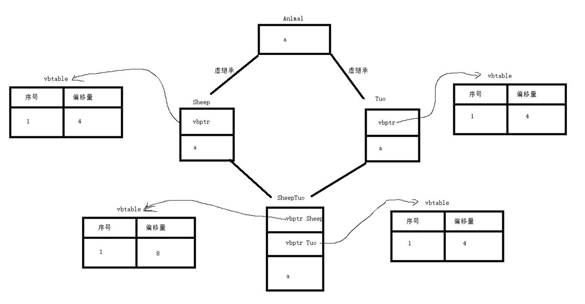

1. 虚继承父类 会产生一个虚基类指针（vbptr），该指针指向一个虚基类表(vbtable),而虚基 类表中存放的是公共祖先数据偏移量。
2. 编译器通过vbptr访问vbtable从中得到公共祖先数据的偏移量 ，然后从内存中方公共祖先的数据

# 多态

## 概述

使用父类指针指向子类空间的目的：让算法 可以操作 父类派生出的所有子类。

## 父类指针指向子类空间 带来的问题

- 父类指针 只能操作 子类中父类部分的数据和方法。
- 当使用基类指针指向派生类对象时，如果基类和派生类都有同名的函数，那么默认会调用基类的函数 

但是 算法要求 通过 父类指针 操作 子类中子类部分的新增方法。

## 虚函数

使用关键字virtual修饰成员函数， 该成员函数为虚函数。

- **修饰过后 如果子类有定义该虚函数的同名函数则优先调用子类函数**
- ==重写==：在**继承**时子类**重写父类的虚函数**，子类重写的函数的返回值类型，函数名、形参必须和父类一模一样，==只有函数体不一样==。
-  子类重写父类的虚函数， 子类重写的函数也是虚函数。

```c++
#include <iostream>

using namespace std;

class Animal{
    public:
    virtual void speak(){
        cout << "动物说话"<< endl;
    }
};

class Dog:public Animal{
    public:
    void speak(){
        cout<<"狗叫"<<endl;
    }
};
class Cat:public Animal{
    public:
    void speak(){
        cout<<"猫叫"<<endl;
    }
};

void fun(Animal *p){  //实现多态，只需要传入实例化的子类即可
    p->speak();
}

int main(int argc, char *argv[])
{
    fun(new Dog);
    fun(new Cat);
    return 0;
}

```

## 多态的分类

- **静态多态**：编译的时候 就决定了函数的功能（早绑定，静态联编），比如：函数重载、重定义、运算符重载 
- **动态多态**：运行的时候 决定函数的功能（晚绑定，动态联编），比如：虚函数

## 虚函数的原理

子类没有重写父类的虚函数时:

- 子类直接继承父类的虚函数以及虚函数记录表

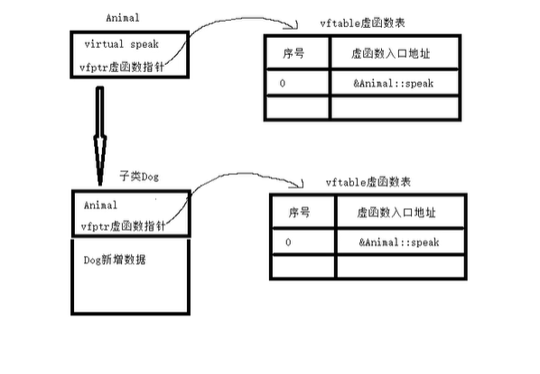

**当子类重写时**:

- 子类将会更新继承的虚函数记录表，使得父类指针调用函数时，虚函数表的函数入口地址已经更新为重写的函数

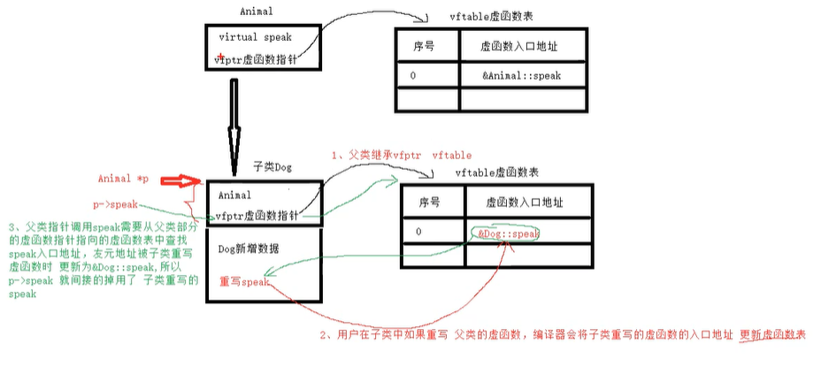

### 虚函数的原理分析

- 父类如果有虚函数，就会产生虚函数指针并指向虚函数表，表中纪录是父类的所有虚函数 的入口地址。
-  一旦父类 派生出 子类，子类就会继承父类的虚函数指针以及虚函数表。
- 如果子类重写父类的虚函数，就会将虚函数表中纪录的函数入口地址更新为重写的虚函数入口地址。 当用户使用父类指针 指向子类空间，且通过父类指针调用虚函数，就通过继承过来的虚函 数指针找到虚函数表，从中取出函数入口地址（子类重写的虚函数），间接的调用子类重 写的虚函数

## 重载、重定义、重写的区别

- **重载**：同一作用域，没有继承，函数名相同，函数的参数的个数、顺序、类型不同可以重 载，返回值类型不能作为重载条件。 
- **重定义**：有继承、子类重新定义 父类的同名函数（非虚函数），只需要函数名相同，就叫 重定义。 
- **重写**：继承时子类重写父类的虚函数， 返回值类型，函数名，形参必须和父类相同，函 数体不同

## 纯虚函数[抽象类]

**关键字virtual修饰没有函数体**，=0，这样的函数成为纯虚函数。

```c++
class Animal
{
    public:
    //纯虚函数
    virtualvoidspeak()=0;
};
```

- **如果一个类中有一个纯虚函数，该类就是抽象类，不能实例化对象**。 
- 如果子类不重写父类的所有纯虚函数，那么子类也是抽象类，也不能实例化对象。
-  **子类必须重写父类的所有纯虚函数**。

## 虚析构

- 析构函数被virtual修饰，称为虚析构。 
- 虚析构的目的：**通过父类指针释放子类的所有空间**。

```c++
class Animal
{
    public:
    Animal()
    {
        cout<<"Animal的构造函数"<<endl;
    }
    //虚析构
    virtual ~Animal()
    {
        cout<<"Animal的析构函数"<<endl;
    }
    //虚函数
    virtual void speak()
    {
        cout<<"动物在说话"<<endl;
    }
};
class Dog:public Animal
{
    public:
    Dog()
    {
        cout<<"Dog的构造函数"<<endl;
    }
    ~Dog()
    {
        cout<<"Dog的析构函数"<<endl;
    }
    virtual void speak()
    {
        cout<<"狗在汪汪"<<endl;
    }
};
int main(int argc, char *argv[])
{
    Animal *p = new Dog;
    p->speak();
    delete p;
    return 0;
}
```

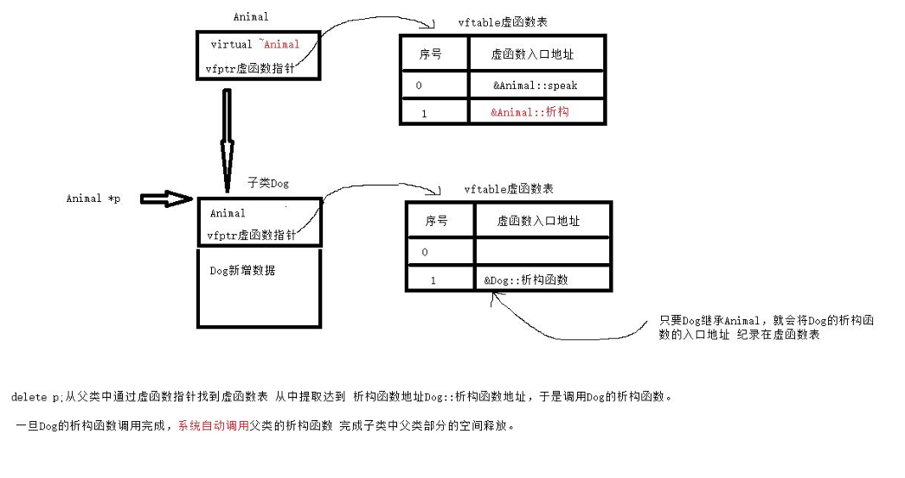

## 纯虚析构

纯虚析构：virtual 修饰 ，=0，类中声明，**类外实现析构的函数体**。

 纯虚析构所在的类是抽象

# 函数模板

## 概述

**模板的分类**：

- 函数模板
- 类模板

**关键字**：==**template**==

将函数用到的类型 用一个虚拟的T表示，这就是函数模板。

T 只作用当前函数或者类

```c++
//这里的模板只作用于 printAllType
template<typename T>
void printAllType(T a)
{
    cout<<a<<endl;
}
//上方只是换行习惯 这里 实际的写法 应该是
template<typename T,typename T1> void printAllType(T a,T1 b)
{
    cout<<a<<endl;
}

void test(){
    printAllType('a');  //a
    printAllType(1);    //1
}
```

## 函数模板会编译两次

- 第一次：对函数模板本生一个编译（将T看成真实的类型编译，编译阶段） 
- 第二次：在调用 根据实参 ==**推导**T的类型== 生成具体的函数。

## 函数模板 和 普通函数 的区别

- 函数模板和普通函数同时识别 **优先调用普通函数**。

  - ```c++
    template<typename T,typename T1> void printAllType(T a,T1 b)
    {
        cout<<"模板"<<endl;
    }
    printAllType(int a,int b)
    {
        cout<<"普通"<<endl;
    }
    
    void test(){
        printAllType(1,10);  //普通
        printAllType(1,'a');    //模板
    }
    ```

    

-  函数模板和普通函数同时识别 使用==<类型>==强制使用函数模板。

  - ```C++
    template<typename T> void printAllType(T a,T1 b)
    {
        cout<<"模板"<<endl;
    }
    printAllType(int a,int b)
    {
        cout<<"普通"<<endl;
    }
    
    void test(){
        printAllType<int>(1,10);  //强制使用模板并且类型为int
        printAllType<int>(1,'a');    //强制使用int，此时参数b会接受到 ASCII码值
    }
    ```

- 函数模板 不支持 自动类型转换。普通函数支持自动类型转换。
-  使用<>指定T的类型后， 函数模板才支持自动类型转换

## 函数模板和模板函数的区别

```c++
//这里其实应该叫做函数模板，并不是一个真正的函数
template<typename T> void printAllType(T a,T1 b)
{
    cout<<"模板"<<endl;
}

//经由编译器推导后，得出T的类型为int 于是会参数如下的模板函数
printAllType(int a,int b)
{
    cout<<"模板"<<endl;
}
void test(){
    printAllType(1,10);
}
```

## 函数模板的局限性

有时 函数模板 推导出T的类型后 也无法正常运行（主要是T为自定义类型）

解决方法一：**函数模板的参数具体化**（完成函数模板的第二步），这样当函数模板发现有无法直接使用的类型时，会之前去找具体化的模板

```c++
class Stu
{
    public:
    int num;
    string name;
    float score;
    public:
    Stu(){}
    Stu(int num,string name,float score)
    {
        this->num=num;
        this->name=name;
        this->score=score;
    }
};
template<typename T>
void printArrayAllType(T *arr,unsigned int n)
{
    int i=0;
    for(i=0;i<n;i++)
    {
        cout<<arr[i]<<"";
    }
    cout<<endl;
}
//方一：函数模板的参数具体化（完成函数模板的第二步）
template<>
void printArrayAllType(Stu*arr,unsigned int n)
{
    int i=0;
    for(i=0;i<n;i++)
    {
        cout<<arr[i].num<<""<<arr[i].name<<""<<arr[i].score<<endl;
    }
    cout<<endl;
}
void test03()
{
    int arr1[5]={10,20,30,40};   //调用为具体化的模板
    Stu edu[]={{100,"lucy",99.9f},{101,"bob",88.8f},{102,"tom",77.7f}}; //调用具体化的模板
    printArrayAllType(arr1,sizeof(arr1)/sizeof(arr1[0]));
    printArrayAllType(edu,sizeof(edu)/sizeof(edu[0]));
}
```

解决方法二：**重载输出运算符**

```c++
ostream &operator <<(ostream &out,Stu ob)
{
    out<<ob.num<<""<<ob.name<<""<<ob.score<<endl;
    return out;
}
```

# 类模板

类模板：将类中的类型抽象化用一个虚拟的T表示这样的类就叫类模板。

## 类模板的定义

```c++
template<class T1,class T2>
    class Data
    {
        private:
        T1 a;
        T2 b;
        public:
        Data(){}
        Data(T1 a,T2 b)
        {
            this->a=a;
            this->b=b;
        }
    };

```

## 类模板实例化

类模板实例化对象==不支持类型推导==,**必须显式指定T的类型**

```c++
template<class T1,class T2>
class Data
{
    private:
    T1 a;
    T2 b;
    public:
    Data(){}
    Data(T1 a,T2 b)
    {
        this->a=a;
        this->b=b;
    }
};
void test01()
{
    //Data ob1(10,'A');//err不支持类型推导
    //必须指定T的类型
    Data<int,char>ob1;
    Data<char,int>ob2('a',10);
}
```

## 类模板的成员函数在类外实现

```c++
template<class T1,class T2>
    class Data
    {
        private:
        T1 a;
        T2 b;
        public:
        Data(){}
        Data(T1 a,T2 b)
        {
            this->a=a;
            this->b=b;
        }
        void showData();
    };
//类外实现类模板的成员函数一定要注意Data<T1,T2>才是真正的类名称
template<class T1,class T2>
    void Data<T1,T2>::showData()
    {
        cout<<"a="<<a<<"b="<<b<<endl;
    }
void test01()
{
    //Dataob1(10,'A');//err不支持类型推导
    //必须指定T的类型
    Data<int,char>ob1;
    ob1.showData();
    Data<char,int>ob2('a',10);
    ob2.showData();
}
```

## 类模板分文件带来的问题（.hpp）

由于类模板分文件时 将函数声明 与 函数体 分开书写 导致在变量类型第一次被推导出来以后  ， 编译器根据推导出的类型去寻找 函数体 ，进而无法找到导致报错，所以类模板无法分文件书写

**解决方式**：

- 将分出去的函数体文件直接引入【导致不规范，不使用】
- 将分出去的函数体文件 写到 .h文件中，但是为了符合规范，需要将该.h文件设置为 <span style="color:red">**.hpp**</span>文件

## 类模板的继承

### 类模板 派生出 普通类

类模板必须指定T的类型（将类模板转换成普通类）

```c++
template<class T1, class T2>
    class Data
    {
        private:
        T1 a;
        T2 b;
        public:
        Data(){}
        Data(T1 a, T2 b)
        {
            this->a = a;
            this->b = b;
        }
        void showData()
        {
            cout<<"a="<<a<<",b="<<b<<endl;
        }
    };
//类模板派生出普通类
//类模板必须指定T的类型（将类模板转换成普通类）
class Son1:public Data<int,char>
{
    private:
    int c;
    public:
    Son1(){}
    Son1(int a,char b,int c):Data<int,char>(a,b)
    {
        this->c=c;
    }
    void showSon1()
    {
        showData();
        cout<<"c="<<c<<endl;
    }
};
void test01()
{
    Son1 ob1(10,'a',20);
    ob1.showSon1();
}
```

## 类模板的友元

### 普通全局函数作为友元

```c++
template<class T1,class T2>
    class Data
    {
        friend void printData01(Data<int,char>&ob);
        private:
        T1 a;
        T2 b;
        public:
        Data(){}
        Data(T1 a,T2 b)
        {
            this->a=a;
            this->b=b;
        }
    };
//普通函数作为友元(必须指明类模板的类型)
void printData01(Data<int,char>&ob)
{
    cout<<"a="<<ob.a<<",b="<<ob.b<<endl;
}
void test01()
{
    Data<int,char>ob1(100,'a');
    printData01(ob1);
}

```

### 函数模板作为类模板的友元

```c++
template<class T1,class T2>
    class Data
    {
        template<typename T3,typename T4>
        friend void printData01(Data< T3,T4r>&ob);
        private:
        T1 a;
        T2 b;
        public:
        Data(){}
        Data(T1 a,T2 b)
        {
            this->a=a;
            this->b=b;
        }
    };
//普通函数作为友元(必须指明类模板的类型)
template<typename T3,typename T4>
void printData01(Data<T3,T4>&ob)
{
    cout<<"a="<<ob.a<<",b="<<ob.b<<endl;
}
void test01()
{
    Data<int,char>ob1(100,'a');
    printData01(ob1);
}
```

# 类型转换

## 上行和下行转换的问题

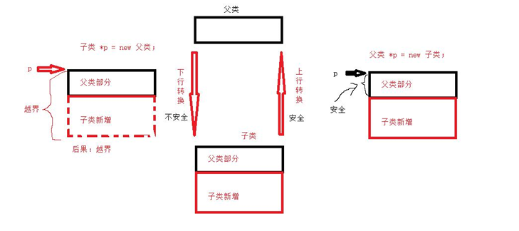

## 静态类型转换(static_cast）

```c++
class Base{};
class Son:public Base{};
class Other{};
void test01()
{
    //1、基本类型间的转换(支持)
    int num = 0;
    double d = 3.14;
    num=static_cast<int>(d);
    //2、基类指针类型的转换(不支持)
    //int *p1 = static_cast<int *>(&d); //报错
    //3、上行转换(支持)
    Base *p2 = static_cast<Base *>(new Son);
    //4、下行转换(支持)
    Son *p3 = static_cast<Son *>(new Base);
    //5、不相关类型转换(不支持)
    //Son *p4 = static_cast<Son *>(new Other);
}

```

## 动态转换(dynamic_cast)

```c++
void test02()
{
    //1、基本类型间的转换(不支持)
    int num=0;
    double d=3.14;
    //num=dynamic_cast<int>(d);
    //2、基类指针类型的转换(不支持)
    //int*p1=dynamic_cast<int*>(&d);
    //3、上行转换(支持)
    Base*p2=dynamic_cast<Base*>(newSon);
    //4、下行转换(不支持)
    //Son*p3=dynamic_cast<Son*>(newBase);
    //5、不相关类型转换(不支持)
    //Son*p4=dynamic_cast<Son*>(newOther);
}
```

## 常量转换(const_cast)

一般用来**解除const 或者 追加const**。

```c++
void test(){
    const int data=10;
    int *p=const_cast<int *>(&data);
    int num=10;
    const int *p1=const_cast<const int *><& num>
}
```

## 重新解释转换(reinterpret_cast

这是最不安全的一种转换机制，最有可能出问题。

```c++
void test02()
{
    //1、基本类型间的转换(不支持)
    int num=0;
    double d=3.14;
    //num=reinterpret_cast<int>(d);
    //2、基类指针类型的转换(支持)
    int*p1=reinterpret_cast<int*>(&d);
    //3、上行转换(支持)
    Base *p2 = reinterpret_cast<Base *>(new Son);
    //4、下行转换(支持)
    Son *p3 = reinterpret_cast<Son *>(new Base);
    //5、不相关类型转换(支持)
    Son *p4 = reinterpret_cast<Son *>(new Other);
}
```

# 异常

## 概述

- 程序运行的过程中发生的一些异常事件（如：除0溢出，数组下标越界，所要读取的文 件不存在,空指针，内存不足等等）。
-  C++的异常不可忽略，如果用户忽略，系统检查到异常一般都是结束进程。

**C语言的异常处理方式**：

在C语言的世界中，对错误的处理总是围绕着两种方法：

-  一是使用整型的返回值标识错误；
-  二是使用**errno**宏（可以简单的理解为一个全局整型变量）去记录错误

## 异常的基本语法

```c++
try//试着捕获异常
{
    //抛出异常
    throw 10;
}
catch(异常类型 异常变量)//关心的异常类型
{
    //自己的任务
}
```

```c++
try
{
    throw 'a';
}
catch(int num)
{
    cout<<"捕获到int类型异常num="<<num<<endl;
}
catch(char ch)
{
    cout<<"捕获到char类型异常ch="<<ch<<endl;
}
catch(...)
{
    cout<<"其他异常了"<<endl;
}


// 打印   捕获到char类型异常ch=a
```

## 抛出基本的异常类型

```c++
int my_div(int a,int b)
{
    if(b==0)
        throw -1;
    return a/b;
}
void test02()
{
    try
    {
        int ret=0;
        ret=my_div(10,0);
        cout<<"ret="<<ret<<endl;
    }
    catch(int e)
    {
        cout<<"异常值为:"<<e<<endl;
    }
}
```

## 栈解旋(unwinding)

异常被抛出后，从进入try块起，到异常被抛掷前，这期间在栈上构造的所有对象，都会被自动析构。

析构的顺序与构造的顺序相反，这一过程称为栈的解旋(unwinding)

```c++
class Data
{
    public:
    int a;
    public:
    Data (){}
    Data(int a)
    {
        this->a=a;
        cout<<"构造函数a="<<a<<endl;
    }
    ~Data()
    {
        cout<<"析构函数a="<<a<<endl;
    }
};
voidtest03()
{
    try
    {
        Data ob1(10);
        Data ob2(20);
        Data ob3(30);
        throw 10;//抛出异常
    }
    catch(inte)
    {
        cout<<"int异常了e="<<e<<endl;
    }
}


//打印：
//构造函数a=10
//构造函数a=20
//构造函数a=30
//析构函数a=30
//析构函数a=20
//析构函数a=10
//int异常了e=10
```

## 异常接口声明

```c++
//函数默认可以抛出任何类型
//void func()

//func只能抛出int或char类型异常
//void func()throw(int,char)

//func不能抛出任何异常
void func()throw()   //此时因为所有异常都不能抛出，只会在编译器报错
{
    throw 10;
    //throw'a';
    //throw3.14;
}
void test04()
{
    try
    {
        func();
    }
    catch(int e)
    {
        cout<<"int异常了e="<<e<<endl;
    }
    catch(char e)
    {
        cout<<"char异常了e="<<e<<endl;
    }
    catch(double e)
    {
        cout<<"double异常了e="<<e<<endl;
    }
    catch(...)
    {
        cout<<"其他异常"<<endl;
    }
}
```

## 异常变量生命周期

建议一般使用引用获取异常的值。

```c++
class MyExplicit
{
    public:
    MyExplicit()
    {
        cout<<"MyExplicit构造了"<<endl;
    }
    MyExplicit(const MyExplicit &ob)
    {
        cout<<"MyExplicit拷贝构造了"<<endl;
    }
    ~MyExplicit()
    {
        cout<<"MyExplicit析构了"<<endl;
    }
};
void test05()
{
    try
    {
        throw MyExplicit();
    }
    //   try  
    //   {
    //   这里会触发两次MyExplicit的拷贝构造，首先throw  ob1会先将 ob1的值赋值给一个临时空间，然后在赋值给catch中接受的变量，因此触发了两次拷贝
    //       MyExplicit  ob1;
    //       throw  ob1
    //   }
    //catch(MyExplicit ob)//用普通对象接异常值会发生拷贝构造
    //catch(MyExplicit *p)//使用对象指针变量解堆区异常需要手动释放
    catch(MyExplicit &e)//推荐引用解异常值
    {
        //deletep;
    }
}
```

## 异常的多态使用

目的：建议使用 父类异常的引用 获取子类的异常值。

```c++
//假设：Base是所有异常的父类
class Base
{
    public:
    virtual void what()
    {
        cout<<"我是父类异常"<<endl;
    }
};
class Son1:public Base
{
    public:
    virtual void what()
    {
        cout<<"我是Son1异常"<<endl;
    }
};
class Son2:public Base
{
    public:
    virtual void what()
    {
        cout<<"我是 Son2 异常"<<endl;
    }
};
class Son3:public Base
{
    public:
    virtual void what()
    {
        cout<<"我是 Son3 异常"<<endl;
    }
};
void test01()
{
    try
    {
        throw Son3();
    }
    catch(Base &e)//建议使用父类异常的引用 获取子类的异常值
    {
        e.what();
    }
}
```

## 标准异常类的应用

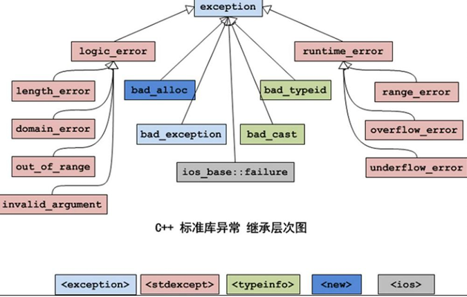

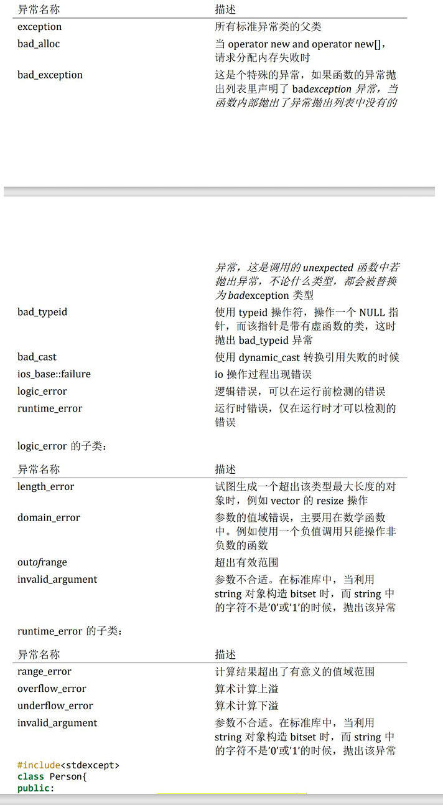

```c++
#include<exception>   //需要引入该库
int arr[5]={10,20,30,40,50};
int getArrayElem(int pos)
{
    if(pos<0||pos>=5)
    {
        throw out_of_range("数组下标越界");
    }
    returnarr[pos];
}
void test02()
{
    try
    {
        cout<<getArrayElem(100)<<endl;  //数组下标越界
    }
    catch(exception &e)
    {
        cout<<e.what()<<endl;
    }
}
```

## 通过标准的异常类扩展出自己的标准异常类

```c++
#include<exception>
//1、公共继承标准的异常类exception
class MyException:public exception
{
    private:
    string msg;
    public:
    MyException(){}
    MyException(string msg)
    {
        this->msg=msg;
    }
    //2、必须重写exception的what,防止父类抛出异常
    virtual const char* what() const throw()
    {
        return msg.c_str();
    }
};

int arr[5]={10,20,30,40,50};
int getArrayElem(int pos)
{
    if(pos<0||pos>=5)
    {
        throw MyException("数组下标越界,哈哈");
    }
    return arr[pos];
}
void test02()
{
    try
    {
        cout<<getArrayElem(100)<<endl;
    }
    catch(exception &e)
    {
        cout<<e.what()<<endl;
    }
}
```

# STL

STL(Standard Template Library,标准模板库)

## STL的六大组件

- 容器：存放数据 
- 算法：操作数据 
- 迭代器：算法 通过迭代器 操作容器

- 仿函数：是为算法 提供策略。
- 适配器：为算法提供更多接口 
- 空间配置器：自动管理算法或容器空间

## 质变算法和非质变算法

- **质变算法**：是指运算过程中会更改区间内的元素的内容。例如拷贝，替换，删除等 等 
- **非质变算法**：是指运算过程中不会更改区间内的元素内容，例如查找、计数、遍 历、寻找 极值等等

## 迭代器的分类

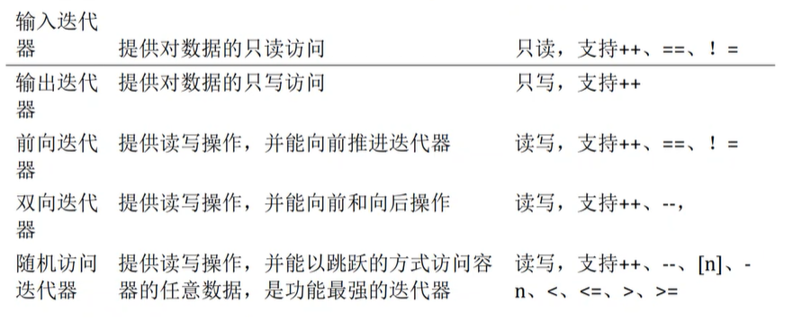

## string类

string它是一个可以操作字符串的类

### string构造函数

```c++
/*
 3.1.2.1string构造函数
string();//创建一个空的字符串例如:stringstr;
 string(conststring&str);//使用一个string对象初始化另一个string对象
string(constchar*s);//使用字符串s初始化
string(intn,charc);//使用n个字符c初始化v
 */
void test01()
{
    string str1("hello world");
    cout<<str1<<endl;//hello world
    string str2(10,'H');
    cout<<str2<<endl;//HHHHHHHHHH
}
```

### string的赋值

```c++
string& operator=(const char*s);//char*类型字符串赋值给当前的字符串
string& operator=(const string &s);//把字符串s赋给当前的字符串
string& operator=(char c);//字符赋值给当前的字符串
string& assign(const char*s);//把字符串s赋给当前的字符串
string& assign(const char*s, int n);//把字符串s的前n个字符赋给当前的字符串
string& assign(const string &s);//把字符串s赋给当前字符串
string& assign(int n,char c);//用n个字符c赋给当前字符串
string& assign(const string &s, int start,int n);//将s从start开始n个字符赋值给字符串
```

```c++
void test02()
{
    string str1;  
    str1="hello world"; //这里重载了=，string& operator=(const char*s)，下同
    string str2;
    str2=str1; //重载
    string str3;
    str3='H';
    cout<<str1<<endl;//"hello world"
    cout<<str2<<endl;//"hello world"
    cout<<str3<<endl;//'H'
    string str4;
    str4.assign("hello world",5);
    cout<<str4<<endl;//"hello"
    string str5;
    str5.assign(10,'G');
    cout<<str5<<endl;//GGGGGGGGGG
    string str6="helloworld";
    string str7;
    str7.assign(str6,3,4);
    cout<<str7<<endl;//low
}
```

### string存取字符操作

- ==[]==如果越界**不会抛出异常**
- ==at==越界**会抛出异常**

```c++
char &operator[](int n);//通过[]方式取字符 
char &at(int n);//通过at方法获取字符
```

```c++
/*
string存取字符操作
char&operator[](int n);//通过[]方式取字符
char&at(int n);//通过at方法获取字符
*/
void test03()
{
    string str1="hello world";
    str1[4]='H';
    cout<<str1[4]<<endl;//'H'
    cout<<str1<<endl;//hellH world
    str1.at(1)='E';
    cout<<str1<<endl;//hEllH world
    //[]如果越界不会抛出异常at越界会抛出异常
    try
    {
        //str1[1000]='H';//无异常
        str1.at(1000)='h';//有异常
    }
    catch(exception &e)
    {
        cout<<e.what()<<endl;
    }
}
```

### string拼接操作

```c++
string& operator+=(const string &str);//重载+=操作符
string& operator+=(const char *str);//重载+=操作符
string& operator+=(constcharc);//重载+=操作符

string& append(constchar*s);//把字符串s连接到当前字符串结尾
string& append(const char*s,intn);//把字符串s的前n个字符连接到当前字符串结尾

string& append(const string &s);//同operator+=()

string& append(const string &s,int pos,int n);//把字符串s中从pos开始的n个字符连接到当前字符串结尾 

string&append(int n,char c);//在当前字符串结尾添加n个字符c

```

### string查找和替换

```c++
int find(const string &str,int pos=0)const;//查找str第一次出现位置,从pos开始查找

int find(const char*s,int pos=0)const;//查找s第一次出现位置,从pos开始查找

int find(const char*s,int pos,int n)const;//从pos位置查找s的前n个字符第一次位置

int find(const char c,int pos=0)const;//查找字符c第一次出现位置

int rfind(const string&str, int pos=npos)const;//查找str最后一次位置,从pos开始查找

int rfind(const char*s,int pos=npos)const;//查找s最后一次出现位置,从pos开始查找

int rfind(const char*s,int pos,int n)const;//从pos查找s的前n个字符最后一次位置

int rfind(const cha rc,int pos=0)const;//查找字符c最后一次出现位置

string &replace(int pos,int n,const string&str);//替换从pos开始n个字符为字符串str

string &replace(int pos,int n,const char*s);//替换从pos开始的n个字符为字符串s


string str1="hello world";
string str2="wor";
int ret=str1.find(str2);
cout<<"ret="<<ret<<endl;//6

```

### string比较操作

```c++
//compare函数在>时返回1，<时返回-1，==时返回0
//比较区分大小写，比较时参考字典顺序，排越前面的越小。大写的A比小写的a小。
int compare(const string &s)const;//与字符串s比较
int compare(const char *s)const;//与字符串s比较
void test()
{
    string str1="hello";
    string str2="world";
    if(str1.compare(str2)==0)
    {
        cout<<"相等"<<endl;
    }
    else if(str1.compare(str2)>0)
    {
        cout<<"大于"<<endl;
    }
}
```

### string子串

```c++
string substr(int pos=0,int n=npos)const;//返回由pos开始的n个字符组成的字符串

string &insert(int pos,const char*s);//插入字符串
string &insert(int pos,const string &str);//插入字符串
string &insert(int pos,int n,char c);//在指定位置插入n个字符c
string &erase(int pos,int n=npos);//删除从Pos开始的n个

void test()
{
    string str1="hello world";
    cout<<str1.substr(2,3)<<endl;//llo
    string str2="hehehe:xixixi:lalalalala:heiheiheihei";
    int s=0;
    while(1)
    {
        int ret=str2.find(":",s);
        if(ret==-1)
        {
            cout<<str2.substr(s,str2.size()-s)<<endl;
            break;
        }
        cout<<str2.substr(s,ret-s)<<endl;
        s=ret+1;
    }
    string str3="hello world";
    str3.insert(4,"*****");
    cout<<str3<<endl;//hell*****o world
    str3.erase(4,5);
    cout<<str3<<endl;//hello world
}
```

### string 截取 split

```c++
QStringList list=str_msg.split('\n');   //按照给定字符截取为数组
for(int i=0;i<list.size();i++){
    QStringList list2=list[i].split(",");
    Mumap.insert(make_pair(list2[0],list2[1]));
}
```


### string 和 c 字符串的转换 c_str()

```c++
void test08(){
    //c风格的字符串
    char *str1="hello world";
    string str2=str1;
    cout<<str2<<endl;
    //string转换成c风格字符串
    string str3="hello world" ;
    const char *p = str3.c_str();
    cout<<"p="<<p<<endl;
}

```

### QString 和 c 字符串的转换 

```c++
char *p;
QByteArray ba = data->usename.toLatin1();
p=ba.data();
```


## vector容器

### 概述

vector容器是：

- ==**单端动态数组**==容器【只能在一端操作】。
- 是类模板。
- 迭代器是随机访问迭代器。

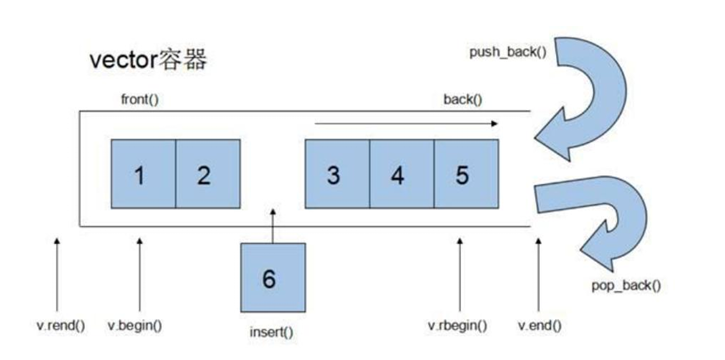

- push_back() ：尾部插入数据、
- pop_back()：尾部删除数据、
- front()：返回的是头元素、
- back() ：返回的 是尾元素。
- v.begin() ：返回的是起始迭代器,指向的是第0个元素的位置。
- v.end() ：返回的是结束迭代器，指向的是尾元素的下一个元素的位置。 
- insert()： 插入函数。
-  vector 容器的空间是连续的。

### 定义迭代器

```c++
 容器<容器类型>::iterator 变量名=v.begin();
```

```c++
 vector<int>::iterator it=v.begin();
```


### vector 构造函数

```c++
#include <iostream>
#include <vector>
using namespace std;
/*
 vector<T> v; //采用模板实现类实现，默认构造函数
vector(v.begin(), v.end());//将 v[begin(), end())区间中的元素拷贝给本身。
vector(n, elem);//构造函数将 n 个 elem 拷贝给本身。
vector(const vector &vec);//拷贝构造函数。
*/
void printVectorInt(vector<int> &v)
{
    //遍历v1容器
    //定义迭代器
    vector<int>::iterator it=v.begin(); //指向v向量的开始位置
    for(;it!=v.end();it++)
    {
        //*it 的类型为int
        //*it 代表的就是容器元素的内容
        cout<<*it<<" ";
    }
    cout<<endl;
}
void test01()
{
    vector<int>v1(5,100);
    cout<<"大小:"<<v1.size()<<"容量:"<<v1.capacity()<<endl;     //大小: 5 容量:5
    v1.push_back(200);
    cout<<"大小:"<<v1.size()<<"容量:"<<v1.capacity()<<endl;    /// 大小: 6 容量: 10    这里因为容量翻了一倍
    printVectorInt(v1);
    vector<int>v2(v1.begin(),v1.end());  //将v1拷贝给了v2
    printVectorInt(v2);
}
```

### vector常用赋值操作

**vector常用赋值操作**：

```c++
assign(beg,end);//将[beg,end)区间中的数据拷贝赋值给本身。
assign(n,elem);//将n个elem拷贝赋值给本身。
vector &operator=(const vector &vec);//重载等号操作符
swap(vec);//将vec与本身的元素互换。
```

**vector大小操作**：

```c++
size();//返回容器中元素的个数
empty();//判断容器是否为空,如果是空则返回为真
resize(int num);//重新指定容器的长度为num，若容器变长，则以默认值填充新位置。如果容器变短，则末尾超出容器长度的元素被删除。
resize(int num,elem);//重新指定容器的长度为num，若容器变长，则以elem值填充新位置。如果容器变短，则末尾超出容器长>度的元素被删除。
capacity();//容器的容量
reserve(int len);//容器预留len个元素长度，预留位置不初始化，元素不可访问。
```

```c++
void test02()
{
    vector<int>v1(5,10);
    printVectorInt(v1);//10 10 10 10 10
    vector<int>v2;
    v2.assign(v1.begin(),v1.end());
    printVectorInt(v2);//10 10 10 10 10
    vector<int>v3(10,5);
    printVectorInt(v3);//5 5 5 5 5 5 5 5 5 5
    v2.swap(v3);
    printVectorInt(v2);//5 5 5 5 5 5 5 5 5 5
    printVectorInt(v3);//10 10 10 10 10
    vector<int> v4(5,10);
    printVectorInt(v4);//10 10 10 10 10
    //resize 功能扩展容器大小 过大默认补0
    v4.resize(10);
    printVectorInt(v4);//10 10 10 10 10 0 0 0 0 0
    //resize 功能扩展容器大小 过大默认补200
    v3.resize(10,200);
    printVectorInt(v3);//10 10 10 10 10 200 200 200 200 200
    v3.resize(3);
    printVectorInt(v3);//10 10 10
}
```

### 预留空间 reserve

```c++
void testo3(){
    vector<int> v1;//预留1000容量
    v1.reserve (1000);
    vector<int> ::iterator it;
    int i=0;
    for(i=0;i<1000;i++){
        v1.push_back(i);
        if(it != v1.begin()){
            cout<<"size="<<v1.size()<<"容量: "<<v1.capacity( )<<endl;
            it=v1.begin();
        }
    }
//打印结果 size=1 容量: 1000
```

### vector数据存取操作

**vector数据存取操作**：

```c++
at(int idx);//返回索引idx所指的数据，如果idx越界，抛出out_of_range异常。
operator[];//返回索引idx所指的数据，越界时，运行直接报错
front();//返回容器中第一个数据元素
back();//返回容器中最后一个数据元素
```

**vector插入和删除操作**：

```c++
insert(const_iterator pos,int count,ele);//迭代器指向位置pos插入count个元素ele.
push_back(ele);//尾部插入元素ele
pop_back();//删除最后一个元素
erase(const_iterator start,const_iterator end);//删除迭代器从start到end之间的元素
erase(const_iterator pos);//删除迭代器指向的元素
clear();//删除容器中所有元素
```

### 巧用swap函数收缩空间

```c++
void test()
{
    vector<int>v1;
    v1.reserve(1000);//预留1000个元素
    v1.push_back(10);
    v1.push_back(20);
    v1.push_back(30);
    v1.push_back(40);
    v1.push_back(50);
    cout<<"size="<<v1.size()<<",容量="<<v1.capacity()<<endl;//size=5,容量=1000
    //resize无法修改已有的容量大小
    //v1.resize(5);
    //cout<<"size="<<v1.size()<<",容量="<<v1.capacity()<<endl;//size=5,容量=1000
    vector<int>(v1).swap(v1);
    cout<<"size="<<v1.size()<<",容量="<<v1.capacity()<<endl;//size=5,容量=5
}

```

### vector容器嵌套容器

```c++
vector< vector<int> >::iteratorit=v.begin();
for(;it!=v.end();it++)
{
    //*it==vector<int>
    vector<int>::iteratormit=(*it).begin();
    for(;mit!=(*it).end();mit++)
    {
        cout<<*mit<<"";
    }
    cout<<endl;
}
```

### 存放自定义数据

```c++
#include<string>
class Person
{
    friend void test();
    private:
    int num;
    string name;
    double score;
    public:
    Person(){}
    Person(int num,string name,double score)
    {
        this->num=num;
        this->name=name;
        this->score=score;
    }
}

void test()
{
    vector<Person>v1;
    v1.push_back(Person(100,"lucy",99.9));
    v1.push_back(Person(101,"bob",88.9));
    v1.push_back(Person(102,"tom",77.9));
    v1.push_back(Person(103,"德玛",66.9));
    v1.push_back(Person(104,"小炮",55.9));
    vector<Person>::iteratorit=v1.begin();
    for(;it!=v1.end();it++)
    {
        cout<<(*it).num<<" "<<(*it).name<<" "<<(*it).score<<endl;

    }
}
```

## deque容器

- deque 容器是**双端动态数组**，迭代器也是随机访问迭代器。 
- Vector 容器是单向开口的连续内存空间，deque 则是一种双向开口的连续线性空 间。

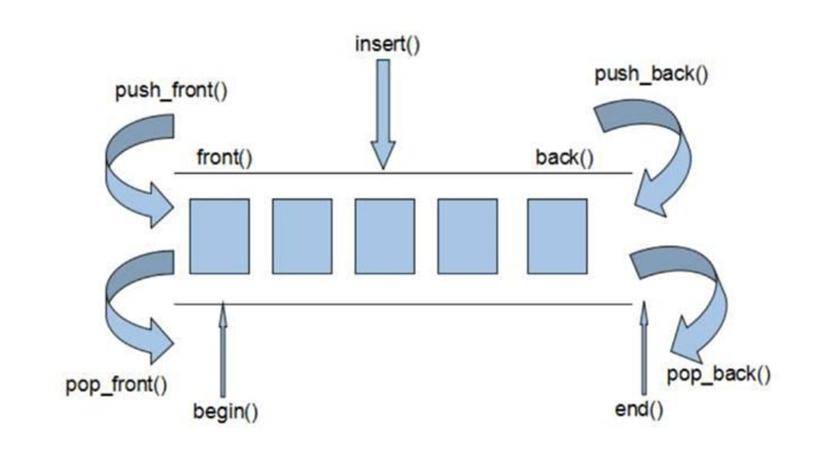

### deque 容器和 vector 容器最大的差异

- 一在于 deque 允许使用常数项时间对头尾端进行元素的插入和删除操作。
-  二在于 deque 没有容量的概念，因为它是动态的以==**分段连续空间组合而成**==，随时可以增加一段新的空间并链接起来

### deque构造函数

```c++
deque<T>deqT;//默认构造形式
deque(beg,end);//构造函数将[beg,end)区间中的元素拷贝给本身。
deque(n,elem);//构造函数将n个elem拷贝给本身。
deque(const deque &deq);//拷贝构造函数。
```

### deque赋值操作

```c++
assign(beg,end);//将[beg,end)区间中的数据拷贝赋值给本身。
assign(n,elem);//将n个elem拷贝赋值给本身。
deque&operator=(const deque&deq);//重载等号操作符
swap(deq);//将deq与本身的元素互换
```

### deque大小操作

```c++
deque.size();//返回容器中元素的个数
deque.empty();//判断容器是否为空
deque.resize(num);//重新指定容器的长度为num,若容器变长，则以默认值填充新位置。如果容器变短，则末尾超出容器长度的元素被删除。
deque.resize(num,elem);//重新指定容器的长度为num,若容器变长，则以elem值填充新位置,如果容器变短，则末尾超出容器长度的元素被删除。
```

### 双端插入和删除操作

```c++
push_back(elem);//在容器尾部添加一个数据
push_front(elem);//在容器头部插入一个数据
pop_back();//删除容器最后一个数据
pop_front();//删除容器第一个数据
```

### deque数据存取

```c++
at(idx);//返回索引idx所指的数据，如果idx越界，抛出out_of_range。
operator[];//返回索引idx所指的数据，如果idx越界，不抛出异常，直接出错。
front();//返回第一个数据。
```

### deque插入操作

```c++
insert(pos,elem);//在pos位置插入一个elem元素的拷贝，返回新数据的位置。
insert(pos,n,elem);//在pos位置插入n个elem数据，无返回值。
insert(pos,beg,end);//在pos位置插入[beg,end]区间的数据，无返回值。
```

### deque删除操作

```c++
clear();//移除容器的所有数据
erase(beg,end);//删除[beg,end)区间的数据，返回下一个数据的位置。
erase(pos);//删除pos位置的数据，返回下一个数据的位置。
```

## stack容器

stack 容器为栈容器。 

stack 是一种先进后出(FirstInLastOut,FILO)的数据结构，它只有一个出口。

栈顶：操作数据的一端叫做栈顶另一端叫栈底。 

push入栈，pop出栈，top永远指向栈顶元素。 

stack 容器没有迭代器，**==不支持遍历行为==**。

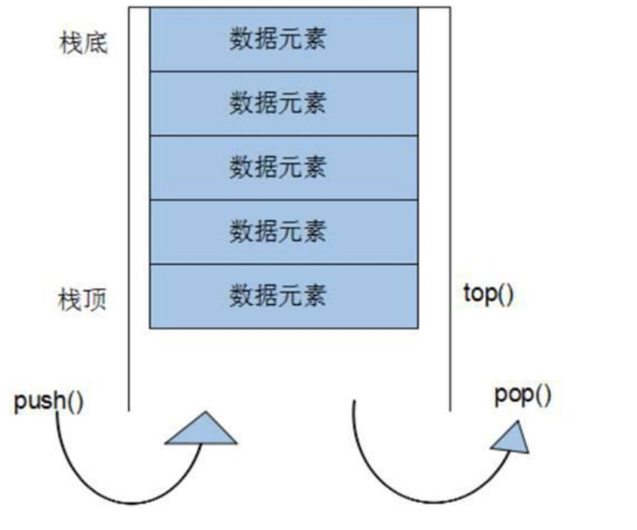

### stack构造函数

```c++
stack<T> stkT;//stack采用模板类实现，stack对象的默认构造形式：
stack(const stack &stk);//拷贝构造函数
```

### stack赋值操作

```c++
stack&operator=(conststack&stk);//重载等号操作符
```

### stack数据存取操作

```c++
push(elem);//向栈顶添加元素
pop();//从栈顶移除第一个元素
top();//返回栈顶元素
```

### stack大小操作

```c++
empty();//判断堆栈是否为空
size();//返回堆栈的大小
```

```c++
int main(int argc,char*argv[])
{
    stack<int>s;
    s.push(10);
    s.push(20);
    s.push(30);
    s.push(40);
    s.push(50);
    if(!s.empty())
    {
        cout<<"大小:"<<s.size()<<endl;
        while(!s.empty())//只要s不为空
        {
            cout<<s.top()<<"";//访问栈顶元素
            //出栈
            s.pop();
        }
    }
    return 0;
}

```

## queue队列容器

Queue 是一种先进先出(FirstInFirstOut,FIFO)的数据结构，它有两个出口

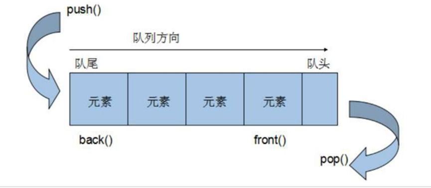

- push:入队， 插入数据的一端叫做队尾。
- pop:出队， 出队的一端叫队头。
- back() 返回的是尾元素，
- front（）返回的是头元素。
-  队列容器 没有迭代器， ==**不支持遍历行为**==。

### queue构造函数

```c++
queue<T> queT;//queue 采用模板类实现，queue 对象的默认构造形式：
queue(const queue &que);//拷贝构造函数
```

### queue存取、插入和删除操作

```c++
push(elem);//往队尾添加元素
pop();//从队头移除第一个元素
back();//返回最后一个元素
front();//返回第一个元素
```

### queue 赋值操作

```c++
queue& operator=(const queue &que);//重载等号操作符
```

### queue大小操作

```c++
empty();//判断队列是否为空
size();//返回队列的大小
```

## list链表容器

List 容器是一个双向链表

list容器的迭代器是双向迭代器不支持+1，+2，只有随机访问迭代器支持+1，+2，但是它支持 **++**

```c++
list<int>::iteratorit=l1.begin();
it++;
it++
```

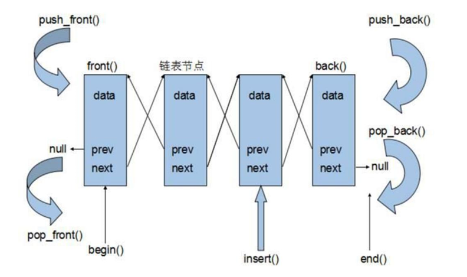

### list构造函数

```c++
list<T>lstT;//list采用采用模板类实现,对象的默认构造形式：
list(beg,end);//构造函数将[beg,end)区间中的元素拷贝给本身。
list(n,elem);//构造函数将n个elem拷贝给本身。
list(constlist&lst);//拷贝构造函数。
```

### list数据元素插入和删除操作

```c++
push_back(elem);//在容器尾部加入一个元素
pop_back();//删除容器中最后一个元素
push_front(elem);//在容器开头插入一个元素
pop_front();//从容器开头移除第一个元素
insert(pos,elem);//在pos位置插elem元素的拷贝，返回新数据的位置。
insert(pos,n,elem);//在pos位置插入n个elem数据，无返回值。
insert(pos,beg,end);//在pos位置插入[beg,end)区间的数据，无返回值。
clear();//移除容器的所有数据
erase(beg,end);//删除[beg,end)区间的数据，返回下一个数据的位置。
erase(pos);//删除pos位置的数据，返回下一个数据的位置。
remove(elem);//删除容器中所有与elem值匹配的元素
```

### list大小操作

```c++
size();//返回容器中元素的个数
empty();//判断容器是否为空
resize(num);//重新指定容器的长度为num,若容器变长，则以默认值填充新位置。如果容器变短，则末尾超出容器长度的元素被删除。
resize(num,elem);//重新指定容器的长度为num，若容器变长，则以elem值填充新位置。如果容器变短，则末尾超出容器长度的元素被删除。
```

### list赋值操作

```c++
assign(beg,end);//将[beg,end)区间中的数据拷贝赋值给本身。
assign(n,elem);//将n个elem拷贝赋值给本身。
list&operator=(const list&lst);//重载等号操作符
swap(lst);//将lst与本身的元素互换。
```

### list数据的存取

```c++
front();//返回第一个元素。
back();//返回最后一个元素。
```

### list反转排序

```c++
reverse();//反转链表，比如lst包含1,3,5元素，运行此方法后，lst就包含5,3,1元素。
sort();//list排序
```

## set/multiset容器

- set 的特性是：**所有元素都会根据元素的键值自动被排序**。
- set 的元素即是键值又是实值。（set容器只有键值）
- set 容器**不允许有重复的键值**。 
- set 容器不允许修改键值，会破坏set容器的排序规则。
- set容器的迭代器为只读迭代器。
- **multiset容器的键值允许重复**。

### set构造函数

```c++
set<T>st;//set默认构造函数：
mulitset<T>mst;//multiset默认构造函数:
 set(constset&st);//拷贝构造函数
```

### set赋值操作

```c++
set&operator=(const set&st);//重载等号操作符
swap(st);//交换两个集合容器
```

### set大小操作

```c++
size();//返回容器中元素的数目
empty();//判断容器是否为空
```

### set插入和删除操作

```c++
insert(elem);//在容器中插入元素。
clear();//清除所有元素
erase(pos);//删除pos迭代器所指的元素，返回下一个元素的迭代器。
erase(beg,end);//删除区间[beg,end]的所有元素，返回下一个元素的迭代器。
erase(elem);//删除容器中值为elem的元素。
```

### set查找操作

```c++
find(key);//查找键key是否存在,若存在，返回该键的元素的迭代器；若不存在，返回set.end();
 count(key);//查找键key的元素个数
```

```c++
void printSetInt(set<int>&s)
{
    set<int>::iterator it=s.begin();
    for(;it!=s.end();it++)
    {
        cout<<*it<<"";
    }
    cout<<endl;
}
voidtest01()
{
    set<int>s1;
    s1.insert(30);
    s1.insert(40);
    s1.insert(10);
    s1.insert(50);
    s1.insert(20);
    printSetInt(s1);//10 20 30 40 50
    s1.erase(20);
    printSetInt(s1);//10 30 40 50
    set<int>::const_iteratorret;
    ret=s1.find(40);
    if(ret!=s1.end())
    {
        cout<<"寻找的结果:"<<*ret<<endl;//40
    }
    //count(key);//查找键key的元素个数结果只会是0或1
    cout<<s1.count(40)<<endl;//1
      cout<<s1.count(400)<<endl;//0
}
```

### 修改set容器的排序规则

```c++
 set<int,自定义规则仿函数>
```

```c++
class MyGreater
{
    public:
    bool operator()(int v1,int v2)
    {
        return v1>v2;
    }
};
void printSetInt(set<int,MyGreater>&s)
{
    set<int,MyGreater>::iteratorit=s.begin();
    for(;it!=s.end();it++)
    {
        cout<<*it<<"";
    }
    cout<<endl;
}
voidtest02()
{
    //set<int,规则>s1;
    set<int,MyGreater>s1;
    s1.insert(30);
    s1.insert(40);
    s1.insert(10);
    s1.insert(50);
    s1.insert(20);
    printSetInt(s1);//50 40 30 20 10
}
```

### set容器存放自定义数据必须修改排序规则

```c++
#include<string>
#include<set>
class PersonLess; //向前声明
class Person
{
    friend class PersonLess;
    friend void printSetPerson(set<Person,PersonLess>&s);
    private:
    int num;
    string name;
    double score;
    public:
    Person(){}
    Person(int num,string name,double score)
    {
        this->num=num;
        this->name=name;
        this->score=score;
    }
    #if 0//不用修改排序规则直接重载<运算符，不建议
    bool operator<(const Person ob)const
    {
        return num<ob.num;
    }
    #endif
};
//使用排序规则
class PersonLess
{
    public:
    bool operator()(Person ob1,Person ob2)
    {
        //如果学号相等按成绩插入
        if(ob1.num==ob2.num)
            return ob1.score>ob2.score;
        //优先按学号插入
        return ob1.num<ob2.num;
    }
};
void printSetPerson(set<Person,PersonLess>&s)
{
    set<Person,PersonLess>::const_iterator it=s.begin();
    for(;it!=s.end();it++)
    {
        cout<<(*it).num<<" "<<(*it).name<<" "<<(*it).score<<endl;
    }
}
void test03()
{
    set<Person,PersonLess> s1;
    s1.insert(Person(101,"lucy", 99.9));
    s1.insert(Person(105,"德玛", 88.9));
    s1.insert(Person(104,"小法", 77.9));
    s1.insert(Person(101,"tom", 66.9));
    s1.insert(Person(103,"bob", 55.9));
    printSetPerson(s1);
}
```


### set容器的上下限的问题

```c++
lower_bound(keyElem);//下限：返回第一个 key>=keyElem 元素的迭代器。
upper_bound(keyElem);//上限：返回第一个 key>keyElem 元素的迭代器。
equal_range(keyElem);//返回容器中key与keyElem相等的上下限的两个迭代器
```

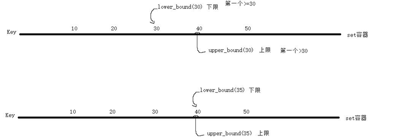

```c++
void test04()
{
    set<int>s1;
    s1.insert(30);
    s1.insert(40);
    s1.insert(10);
    s1.insert(50);
    s1.insert(20);
    printSetInt(s1);//1020304050
    //寻找下限
    set<int>::const_iterator ret;
    ret=s1.lower_bound(30);
    if(ret!=s1.end())
    {
        cout<<"下限:"<<*ret<<endl;
    }
    //寻找上限
    ret=s1.upper_bound(30);
    if(ret!=s1.end())
    {
        cout<<"上限:"<<*ret<<endl;
    }
    //寻找上下限通过对组(pair)返回上下限
    //pair<int,char>访问的时候first访问的是第一个值，second访问的是第二个值
   //set<int>::const_iterator 代表了上下限迭代器的类型
    pair<set<int>::const_iterator,set<int>::const_iterator>pr;
    pr=s1.equal_range(30);
    if(pr.first!=s1.end())
    {
        cout<<"下限:"<<*(pr.first)<<endl;
    }
    if(pr.second!=s1.end())
    {
        cout<<"下限:"<<*(pr.second)<<endl;
    }
}

```

## 对组pair

- 对组(pair)将一对值组合成一个值，这一对值可以具有不同的数据类型
- 两个值可 以分别 用 pair 的两个公有属性 first 和 second 访问。

```c++
//类模板：
template<class T1, class T2> struct pair；
```

```c++
void test(){
    pair<int,string> pr1(9527,"星爷");
    pair<int,string> pr2= make_pair(10086, "中国移动");//推荐
    cout<<pr1.first<<" "<<pr1.second<<endl; //9527 星爷
    cout<<pr2.first<<" "<<pr2.second<<endl; //10086 中国移动
}
```


## map/multimap

- map 的特性是，所有元素都会根据元素的键值自动排序。
-  map 所有的元素都是 pair,同时拥有实值和键值:
  - pair 的第一元素被视为键值，
  - 第二元素 被视为实值，
-  map 不允许两个元素有相同的键值. 
- map 的迭代器是只读迭代器。

### map构造函数

```c++
map<T1,T2>mapTT;//map默认构造函数:
map(const map &mp);//拷贝构造函数
```

### map赋值操作

```c++
map&operator=(const map &mp);//重载等号操作符
swap(mp);//交换两个集合容器
```

### map大小操作

```c++
size();//返回容器中元素的数目
empty();//判断容器是否为空
```

### map插入数据元素操作

```c++
map.insert(...);//往容器插入元素，返回pair<iterator,bool>
map<int,string>mapStu;
//第一种通过pair的方式插入对象
mapStu.insert(pair<int,string>(3,"小张"));
//第二种通过pair的方式插入对象
mapStu.inset(make_pair(-1,"校长"));
//第三种通过value_type的方式插入对象
mapStu.insert(map<int,string>::value_type(1,"小李"));
//第四种通过数组的方式插入值
mapStu[3]="小刘";
mapStu[5]="小王";
```

### map删除操作

```c++
clear();//删除所有元素
erase(pos);//删除pos迭代器所指的元素，返回下一个元素的迭代器。
erase(beg,end);//删除区间[beg,end)的所有元素，返回下一个元素的迭代器。
erase(keyElem);//删除容器中key为keyElem的对组。
```

### map查找操作

```c++
find(key);//查找键key是否存在,若存在，返回该键的元素的迭代器；/若不存在，返回map.end();
count(keyElem);//返回容器中key为keyElem的对组个数。对map来说，要么是0，要么是1。对multimap来说，值可能大于1。
lower_bound(keyElem);//返回第一个key>=keyElem元素的迭代器。
upper_bound(keyElem);//返回第一个key>keyElem元素的迭代器。
equal_range(keyElem);//返回容器中key与keyElem相等的上下限的两个迭代器
```

```c++
void printMap01(map<int,string>&m)
{
    map<int,string>::const_iterator it=m.begin();
    for(;it!=m.end();it++)
    {
        //*it==pair<int,string>
        cout<<(*it).first<<""<<(*it).second<<endl;
    }
}
void test()
{
    map<int,string> m1;
    m1.insert(pair<int,string>(10086,"移动"));
    m1.insert(make_pair(10010,"联通"));//推荐
    m1.insert(map<int,string>::value_type(10000,"电信"));
    m1[9527]="星爷";//make_pair(9527,"星爷")
    //必须保证key值是存在
    cout<<m1[1006]<<endl;
    printMap01(m1);
}
```

### map容器的使用

```c++
#include<map>
#include<string>
class mapGreater
{
    public:
    bool operator()(int v1,int v2)
    {
        return v1>v2;
    }
};
class Person
{
    friend void printMapPerson(map<int,Person,mapGreater>&m);
    private:
    int num;
    string name;
    double score;
    public:
    Person(){}
    Person(int num,string name,double score)
    {
        this->num=num;
        this->name=name;
        this->score=score;
    }
};
void printMapPerson(map<int,Person,mapGreater>&m)
{
    map<int,Person,mapGreater>::const_iteratorit=m.begin();
    for(;it!=m.end();it++)
    {
        //*it==pair<int,Person>
        cout<<(*it).first<<""<<(*it).second.name<<""<<(*it).second.score<<endl;
    }
}
void test()
{
    map<int,Person,mapGreater> m;
    m.insert(make_pair(100,Person(100,"lucy",99.9)));
    m[101]=Person(101,"bob",88.8);
    m.insert(make_pair(104,Person(104,"tom",77.9)));
    m.insert(make_pair(103,Person(103,"德玛",66.9)));
    m.insert(make_pair(102,Person(102,"小法",55.9)));
    printMapPerson(m);
}

```

## 容器总结

- vector 的使用场景：比如软件历史操作记录的存储，我们经常要查看历史记录， 比如上 一次的记录，上上次的记录，但却不会去删除记录，因为记录是事实的描 述。
-  deque 的使用场景：比如排队购票系统，对排队者的存储可以采用 deque， 支持头端的 快速移除，尾端的快速添加。如果采用 vector，则头端移除时，会移动 大量的数据，速 度慢。
- list 的使用场景： 比如公交车乘客的存储，随时可能有乘客下车，支持频繁的不确实位置 元素的移除 插入。 
- set 的使用场景：比如对手机游戏的个人得分记录的存储，存储要求从高 分到低分的顺序 排列
-  map 的使用场景：比如按 ID 号存储十万个用户，想要 快速要通过 ID 查找对应的用户

## 函数对象

- 函数对象又叫仿函数：一个重载了函数调用运算符的类，实例化的对象叫做函数对象（仿函数）。
-  函数对象（仿函数），为算法提供策略。
- 如果重载函数调用运算符中 有一个参数叫一元仿函数。 
- 如果重载函数调用运算符中 有二个参数叫二元仿函数。

```c++
//函数对象（仿函数）
class Print
{
    public:
    Print& operator()(char *str)
    {
        cout<<str;
        return *this;
    }
};
int main(int argc, char *argv[])
{
    Print ob1;
    ob1("hello world");
    Print()("hello")("world")("xixixi");
    return 0;
}
```

## 谓词

- 返回值为bool类型的普通函数或函数对象都是谓词。 
- 返回值为bool的普通函数或函数对象 如果是一个参数，叫做一元谓词。
- 返回值为bool的普通函数或函数对象 如果是二个参数，叫做二元谓词。

### 一元谓词的举例

```c++
//普通函数实现谓词（一元谓词）
bool myGreaterThan20(int value)
{
    return value>20;
}
//仿函数实现谓词（一元谓词）
class MyGreaterThan20
{
    public:
    bool operator()(int value)
    {
        return value>20;
    }
};
void test02()
{
    vector<int> v;
    v.push_back(10);
    v.push_back(40);
    v.push_back(50);
    v.push_back(20);
    v.push_back(30);
    vector<int>::iterator ret;
    //find_if会逐个元素取出传递给myGreaterThan20函数判断
    //如果是普通函数作为谓词只需要传递函数名 引入#include <algorithm>库
    //ret=find_if(v.begin(),v.end(),myGreaterThan20);
    //如果是函数对象作为谓词只需要传递对象
    ret=find_if(v.begin(),v.end(),MyGreaterThan20());
    if(ret!=v.end())
    {
        cout<<"找到的结果:"<<*ret<<endl;//40
    }
}
```

### 二元谓词的举例

```c++
//普通函数修改排序规则（二元谓词）
bool myGreater(int v1,int v2)
{
    returnv1>v2;
}
//仿函数修改排序规则（二元谓词）
class MyGreater
{
    public:
    bool operator()(int v1,int v2)
    {
        return v1>v2;
    }
};
void test03()
{
    vector<int> v;
    v.push_back(10);
    v.push_back(40);
    v.push_back(50);
    v.push_back(20);
    v.push_back(30);
    //sort(v.begin(),v.end(),myGreater);
    sort(v.begin(),v.end(),MyGreater());
    printVectorInt(v);
}

```

## 内建的函数对象（仿函数）

6个 **算数类** 函数对象,除了negate是一元运算，

```c++
template<class T>T plus<T>//加法仿函数
template<class T>T minus<T>//减法仿函数
template<class T>T multiplies<T>//乘法仿函数
template<class T>T divides<T>//除法仿函数
template<class T>T modulus<T>//取模仿函数
template<class T>T negate<T>//取反仿函数 
```

6个 **关系运算类** 函数对象,每一种都是二元运算

```c++
template<class T>bool equal_to<T>//等于
template<class T>bool not_equal_to<T>//不等于
template<class T>bool greater<T>//大于
template<class T>bool greater_equal<T>//大于等于
template<class T>bool less<T>//小于
template<class T>bool less_equal<T>//小于等于
```

 **逻辑运算类** 运算函数,not为一元运算，其余为二元运算

```c++
template<class T>bool logical_and<T>//逻辑与
template<class T>bool logical_or<T>//逻辑或
template<class T>bool logical_not<T>//逻辑非
```

```c++
void test04()
{
    vector<int>v;
    v.push_back(10);
    v.push_back(40);
    v.push_back(50);
    v.push_back(20);
    v.push_back(30);
    vector<int>::iterator ret;
    // bind2nd()适配器
    ret=find_if(v.begin(),v.end(),bind2nd(greater<int>(),20));  //第一个大于20
    if(ret!=v.end())
    {
        cout<<"找到的结果:"<<*ret<<endl;//40
    }
}
```

## 适配器

适配器：为算法提供更多函数接口。（一般只能多出一个）

### 函数对象适配器

bind1st: 将给出的参数绑定到给定函数的第一个参数

bind2nd:将给出的参数绑定到给定函数的第二个参数

```c++
//2、公共继承binary_function并且还需要参数萃取
class PrintInt:public binary_function<int,int,void>
{
    public:
    //3、对operator()进行const修饰
    void operator()(int val,int tmp)const
    {
        cout<<"val="<<val<<" tmp="<<tmp<<endl;
    }
};
void test()
{
    vector<int> v;
    v.push_back(10);
    v.push_back(40);
    v.push_back(50);
    v.push_back(20);
    v.push_back(30);
    //遍历算法for_each
    //1、使用bind1st或bind2nd对参数进行绑定
    //for_each(v.begin(),v.end(),bind2nd(PrintInt(),200));
    for_each(v.begin(),v.end(),bind1st(PrintInt(),200));
}
```

### 函数指针适配器ptr_fun

**ptr_fun(函数名)**：就是将c++的函数名，转换出他的函数入口地址

```c++
void printVectorInt(int val,int tmp)
{
    cout<<val+tmp<<"";
}
void test01()
{
    vector<int>v;
    v.push_back(10);
    v.push_back(40);
    v.push_back(50);
    v.push_back(20);
    v.push_back(30);
    //遍历算法for_each
    //ptr_fun(printVectorInt)就是将c++的函数名printVectorInt转换出他的函数入口地址
    for_each(v.begin(),v.end(),bind2nd(ptr_fun(printVectorInt),200) );
}
```

### 取反适配器

#### not1 对一元函数对象取反

```c++
void test02(){
    vector<int> v;
    v.push_back( 10);
    v.push_back(40);
    v.push_back (50) ;
    v.push_back(20);
    v.push_back(30);
    vector<int>::iterator ret;
    ret = find_if(v.begin(),v.end( ),not1(bind2nd(greater<int>(),20)) ); //找到第一个不等于20的
    if(ret!=v.end())
    {
        cout<<"找到的结果:"<<*ret<<endl; //找到的结果:10
    }
}

```


#### not2 对二元函数对象取反

```c++
void test03(){
    vector<int> v;
    v.push_back( 10);
    v.push_back(40);
    v.push_back(50);
    v.push_back(20);
    v.push_back(30);
    sort(v.begin(), v.end( ),not2(greater<int>()));
    // lambda表达式本质是一个匿名的函数,相当于一个临时函数
    //[]lambda表达式对外部变量不可见
    //[=]lambda表达式对外部变量只读
    //[&]lambda表达式对外部变量可读可写
    for_each(v.begin(),v.end(),[=](int val){
        cout<<val<<" ";  //相当于把获取的参数一个个接收处理
    });
}
```


### 成员函数适配器mem_fun_ref

成员函数作为适配器，要**求容器中的元素必须是由与该成员函数所属的类实例化出来的**。

```c++
class Data
{
    private:
    int a;
    int b;
    public:
    Data(){}
    Data(int a, int b)
    {
        this->a = a;
        this->b = b;
    }
    //成员函数作为适配器
    void showData()
    {
        cout<<"a="<<a<<",b="<<b<<endl;
    }
};
void test04()
{
    vector<Data> v;
    v.push_back(Data(10,20));
    v.push_back(Data(11,21));
    v.push_back(Data(12,22));
    v.push_back(Data(13,23));
    v.push_back(Data(14,24));
   //容器v中的元素是Data类实例化出的对象
   //showData是属于Data类中的函数
   //满足条件可以使用mem_fun_ref，由此也可以控制对象的属性
    for_each(v.begin(),v.end(),mem_fun_ref(&Data::showData));
}
```

## lambda表达式

```c++
void test03(){
    vector<int> v;
    v.push_back( 10);
    v.push_back(40);
    v.push_back(50);
    v.push_back(20);
    v.push_back(30);
    sort(v.begin(), v.end( ),not2(greater<int>()));
    // lambda表达式本质是一个匿名的函数,相当于一个临时函数
    //[]lambda表达式对外部变量不可见
    //[=]lambda表达式对外部变量只读
    //[&]lambda表达式对外部变量可读可写
    for_each(v.begin(),v.end(),[=](int val){
        cout<<val<<" ";  //相当于把获取的参数一个个接收处理
    });
}
```


## 常用遍历算法

### for_each

```c++
/*
遍历算法遍历容器元素
@parambeg开始迭代器
@paramend结束迭代器
@param_callback函数回调或者函数对象
@return函数对象
*/
for_each(iterator beg,iterator end,_callback)

```

### transform 

transform 算法 :**将指定容器区间元素搬运到另一容器中**

**注意** :transform ==**不会给目标容器分配内存**==，所以需要我们提前分配好内存

```c++
/*
        @param beg1 源容器开始迭代器
        @param end1 源容器结束迭代器
        @param beg2 目标容器开始迭代器
        @param _cakkback 回调函数或者函数对象
        @return 返回目标容器迭代器
        */
transform(iterator beg1, iterator end1, iterator beg2, _callbakc)
```

```c++
int myTrans(int val){
    return val;
}

void test(){
    vector<int> v1(5,100);
    vector<int> v2;
    //需求将v1的内容搬运到v2
    v2.resize(v1.size());
    transform(v1.begin(),v1.end(),v2.begin(),myTrans);
}

```


## 常用查找算法

### find

```c++
/*
 @param beg 容器开始迭代器
@param end 容器结束迭代器
@param value 查找的元素
@return 返回查找元素的位置
*/
find(iterator beg, iterator end, value)
    void test02()
{
    vector<int> v1;
    v1.push_back(10);
    v1.push_back(20);
    v1.push_back(30);
    v1.push_back(40);
    v1.push_back(50);
    vector<int>::iterator ret;
    ret=find(v1.begin(),v1.end(),30);
    if(ret!=v1.end())
    {
        cout<<"找到:"<<*ret<<endl;
    }
}
```

### find_if

```c++
/*
 @param beg容器开始迭代器
@param end容器结束迭代器
@param callback回调函数或者谓词(返回bool类型的函数对象)
 @return bool查找返回true否则false
 */
 find_if(iterator beg,iterator end,_callback)
```

### adjacent_find算法查找相邻重复元素

```c++
/*
 @param beg容器开始迭代器
@param end容器结束迭代器
@param _callback回调函数或者谓词(返回bool类型的函数对象)
 @return返回相邻元素的第一个位置的迭代器
*/
adjacent_find(iterator beg, iterator end,_callback);
void test03()
{
    vector<int>v1;
    v1.push_back(10);
    v1.push_back(20);
    v1.push_back(30);
    v1.push_back(30);
    v1.push_back(50);
    v1.push_back(50);
    vector<int>::iterator ret;
    ret=adjacent_find(v1.begin(),v1.end());
    if(ret!=v1.end())
    {
        cout<<"找到:"<<*ret<<endl;//30  因为30是第一个重复的
    }
}
```

### binary_search算法二分查找法

主要用于是否存在某个数据

```c++
/*
 binary_search算法二分查找法
注意:在无序序列中不可用
@param beg容器开始迭代器
@param end容器结束迭代器
@param value查找的元素
@return bool查找返回true否则false
 */
bool binary_search(iterator beg, iterator end,value);
void test04()
{
    vector<int>v1;
    v1.push_back(10);
    v1.push_back(20);
    v1.push_back(30);
    v1.push_back(40);
    v1.push_back(50);
    bool ret=binary_search(v1.begin(),v1.end(),30);
    if(ret)
    {
        cout<<"有这个数据"<<endl;
    }
}
```

### count统计元素出现次数

```c++
/*
 count算法统计元素出现次数
@param beg容器开始迭代器
@param end容器结束迭代器
@param value回调函数或者谓词(返回bool类型的函数对象)
 @return int返回元素个数
*/
count(iterator beg,iterator end,value);
void test()
{
    vector<int>v1;
    v1.push_back(30);
    v1.push_back(20);
    v1.push_back(30);
    v1.push_back(40);
    v1.push_back(30);
    cout<<count(v1.begin(),v1.end(),30)<<endl; //3
}
```

### count_if 条件统计元素出现次数

```c++
/*
 @param beg容器开始迭代器
@param end容器结束迭代器
@param callback回调函数或者谓词(返回bool类型的函数对象)
 @return int返回元素个数
*/
count_if(iterator beg, iterator end,_callback);
void test()
{
    vector<int>v1;
    v1.push_back(30);
    v1.push_back(20);
    v1.push_back(30);
    v1.push_back(40);
    v1.push_back(30);
    cout<<count_if(v1.begin(),v1.end(),bind2nd(greater<int>(),30))<<endl;
}
bool AtoB(int a)
{
    if(a>10&&a<50)
        return true;
    return false;
}
void test05()
{
    vector<int>v1;
    v1.push_back(10);
    v1.push_back(20);
    v1.push_back(30);
    v1.push_back(40);
    v1.push_back(50);
    cout<<count_if(v1.begin(),v1.end(),AtoB)<<endl;//3
}
```


## 常用排序算法

### merge

-  merge算法:容器元素合并，并存储到另一容器中
- **注意**:两个容器必须是==**有序**==的

```c++
/*
@parambeg1容器1开始迭代器
@paramend1容器1结束迭代器
@parambeg2容器2开始迭代器
@paramend2容器2结束迭代器
@paramdest目标容器开始迭代器
*/
merge(iterator beg1,iterator end1,iterator beg2,iterator end2,iterat
      or dest);
void test06()
{
    vector<int> v1;
    v1.push_back(10);
    v1.push_back(30);
    v1.push_back(50);
    vector<int> v2;
    v2.push_back(20);
    v2.push_back(40);
    v2.push_back(60);
    v2.push_back(80);
    vector<int> v3;
    v3.resize(v1.size()+v2.size());
    merge(v1.begin(),v1.end(),v2.begin(),v2.end(),v3.begin());
    for_each(v3.begin(),v3.end(),[=](intval){
        cout<<val<<"";//10 20 30 40 50 60 80
    });
    cout<<endl;
}

```

### sort

容器元素排序

```c++
/*
 @parambeg容器1开始迭代器
@paramend容器1结束迭代器
@param_callback回调函数或者谓词(返回bool类型的函数对象)
 */
sort(iterator beg, iterator end,_callback)
```

### random_shuffle

对指定范围内的元素随机调整次序

```c++
/*
 @parambeg容器开始迭代器
@paramend容器结束迭代器
*/
#include<time.h>
#include<stdlib.h>
    #include <algorithm>
random_shuffle(iterator beg,iterator end);
void test()
{
    vector<int>v1;
    v1.push_back(10);
    v1.push_back(20);
    v1.push_back(30);
    v1.push_back(40);
    v1.push_back(50);
    v1.push_back(60);
    //需要设置随机数种子,如果不设置随机数种子，则每次结果相同
    srand(time(NULL));
    random_shuffle(v1.begin(),v1.end());
    for_each(v1.begin(),v1.end(),[=](int val){
        cout<<val<<""<<endl;
// 10 20  50 30 40  60 这个打印结果不唯一，每次运行结果不同
    });
}

```

### reverse

反转指定范围的元素

```c++
/*
 reverse算法反转指定范围的元素
@parambeg容器开始迭代器
@paramend容器结束迭代器
*/
 reverse(iterator beg,iterator end)
```


## 常用拷贝和替换算法

### copy

将容器内指定范围的元素拷贝到另一容器中

```c++
/*
 @param beg容器开始迭代器
@param end容器结束迭代器
@param dest目标起始迭代器
*/
#include<iterator>
copy(iterator beg,iterator end,iterat or dest);
void test09()
{
    vector<int>v1;
    v1.push_back(10);
    v1.push_back(20);
    v1.push_back(30);
    v1.push_back(40);
    v1.push_back(50);
    v1.push_back(60);
    vector<int>v2;
    v2.resize(v1.size());
    copy(v1.begin(),v1.end(),v2.begin());
    //ostream_iterator<int>(cout,"")输出迭代器，这里表示使用 cout  输出 ，使用 " " 进行分隔,即将v2.begin(),v2.end()之间的内容给到ostream_iterator迭代器按照给定当时输出
    copy(v2.begin(),v2.end(),ostream_iterator<int>(cout,""));
    cout<<endl;//10 20 30 40 50 60
}
```

### replace

将容器内指定范围的旧元素修改为新元素

```c++
/*
 replace算法将容器内指定范围的旧元素修改为新元素
@param beg容器开始迭代器
@param end容器结束迭代器
@param oldvalue旧元素
@param newvalue新元素
*/
replace(iterator beg,iterator end,oldValue,newValue);
void test10()
{
    vector<int>v1;
    v1.push_back(10);
    v1.push_back(20);
    v1.push_back(30);
    v1.push_back(20);
    v1.push_back(50);
    v1.push_back(20);
    replace(v1.begin(),v1.end(),20,200);
    copy(v1.begin(),v1.end(),ostream_iterator<int>(cout,""));
    cout<<endl;//10 200 30 200 50 200  将20替换为了200
}
```

### replace_if

将容器内指定范围满足条件的元素替换为 新元素

```c++
/*
 replace_if算法将容器内指定范围满足条件的元素替换为新元素
@param beg容器开始迭代器
@param end容器结束迭代器
@param callback函数回调或者谓词(返回Bool类型的函数对象)
 @param newvalue新元素
*/
replace_if(iterator beg,iterator end,_callback,newvalue);
bool greaterThan(int value)
{
    return value>20;
}
void test10()
{
    vector<int>v1;
    v1.push_back(10);
    v1.push_back(20);
    v1.push_back(30);
    v1.push_back(20);
    v1.push_back(50);
    v1.push_back(20);
    replace_if(v1.begin(),v1.end(),greaterThan,200);
    copy(v1.begin(),v1.end(),ostream_iterator<int>(cout,""));
    cout<<endl;//10 20 200 20 200 20   将大于20替换为了200
}
```

### swap

互换两个容器的元素

```c++
/*
 swap算法互换两个容器的元素
@paramc1容器1
 @paramc2容器2
 */
 swap(container c1,container c2)
```


## 常用算数生成算法

### accumulate计算容器元素累加总和

```c++
/*
 @param beg容器开始迭代器
@param end容器结束迭代器
@param value累加值
*/
accumulate(iterator beg,iterator end,value);
void test()
{
    vector<int>v1;
    v1.push_back(10);
    v1.push_back(20);
    v1.push_back(30);
    v1.push_back(20);
    v1.push_back(50);
    v1.push_back(20);
    cout<<accumulate(v1.begin(),v1.end(),0)<<endl;//150
}
```

### fill向容器中添加元素

```c++
/*
 fill算法向容器中添加元素
@parambeg容器开始迭代器
@paramend容器结束迭代器
@paramvaluet填充元素
*/
fill(iterator beg, iterator end,value);
void test()
{
    vector<int>v1;
    v1.resize(5);
    fill(v1.begin(),v1.end(),100);
    copy(v1.begin(),v1.end(),ostream_iterator<int>(cout,""));
    cout<<endl;//100 100 100 100 100
}
```


## 常用集合算法

注意：**所有集合必须有序**

### set_intersection 求两个set集合的交集

```c++
/*
 set_intersection算法求两个set集合的交集
注意:两个集合必须是有序序列
@param beg1容器1开始迭代器
@param end1容器1结束迭代器
@param beg2容器2开始迭代器
@param end2容器2结束迭代器
@param dest目标容器开始迭代器
@return目标容器的最后一个元素的迭代器地址
*/

set_intersection(iterator beg1,iterator end1, iterator beg2,iterator end2,iterat or dest);
void test()
{
    vector<int>v1;
    v1.push_back(1);
    v1.push_back(3);
    v1.push_back(5);
    v1.push_back(7);
    v1.push_back(9);
    vector<int>v2;
    v2.push_back(7);
    v2.push_back(9);
    v2.push_back(11);
    v2.push_back(13);
    v2.push_back(15);
    //求v1和v2的交集并放入v3
    vector<int>v3;
    v3.resize(min(v1.size(),v2.size()));
    vector<int>::iterator ret;
    ret=set_intersection(v1.begin(),v1.end(),v2.begin(),v2.end(),v3.begin());
    copy(v3.begin(),ret,ostream_iterator<int>(cout,""));
    cout<<endl;//7 9
}
```

### set_union求两个set集合的并集

```c++
/*
 set_union算法求两个set集合的并集
注意:两个集合必须是有序序列
@param beg1容器1开始迭代器
@param end1容器1结束迭代器
@param beg2容器2开始迭代器
@param end2容器2结束迭代器
@param dest目标容器开始迭代器
@return目标容器的最后一个元素的迭代器地址
*/
set_union(iterator beg1,iterator end1,iterator beg2,iterator end2, iterat or dest);
voidtest13()
{
    vector<int>v1;
    v1.push_back(1);
    v1.push_back(3);
    v1.push_back(5);
    v1.push_back(7);
    v1.push_back(9);
    vector<int>v2;
    v2.push_back(7);
    v2.push_back(9);
    v2.push_back(11);
    v2.push_back(13);
    v2.push_back(15);
    //求v1和v2的并集并放入v3
    vector<int>v3;
    v3.resize(v1.size()+v2.size());
    vector<int>::iterator ret;
    ret=set_union(v1.begin(),v1.end(),v2.begin(),v2.end(),v3.begin());
    copy(v3.begin(),ret,ostream_iterator<int>(cout,""));
    cout<<endl;//1 3 5 7 9 11 13 15
}
```

### set_difference求两个set集合的差集

```c++
/*
 set_difference算法求两个set集合的差集
注意:两个集合必须是有序序列
@param beg1容器1开始迭代器
@param end1容器1结束迭代器
@param beg2容器2开始迭代器
@param end2容器2结束迭代器
@param dest目标容器开始迭代器
@return目标容器的最后一个元素的迭代器地址
*/
set_difference(iterator beg1,iterator end1, iterator beg2,iterator end2,iterat or dest);
void test()
{
    vector<int>v1;
    v1.push_back(1);
    v1.push_back(3);
    v1.push_back(5);
    v1.push_back(7);
    v1.push_back(9);
    vector<int>v2;
    v2.push_back(7);
    v2.push_back(9);
    v2.push_back(11);
    v2.push_back(13);
    v2.push_back(15);
    //求v1差v2的集和并放入v3
    vector<int>v3;
    v3.resize(v1.size());
    vector<int>::iterator ret;
    ret=set_difference(v1.begin(),v1.end(),v2.begin(),v2.end(),v3.begin());
    copy(v3.begin(),ret,ostream_iterator<int>(cout,""));
    cout<<endl;//1 3 5
}
```

案例

举行一场竞技比赛共有24个人参加。比赛共三轮，前两轮为淘汰赛，第三轮为决赛。 比赛方式：分组比赛，每组6个人；选手每次要随机分组，进行比赛； 第一轮分为4个小组，每组6个人。比如编号为:100-123.整体进行抽签（draw）后顺 序比赛。当小组比赛完后，淘汰组内排名最后的三个选手，然后继续下一个小组的比赛。 第二轮分为2个小组，每组6人。比赛完毕，淘汰组内排名最后的三个选手，然后继续 下一个小组的比赛。 第三轮只剩下1组6个人，本轮为决赛，选出前三名。 比赛评分：10个评委打分，去除最低、最高分，求平均分每个选手比赛完由10个评委 分别打分。该选手的最终得分是去掉一个最高分和一个最低分，求得剩下的8个成绩的 平均分。选手的名次按得分降序排列。

fun.h

```c++
#ifndef FUN_H
#define FUN_H
#include <iostream>
#include <string.h>
#include <vector>
#include <map>
#include<time.h>
#include<stdlib.h>
#include <algorithm>
#include <deque>
using namespace std;

class Player{
    friend void Playing(int i, vector<int> &v, map<int, Player> &m,vector<int> &v2);
    private:
    int num;
    string name;
    double score[3];
    public:
    Player();
    Player(int num,string name);

};


void createrPlayer(vector<int> &v,map<int ,Player> &m);
void Playing(int i,vector<int> &v,map<int ,Player> &m,vector<int> &v2);

#endif // FUN_H

```

fun.cpp:

```c++
#include "fun.h"


Player::Player()
{

}

Player::Player(int num, string name):num(num),name(name)
{
    memset(this->score,0,sizeof(this->score));
}


void createrPlayer(vector<int> &v, map<int, Player> &m)
{
    string nameTmp="ABCDEFGHIJKLMNOPQRSTUVWX";
    for(int i=0;i<24;i++){
        string name="选手";
        name+=nameTmp[i];
        int num=1+i;
        v.push_back(num);
        m.insert(make_pair(num,Player(num,name)));
    }
}

void Playing(int i, vector<int> &v, map<int, Player> &m,vector<int> &v2)
{
    cout<<'\t'<<"------------"<<"第"<<i<<"轮比赛"<<"------------"<<endl;
    int count=0;
    srand(time(NULL));
    multimap <double,int,greater<double>> scoreMap;  //greater内建函数表示大于，使得map降序排列
    random_shuffle(v.begin(),v.end());
    vector<int>::iterator vit=v.begin();
    for(;vit!=v.end();vit++){
        count++;
        deque<int> data;
        for(int k=0;k<10;k++){
            int score=rand()%40+61;
            data.push_back(score);
        }
        sort(data.begin(),data.end());
        data.pop_back();
        data.pop_front();
        double avg=accumulate(data.begin(),data.end(),0)/(double)(data.size());
        m[*vit].score[i-1]=avg;

        scoreMap.insert(make_pair(avg,*vit));
        if(count%6==0){
            cout<<"--------------------"<<"第"<<count/6<<"组成绩"<<"-------------------"<<endl;
            multimap <double,int,greater<double>>::iterator muit=scoreMap.begin();
            for(;muit!=scoreMap.end();muit++){
                cout <<m[(*muit).second].num<<" "<<m[(*muit).second].name<<" "<<m[(*muit).second].score[i-1]<<endl;

            }
            multimap <double,int,greater<double>>::iterator muit2=scoreMap.begin();
            for(int x=0;x<3;x++,muit2++){
                v2.push_back((*muit2).second);
                cout<<"\t晋级编号为:"<<(*muit2).second<<endl;
            }
            scoreMap.clear();
        }


    }
}

```

main：

```c++
#include <iostream>
#include <stack>
#include <string>
#include "fun.h"
#include <vector>
#include <map>
using namespace std;

int main(int argc,char*argv[])
{
    vector<int> v1;
    map<int,Player> m1;
    createrPlayer(v1,m1);


    vector<int>v2;//存放第一轮的竞技编号
    Playing(1,v1,m1,v2);
    vector<int>v3;     //存放第二轮的竞技编号
    Playing(2,v2,m1,v3);
    vector<int>v4;       //存放第三轮的竞技编号
    Playing(3,v3,m1,v4);

    return 0;
}
```

