# c基本操作

## 获取键盘输入

### %s获取[不能获取带空格的字符串]

```c
char str[64]=""
scanf("%s",str)
```

### gets获取[危险，不推荐]

```c
char str[64]=""
gets(str)
printf("%s",str)
//原因：这里会一直获取到按下空格为止,然而有时实际上分配的空间并没有那么多，而造成数据超出分配大小，而造成污染
```

### fgets获取[能获取带空格的字符串,推荐]

```c
char *fgets(char *s,int size ,FILE *stream)
参数s: 表示存储字符串的空间起始地址 
参数size:表示最大能获取字符串的字节数-1 
参数stream:输入设备 默认stdin标准输入设备（键盘） 
返回值：字符串的空间起始地址 也就是s指向的地址 

char str[64]=""
fgets(str,sizeof(str),stdin)
str[strlen(str)-1]=0
printf("%s",str)
//注意：它会获取到键盘输入的回车符，所以可以手动将末尾的回车符，替换成\0

    
```

## sizeof 和strlen 的区别 

- sizeof 是测量类型的大小。  
- strlen 是测量字符串的长度（遇到'\0'结束不包含'\0'） 需要头文件：#include  

```c
char buf[128]="hello world"
char bufxx[]="hello world" //省略了数组个数，则默认分配初始化大小
sizeof(buf)  //128
strlen(buf)  //11
sizeof(bufxx)  //12
strlen(bufxx)  //11
```

## 八进制转义和十六机制转义字符 

### 八进制转义 

**\ddd   三个d表示最多识别3位  每个d的范围是0~7.**

```c
'\123'   '\57'  '\58'不正确   '\1234'不正确 
 printf("%s\n", "\123"); //对应ASCII值为83 打印出 S
```

### 十六进制转义

\xhh  每个h的范围0~9 a~f 

<span style="color:red">注意</span>：十六进制转移==具有贪婪性==，它**不止会识别  \x后两位**，而是会一直识别到其他转义或者无法识别的范围才会停止,有时会导致越界

```c
char buf[]="hello\xabcde\xfgworld";
printf("%ld\n",sizeof(buf));//14 
printf("%d\n", strlen(buf));//13 
//原因: hello    5
//     \xabcde  1
//     \xf      1
//     gworld   6
```

\t 是 tab  \r 回到行首  \n换行符     \\才代表字符   %% 表示一个%号 

# 函数

## 函数的分类

- **用户自定义函数、库函数（c/c++库、第三方库）、系统调用（linux内核提供的可访问内 核资源的函数接口）**（记）  
- 无参、有参的函数。  
- 有无返回值的函数。

## 函数声明

编译是从上到下执行，如果单纯的将 函数 写到 调用函数的地方下面，会导致编译错误，此时可以将函数先事先声明

```c
int myFn(int a)

int test(){
  return  myFn(12)     
}

int myFn(int a){
    return a
}

------或者-----
int myFn(int a){
    return a
}
int test(){
  return  myFn(12)     
}
```

## 数组作为参数时形参的大小

- ==在64位平台 任意指针变量的大小为8字节==
- 尽量在函数内部不要使用sizeof测量 形参的数组名（被优化成指针变量 得到的4或 8字节）

```c
void input_char_array(char buf[128], int size){
    printf("%ld",sizeof(buf))   //8
        //因为在函数的形参中会将数组等地址类形参优化为指针类，如：
        //这里会转换为input_char_array(char *buf, int size)            
}

void input_char_array(){
    char buf[128]=""
        printf("%ld",sizeof(buf))   //128
        //解决方式：直接在外部将大小传入
        input_char_array(buf,sizeof(buf))

} 
```

# 预处理

## 内容的分区

主要强调的是运行中的进程内存分区。

  在32位系统中，系统会为每一个进程分配4G的空间（虚拟的）。

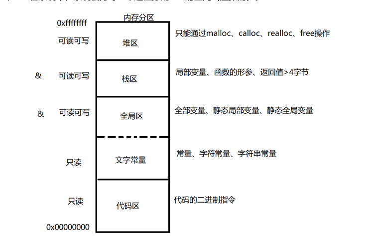

图中 **全部变量** 打字错误，应为 ==全局变量==。

## 各类变量

### 普通局部变量 

**定义形式**：在{}里面定义的变量为普通局部变量。

**作用范围**：在{}里面有效

**生命周期**：{}复合语句结束 局部变量被释放。 

**内存区域**：栈区

==**注意事项**==：  

- 局部变量不初始化 内容不确定 
- 局部变量如果同名 就近原则。

### 普通全局变量 

**定义形式**：在函数外定义的变量。 

**作用范围**：当前源文件以及其他源文件都有效  

**生命周期**：整个进程（运行的程序结束后 才释放） 

**内存区域**：全局区  

**注意事项**：  

- 全局变量不初始化 内容为0  
- <span style='color:red'>如果其他源文件 要使用 全局变量 必须在使用处加 **extern **声明</span>
- 全局变量和局部变量同名优先选择局部变量

```c
//在b.c中使用a.c中定义的变量
//a.c
int num = 5;
void func()
{
    printf("fun in a.c");
}


//b.c中
int main()
{
    extern int num;
    printf("%d",num);
    return 0;
}

//如果存在了这种引用，需要将两个文件同时编译，不然会报错
//gcc a.c   b.c
```


### 静态局部变量 

**定义形式**：在{}里面定义 加static修饰 

**作用范围**：{}里面有效  

**生命周期**：整个进程（运行的程序结束后 才释放）  

**内存区域**：全局区  

**注意事项**：  

- 静态局部变量不初始化 内容为0  
- 静态局部变量 只会定义一次

### 静态全局变量

**定义形式**：全局变量前加static修饰  

**作用范围**：只在当前源文件有效。  

**生命周期**：整个进程（运行的程序结束后 才释放）  

**内存区域**：全局区  

注意事项：  

- 不初始化为0 
- 只在当前源文件有效

### 全局函数

定义的函数默认为全局函数。  

<span style='color:red'>只要在其他源文件加extern 声明 就可以在其他源文件中使用</span>。

### 静态函数

函数返回值值类型前 加static修饰 为静态函数 

**注意**：静态函数不能被其他源文件使用。

## gcc编译过程

预处理、编译、汇编、链接  

- **预处理**：头文件包含、宏替换、条件编译、删除注释 （不作语法检查）  

  - ```
    gcc -E 文件名.c -o 想要预处理后的文件名.i 
    gcc -E 01_code.c -o 01_code.i  
    ```

- **编译**：将预处理好的.i 编译成 汇编文件.s (作语法检查)  

  - ```
    gcc -E 文件名.i -o 想要编译后的文件名.s
    gcc -S 01_code.i -o 01_code.s  
    ```

- **汇编**：将汇编文件.s 生成 二进制文件.o  

  - ```
    gcc -c 01_code.s -o 01_code.o  
    ```

- **链接**：将各个独立的二进制文件+库函数+启动代码 生成可执行文件

  - ```
    gcc 01_code.o -o main 
    ```

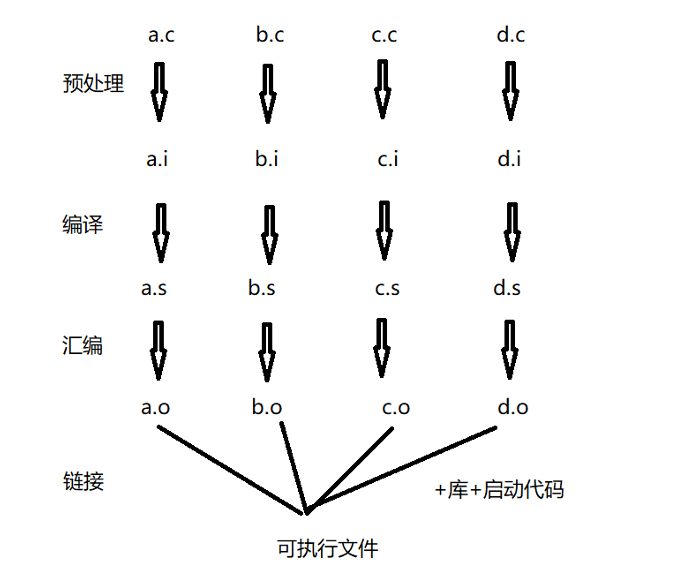

一步到位：

```
gcc 源文件 -o 可执行文件名 
gcc 源文件 默认生成的可执行文件名为a.out 
```

## include头文件包含

**\#include ""** : ==先从当前目录查找头文件，如果找不到 才从系统指定目录找头文件==。（包用户 定义的头文件）  

**#include<>**：只从系统指定目录去找头文件。（包含系统头文件）

**注意**:

- 其实本质就是将文件中的内容直接copy或者引入到当前文件中
- 所以它不仅仅是可以引入头文件 比如#include "a.c"也是可以的
- ==**引入非头文件很危险**==，比如引入==.c==文件中存在全局变量，当前文件也存在，导致覆盖

## define定义宏

**注意**：

- 宏只在当前文件有效
- 如果想要在多个文件中使用同一个宏，最好是==将宏定义在头文件中==。

### 无参的宏

```c
#define N 100 
//在预处理阶段 将所有出现N的位置替换成100 

```

在编译时定义宏：

```
gcc a.c -D N=100
```


### 有参的宏（宏函数）

```c
#define MUL(a,b) a*b
int test(){
    MUL(5,2); //替换为5*2   结果 10
    MUL(5+5,2+2); //替换为5+5*2+2   结果   17
}

//如果想要保证参数完整可以宏定义为： 
#define MUL(a,b) ((a)*(b))
```

### 宏函数和函数的区别

**宏函数**：  

- **带参的宏**  在预处理展开  有大量重复代码(占空间)    没有函数调用带来的出入栈 的开销（时间）。<span style='color:red'>用空间 换 时间</span>。  
- 宏的参数没有类型  不能保证参数的完整性  
- <span style='color:red'>宏没有作用域的限制  不能作为结构体或类的成员</span>（**重要**）

**函数**： 

- 函数调用 需要出入栈的开销（耗时间），代码只有一份（节约空间）。（用时间  换 空间）  
- 函数的参数 有类型 可以保证参数的完整性。 
- 有作用域的限制  能作为结构体或类的成员。

### 取消宏

```c
#define N 100
void test(){
    int a[N]
    #undef N //取消宏定义
    int b[N]  //报错
}
```

## 条件编译

**条件编译与c中的if else语句不同**：

- if else无论如何都会编译，只是根据条件决定去执行那一部分语句
- 条件编译则是 ==如果不满足条件则**不满足部分直接不编译**==。
- 条件编译是在预处理阶段完成

```c
#ifndef XXX   //如果没有编译XXX宏，则只编译语句1，编译             
   语句1;      //了则只编译语句2
#else 
   语句2;
#endif
--------------------
#ifdef XXX
   语句1;
#else 
   语句2;
#endif
-------------------
#if XXX    //这个并非判断是否定义宏，XXX代表表达式
   语句1;
#else 
   语句2;
#endif
```

例子：由是否定义了宏来决定是将输入的字符变为大写还是小写

```c
#define BIG_TO_SMALL
void main(int argc,char *argv[]){
    char buf[128]="";
    printf("输入一个字符串");
    fgets(buf,sizeof(buf),stdin);
    buf[strlen(buf)-1]='\n';
    int i=0;
    while(bug[i]!='\0'){
        #ifdef   BIG_TO_SMALL
        if(buf[i]>'A' && buf[i]<'Z'){
            buf[i]+=32;
            i++;
        }

        #else
        if(buf[i]>'a' && buf[i]<'z'){
            buf[i]-=32;
            i++;
        }
        #endif
    }
}

//----使用#if
//将  #ifdef BIG_TO_SMALL 换为  #if  BIG_TO_SMALL
//此时会成为逻辑判断
//编译时 gcc a.c -D BIG_TO_SMALL=1 
//则会判断为真
```

## 防止头文件重复包含

有时会出现 引入的多个头文件中会出现互相包含的问题.

比如 在test.c中引入 a.h和b.h 两个头文件，但是在a.h中：

```c
//---a.h
#include "b.h"
```

也就是引入了头文件b.h

而在test.c中有：

```c
//---test.c
#include "a.h"
#include "b.h"
```

造成了重复内容而报错

此时有如下两种解决方式：

### Linux的方式 #ifndef

```c
//---a.h文件中
#ifndef _A_H_

#define _A_H_
#include "b.h"

#endif
```

```c
//---b.h文件中
#ifndef _B_H_

#define _B_H_
int data=100;

#endif
```

```c
//---test.c文件中
#include "a.h"
#include "b.h"

//此时哪怕有互相包含，头文件中的内容也不会重复执行
```

### windows的方式 #pragma

```c
//---a.h文件中 
#pragma once  //只包含一次
#include "b.h"
```

## 多文件编程

封装了一个函数库文件以后，如果简单通过extern type XXX()的形式去逐个引入，那么在多文件编程时会变得非常繁琐。解决方式：

- 每封装一个函数库.c文件都要有一个与其对应的.h文件，来引入函数
- 然后通过这个.h文件来一次引入该函数库的内容

**注意**：

- 一个程序中所有的c文件都要执行，哪怕这个.c文件是.h函数的函数库，也要跟随其他c文件一起编译
- 如果需要编译的.c文件，和.h文件不在同一目录下可通过 相对路径来编译和引入有

## 静态库和动态库的制作

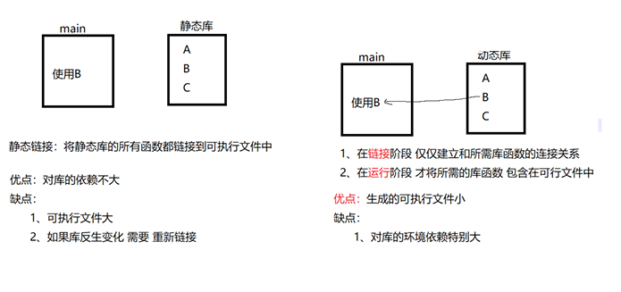

### 静态库制作

设有文件a.c

```c
int add(int a, int b)
{
    return a + b;
};
```

- 1、将需要制作库的源文件生成二进制文件.o  

  - ```
    gcc -c a.c -o a.o  
    ```

    

- 2、使用ar rc将a.o 二进制文件生成库 

  - ```
    ar rc lib库名.a 二进制文件 
    ar rc libmylib.a a.o  
    ```

    此时生成 的库文件名为libmylib.a，但是实际名称为mylib 

**注意**：以==**lib**==开头，==**.a**==结尾   库名称是mylib 

### 使用静态库 

**直接将库放入项目目录**：

直接编译，==不在需要原本的函数库.c的参与==。

```
gcc test.c mylib.a
```

 

**将库放入 指定目录** ：

假设将a.h和libmylib.a全部放入fun文件夹

此时需要指定头文件和静态库的位置

-I 指的是头文件的路径    -L库的路径    -l指的库的名称

```
gcc test.c -I./fun -L./fun -lmylib -o test.out
```

###  将静态库库放入 系统指定目录 

- 系统默认的头文件路径：/usr/include  
- 系统默认的库的路径:/usr/lib

```
gcc test.c  -lmylib 
```

### 动态库制作

设有文件a.c

```c
int add(int a, int b)
{
    return a + b;
};
```

- 1、将需要制作库的源文件生成二进制文件.so  

  - ```
    gcc -shared a.c -o libmylib.so
    ```

  此时生成 的库文件名为libmylib.a，但是实际名称为mylib 

**注意**：以==**lib**==开头，==**.a**==结尾   库名称是mylib 

### 使用动态库 

**直接将库放入项目目录**：

直接编译，==不在需要原本的函数库.c的参与==。

```
gcc test.c mylib.so
```

 但是有时会出现编译通过，运行不通过的情况

解决方式【**添加库的路径**】：

```
//在控制台目录文件夹下输入
export LD_LIBRARY_PATH=./:$LD_LIBRARY_PATH

//export导出环境变量
//LD_LIBRARY_PATH 库的路径的变量名/脚本的变量名
//$LD_LIBRARY_PATH $指取这个变量的值
//意思是取LD_LIBRARY_PATH的值用 ： 号与新的路径组合形成类似 a:b:c的组合  a路径找不到就去b找，b找不到就去c路径找
```

**将库放入 指定目录** ：

假设将a.h和libmylib.a全部放入fun文件夹

此时需要指定头文件和静态库的位置

-I 指的是头文件的路径    -L库的路径    -l指的库的名称

```
gcc test.c -I./fun -L./fun -lmylib -o test.out
//这里也可能找不到库路径
```

###  将动态库放入 系统指定目录 

- 系统默认的头文件路径：/usr/include  
- 系统默认的库的路径:/usr/lib

```
gcc test.c  -lmylib 
//如果有同名的静态库在系统目录中，则默认选择动态库
```

# 指针

## 概述

- 物理内存又叫内部存储器，暂时存放数据，掉电数据丢失。
- 虚拟内存：从物理内存通过操作系统使用MMU技术抽象出来的内存的地址。  
- ==操作系统 将**内存的每一个字节** 分配一个**4字节**或**8字节**的编号，而这个编号就是**地址编号**==。

系统的**最小分配单位是字节**。**最小存储单位二进制位**。

- 在32位系统中 任何指针变量的大小为4字节。 
-  在64位系统中 任何指针变量的大小为8字节。
- 不要操作没有合法指向的指针变量（不要操作野指针）
- 指针赋值为null也不要立即操作

## 定义

- ==*== 修饰指针变量名  
- 保存谁的地址就定义谁 
-  从上往下 整体 替换

## 指针变量的类型

指针变量的类型有两个

- 指针变量自身的类型 【用于赋值语句左右判断】
- 指针变量指向的类型 【决定了指针变量的跨度、取值宽度】

比如：

```
int *p; 
p 自身的类型为int *  指向的类型为int 
```

## 指向类型决定取值宽度

```c
unsigned int data=0x01020304;

unsigned int *p1=&data;    //此时 p1指向类型为 int，因此可以取值的宽度是4字节，可以完整的获取到data的值
printf("%#x",*p1);  //0x1020304;  默认省去高位0值

unsigned short *p2=&data;    //此时 p1指向类型为 int，因此可以取值的宽度是2字节，可以不可以完整的获取到data的值
printf("%#x",*p2)  //0x304;  默认省去高位0值

```

## 指向类型决定单位跨度

```c
int data=10;
int *p1=&data;
printf("%lu",*p1) ;  //假设为140722224
printf("%lu",*p1+1);   //为140722228 而不是 140722224
//因为指向类型决定了单位的跨度，所以相当于是140722224 + 1*int的大小  即140722224 + 4字节
```

例子：

```c
int data=0x01020304
```

此时想要将指针指到前两位

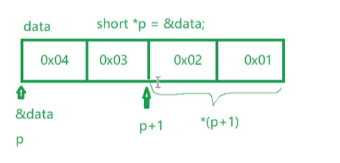

```c
int data=0x01020304;
short *p=&data;   //利用指针指向类型为short，字节只有2字节，直接+1，刚好指到0x02位置
printf("%lu",*(p+1))  //0x102
```

### 其他字节取值案例

分别是取第三字节，和取中间两字节（==使用指针指向类型强转==）

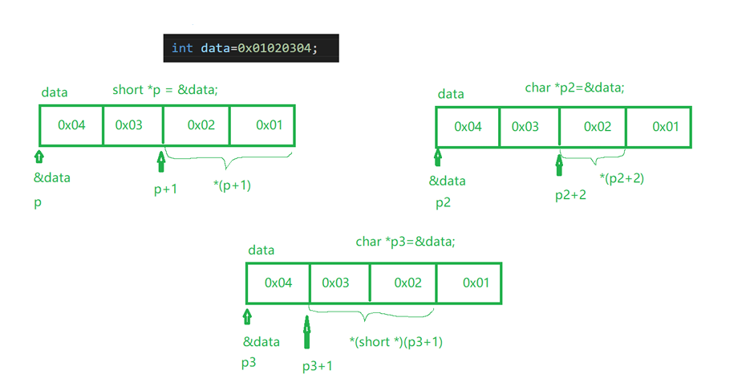

## 指针变量的注意事项

### void 不能直接定义变量  

void num; 

系统无法根据void类型 确定num的空间大小 所以定义失败 

### void *可以定义指针变量

```c
void *p; //p 的类型为  void *
```

- 在32位平台==void *==为4字节，系统能够为p开辟4字节空 间，所以定义成功。
- 不能直接对p取*，  * p报错 不能通过void决定取值宽度，所以* p失败
- 不能让p+1,    p+1报错 不能通过void决定单位跨度，所以p+1失败 

因此：

- **void *p 是万能指针变量， 可以保存任何一级地址。==一般用于函数形参== 让算法通用**。  

  - ```c
    int fn(void *p){
        
    }
    ```

    

- **如果要是用p取值或跳跃 必须实现对p进行 强制类型转换**。

### 不要对未初始化的指针变量取值 

```c
int *p； 
*p;//访问非法内存 
```

### 不要对初始化为NULL的指针变量取值 

```c
int *p=NULL;  *p;//访问非法内存
```

### 操作指针变量不要越界

```c
int data=10; 
int *p=&data; 
p++; 
*p;//访问越界
```

## 指向同一数组的两个元素指针变量的关系

```c
int arr[]={0,1,2,3,4,5};
int *p1=&arr[0];
int *p2=&arr[3];
printf("%d",p2-p1)   //3
```

- 指向同一数组的元素指针变量相减 得到的是相差元素的个数。
-  指向同一数组的元素指针变量相加 无意义。
-  指向同一数组的元素指针变量判断相等==  判断是否指向同一个元素。
-  指向同一数组的元素指针变量判断大小  判断位置关系。 

-  指向同一数组的元素指针变量赋值  p2=p1 让p2和p1指 向同一处。

## 指针数组

```c
类型名 * 数组名[数组长度];
int *p[4];
//注意不可以写成 int (*p)[4]
//因为[]的优先级比*高， 所以p与[]先组合成为数组，再与*结合表示这个数组是指针类型的
```

## 字符数组和字符指针变量的区别

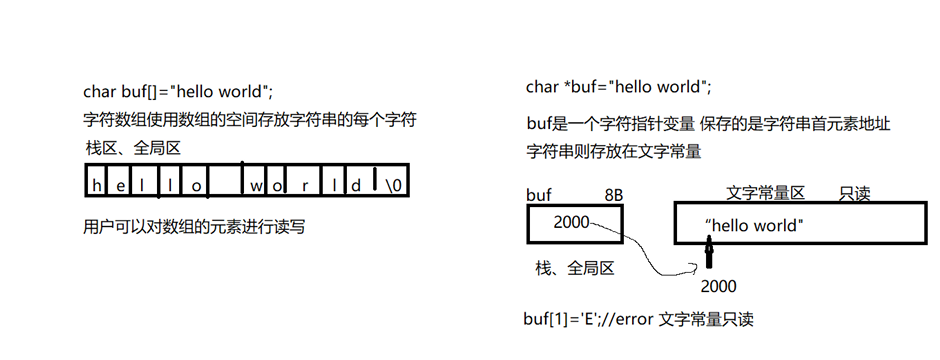

```c
//字符数组：用数组的空间存放各个字符  可读可写 在栈或全局区 
char buf[]="hello world"; 
//字符指针变量：只是保存字符串的首元素地址  字符串本身在文字常量区  不同通过指针变量给字符串赋值 
//指针变量 可以在栈或全局区 
char *buf="hello world"; 
```

## 字符指针数组

字符指针数组 ==存放的是每个字符串首元素地址== 而字符串本身存放在文字常量区（只读）

```c
char *str[5] = {"awer", "bbbb", "cccc", "dddd", "eeee"};
int n = sizeof(str) / sizeof(str[0]);
for (int i = 0; i < n; i++)
{
    printf("%s\n", str[i]); //依次打印字符串
    //因为字符指针数组 存放的是每个字符串首元素地址 而字符串本身存放在文字常量区（只读） 
}

printf("%c\n", *(str[0]));  // a
printf("%c\n", *(str[0] + 1)); //w
printf("%c\n", str[0][1]);  //w 因为 *(p+1)的形式可以简化为 p[1]
```

## 数组的首地址

- ==**数组名**==代表的是数组首元素地址**+1跳过一个元素**
- ==**&数组名**==表示数组的首地址代表的是整个数组**+1跳过整个数组**

```c
int arr[5]={1,2,3,4}
//arr和&arr在地址编号上是同一个地址编号只是类型不一样
//arr+1跳过一个元素&arr+1跳过整个数组
```

**重要**：==对数组的首地址取* 表示的是数组的首元素地址==。  

## 数组指针

```c
类型 (*指针名)[数组长度]
```

```c
int (*p)[5];  //此时p自身类型为：int (*)[5]
```

## 二维数组 和一维数组指针的关系

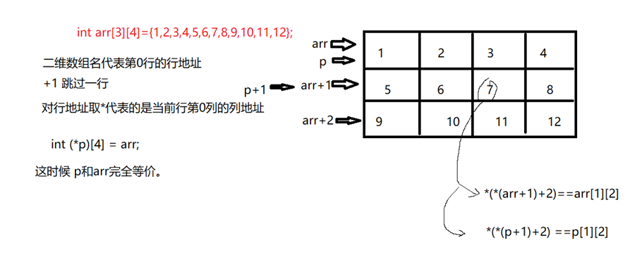

- 一维的数组指针int ( * p)[4] 和二维的数组名 int arr[ 3 ] [ 4 ] 是等价的。（重要）  *
- *二维的数值指针int ( * p)[4] [5]和三维的数组名 int arr[3] [4] [5]是等价的（重要） 

## 指针和函数的关系

```c
//如果形参是二维数组arr[3][4]  优化成 一维数组指针 (*p)[4] 
//如果形参是三维数组arr[3][4][5]  优化成 二维数组指针 (*p)[4][5] 
//如果形参是四维数组arr[3][4][5][6]  优化成 三维数组指针 (*p)[4][5][6] 
//。。。。。 
//如果形参是N维数组arr[3][4][5][6]...[N]  优化成 N-1维数组指针 (*p)[4][5][6]...[N] 
```

## 指针作为函数实参案例

```c
void set_addr(int **p1){
      int data=100; //解决方式 使用static修饰防止销毁
      *p1=&data;
}

void main(int argc, char *argv[])
{
   int *p;
   set_addr(&p);
   printf("%d\n",*p); //100 但是是访问非法内存
}
```

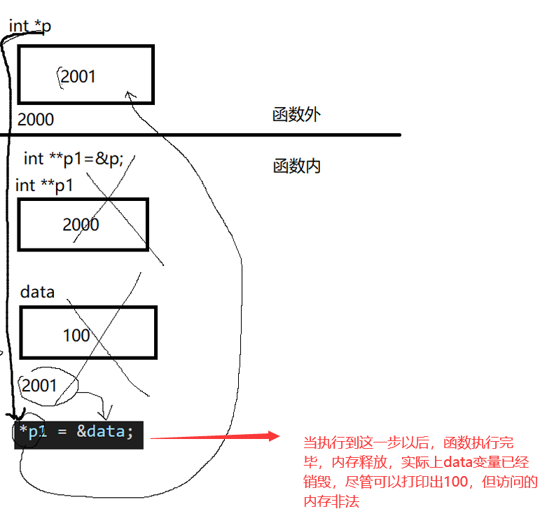

## 指针作为函数返回值

- **函数不要返回值局部变量或局部数组的地址编号**。（==函数结束 函数内部的局部变量或局部 数组空间将被释放==）（重要） 
- **函数返回的地址 一般是堆区的地址编号**。（一般函数从堆区申请空间 通过返回值 将地址 编号返回 给外部使用堆区空间地址）（重要）

## 函数指针

- 函数调用的本质是**==函数地址()==**。
- 函数指针 一般作用与函数的形参 让你的函数更加通用。（重要）
- 函数指针变量+ - 取*  > < !=  都无意义，==   =有意义。 

```c
int add(int x,int y){
    return x+y
}

int (*p)(int x,int y)=null;
p=add;

void test(){
    printf("%d\n",add(100,200));  //300
    printf("%d\n",p(100,200));     //300
}
```

### 函数指针作用

```c
int add(int x,int y){
    return x+y
}

int sub(int x,int y){
    return x-y
}


int fn(int x ,int y ,(*fun)(int ,int)){
    return fun(x,y)
}

void test(){
     fn(10,8,add);
     fn(10,8,sub);
}
```

# 动态内存申请

## 堆区空间概述

- 需要使用**malloc calloc realloc** 从堆区申请空间，==必须使用指针变量 取保存得到的地址编 号==。使用完后 ==记得调用free释放堆区空间==。 
-  堆区空间 是在程序运行过程中 根据需要 申请。所以又叫动态空间。  
- 申请空间、使用空间、释放空间 

## malloc 函数 申请堆区空间

需要头文件 ：

```c
#include <stdlib.h> 
```

```c
void *malloc(size_t size); 
//     参数size：表示申请空间的大小（单位是字节） 
//返回值： 
//     成功：返回堆区空间的起始地址 
//     失败：返回NULL 
//注意： 
//    1、记得对malloc的返回值 强转成你需要的地址类型 
//    2、在ubuntu16.04 中使用gcc编译器 下malloc会对申请到的堆区空间自动清零 
```

例子：

```c
//申请一个int类型的空间
 int *p=(int *)malloc(sizeof(int));
if(p==NULL){
    printf("error");
    return 0;
}

//使用空间
*p=1000;

//释放空间
free(p)
```

## calloc函数申请堆区空间

==在任何平台下 calloc都会对申请的堆区空间清零==,更加通用

```c
void *calloc(size_t nmemb, size_t size); 
//     参数nmemb：内存的块数 
//     参数size：每一块的大小 
//     申请的总大小=nmemb*size 
//返回值： 
//    成功：返回堆区空间的起始地址 
//    失败：返回NULL 
 
```

## realloc函数追加空间

<span style="color:red">realloc**只能对malloc或calloc申请的堆区空间进行追加**</span>。 

```c
void *realloc(void *ptr, size_t size); 
// 参数ptr:是旧空间的起始地址 
// 参数size:旧空间大小+新空间大小 
```

<span style="color:red">必须使用指针变量 保存realloc的返回值</span>，因为它的返回值并不是扩展前的地址而是一个新地址.

## 内存设置函数memset

- **主要用于将指定的内存清0** 
- 它相当于是遍历内存中的每一个字节做统一操作

```c
//#include <string.h> 
void *memset(void *s, int c, size_t n); 
//功能：将指定的内存的每一个字节 设置成特定的值 
//   参数s:指定内存的起始地址 
//   参数c:每个字节特定值 
//   参数n:从s开始 操作n个字节 

char *str=(char *)malloc(10);
memset(str,0,10);
```

## 内存拷贝函数memcpy

```c
void *memcpy(void *dest, const void *src, size_t n); 
//功能：将src指向的空间n个字节 拷贝到 dest指向的空间中 
//  参数dest:目的空间的起始地址 
//  参数src:源空间的起始地址 
//  参数n：操作空间的总字节数 
```

## 静态数组和动态数组

### 静态数组和动态数组的区别 

- **静态数组**：
  - 类似int arr[5];
  - 在编译阶段就已经确定了数组的大小。数据过多溢出  数据过少 浪费空间。
- **动态数组**：
  - 从堆区动态申请空间，
  - 在运行的时候 根据用户的输入决定空间的大小。

```c
#include <stdio.h> 
#include <stdlib.h> 
int main(int argc, char const *argv[]) 
{ 
    int old_n = 0; 
    printf("请输入旧空间的元素个数:"); 
    scanf("%d", &old_n); 

    // 根据old_n申请堆区空间 
    int *arr = (int *)calloc(old_n, sizeof(int)); 
    if (NULL == arr) 
    { 
        printf("calloc error\n"); 
        return 0; 
    } 

    // 获取键盘输入 
    printf("请输入%d个int数值:", old_n); 
    int i = 0; 
    for (i = 0; i < old_n; i++) 
    { 
        scanf("%d", arr + i); 
    } 

    int new_n = 0; 
    printf("请输入新增的元素个数:"); 
    scanf("%d", &new_n); 

    // 为新增的元素个数追加空间 
    arr = (int *)realloc(arr, (old_n + new_n) * sizeof(int)); 
    if (NULL == arr) 
    { 
        printf("realloc error\n"); 
        return 0; 
    } 

    // 为新增的空间输入元素 
    printf("请输入%d个新增的int数据:", new_n); 
    for (i = old_n; i < (old_n + new_n); i++) 
    { 
        scanf("%d", arr + i); 
    } 

    // 遍历整个数组 
    for (i = 0; i < old_n + new_n; i++) 
    { 
        printf("%d ", arr[i]); 
    } 
    printf("\n"); 
    // 释放空间 
    free(arr); 
    return 0; 
} 

```

# 字符串处理函数

## 部分字符串处理函数

### strtok字符分割

```c
char input[16] = "abc,dc,xx";
char *p;

p = strtok(input, ",");
if (p)
    printf("%s\n", p);  //abc

p = strtok(NULL, ",");
if (p)
    printf("%s\n", p);  //dc
p = strtok(NULL, ",");
if (p)
    printf("%s\n", p);  //xx
```

### atoi(),atof字符串转整型、浮点型

```c
int val;
char str[20];

strcpy(str, "98993489");
val = atoi(str);
```


## sprintf组包函数[相当于字符串模板]

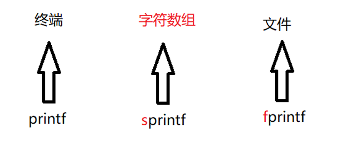

```c
int year=2024;
int month=7;
char buf[128]="";
int time=sprintf(buf,"%d年%月",year,month)//2023年7月
```

## sscanf 解包函数

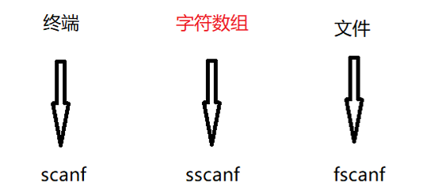

- **注意**：

  -  ==**%s 在 sscanf 中提取到的内容是字符串，且遇到空格和字符串结束提取 **==。

  -  **sscanf的返回值是成功匹配的到的个数**

  -  ```c
    char str1[128]="hello world";
    char str2[128]="";
    int num=sscanf(str1,"%s",str2);     //获取匹配到的个数
    printf("%s,%d",str2, num);  //hello 1
    ```
  
- ==%d %ld %hd %u %hu %lu 和 sscanf 提取的是数值==,**遇到非数值字符结束**.

- %c 和sscanf 提取一个字符 

  - ```c
    char str1[128]="hello world";
    char str2[128]="";
    sscanf(str1,"%c",str2);  
    printf("%s",str2);  //h
    ```

    

### 提取指定个数的字符或数值 %3s %3d

```c
char str1[128] = "hello world qwe";
char str2[128] = "";
sscanf(str1, "%3s", str2);
printf("%s", str2); // hel
//----------------
char str1[128] = "hello world qwe";
char str2[128] = "";
sscanf(str1, "%8s", str2);
printf("%s", str2); // hello   依旧遇到空格停止
//------------------------
char str1[128] = "123456";
int data = 0;
sscanf(str1, "%3d", &data);
printf("%d", data); // 123
```

### % * s 跳过提取到的字符串 %*d跳过提取的数值 

```c
char str1[128] = "123456";
int data = 0;
sscanf(str1, "%*2d%3d", &data); //跳过两个
printf("%d\n", data); //345
```

###  %[a-z]

表示匹配 a 到 z 中任意字符(尽可能多的匹配) 【注意：提取到的结果是字符串】

```c
sscanf("abcABC","%[a-z]") //提取的结果是"abc" 
```

### %[aBc]

 匹配 a、B、c 中一员，贪婪性

```c
sscanf("abcABC","%[aBc]")//提取的结果是"a"，也就是当遇到不匹配的字符时立马停止
```

###  %[ ^ aFc]

匹配非 a Fc 的任意字符，贪婪性 

```c
sscanf("abcABC","%[^A]");//提取的结果是"abc" 
sscanf("[简单爱:啦啦啦]","%[^]]");//提取的结果是"[简单爱:啦啦啦" 
sscanf("[简单爱:啦啦啦]","%[^:]");//提取的结果是"[简单爱" 
sscanf("[简单爱:啦啦啦]","%*c%[^:]");//提取的结果是"简单爱"、 
sscanf("[简单爱:啦啦啦]","%*[^:]%*c%[^]]");//提取的结果是"啦啦啦" 
sscanf("[简单爱:啦啦啦]","%*[^:]:%[^]]");//提取的结果是"啦啦啦"  *[^:]跳过冒号之前的内容  :匹配到:号时跳过 %[^]]匹配到非]位置 
```

# const和指针的关系

## const修饰普通变量 

- const修饰data为只读用户不能通过data给空间赋值
- 用户可以通过其他方式对data对应的空间内容赋值

```c
// const 修饰data为只读 data本质还是变量 
const int data = 10; 
// data = 1000;//error 
int *p = (int *)&data; 
*p = 1000; 
printf("data=%d\n", data);//1000
```

## const 在*的左边 

```c
int data=100;
int num=800;
const int  *p=&data;
//*p=1000;//报错， const在 * 左边表示指针内容只读，但是指针可读可写

p=&num;
printf("%d",*p);  //800 ，可以修改指针指向
```

## const 在*的右边 

```c
int data = 100;
int num = 800;
int *const p = &data;
*p=1000;//1000， const在 * 右边边表示指针内容可读可写，但是指针指向只读

// p = &num; 报错
printf("%d", *p); // 1000 ，可以修改指针内容
```

## const 在*左右两边

指针内容只读，但是指针指向只读

```c
int data = 100;
int num = 800;
const int *const p = &data;
```

# typedef别名

- typedef 给已有的类型 重新取个别名。
- 别名也是类型，旧类型任然可用 

## 常见的typedef定义形式 

```c
typedef int *P_TYPE   //此时P_TYPE 等价int *
P_TYPE p;


typedef int Arr[5]  
Arr arr;  //此时arr是一个长度为5的数组


typedef int (*P_FUN)(int,int)  
P_FUN p=my_add;  //此时arr是一个长度为5的数组
```

# 结构体

- 基本类型 char short int long float double  
- 构造类型：有基本类型封装打包而来，char name[32];  
  - 结构体 struct  
  - 共有体 union  
  - 枚举 enum    
- 结构体：有关键字struct修饰，是一种或多种基本类型或构造类型的数据的集合。

## 结构体类型的定义

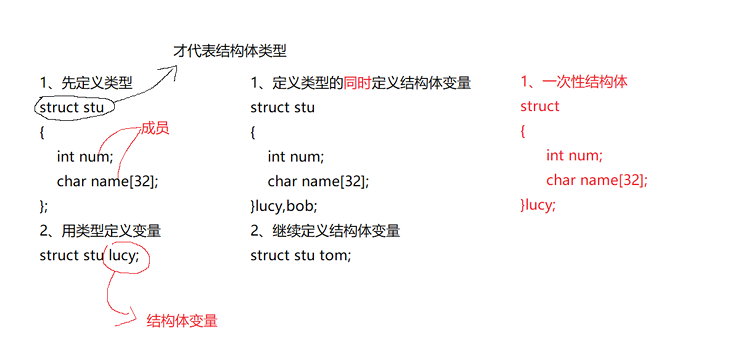

## 定义结构体变量

操作结构体成员的时候 必须遵循 成员自身的类型。（重要）

```c
struct stu{     //这个相当于是定义一个类型
    int num;
    char name[32];
}

typedef struct stu{     //这个相当是为类型取了一个别名,方便操作
    int num;
    char name[32];
}STU


void test{
    struct stu luck ={100,"luck"};
    //luck.num 100
    STU luck2 ={100,"luck"};
}
```

## 结构体成员的操作

```c
struct stu{
    int num;
    char name[32];
}


void test{
    struct stu luck ={100,"luck"};
    struct stu luck ={88,"bb"};
}

```

### 结构体变量清0

```c
memset(&bob, 0, sizeof(bob));
```

### 赋值

```c
// 将lucy内容 赋值 给bob（方法1：逐个成员操作） 
 bob.num = lucy.num; 
 strcpy(bob.name, lucy.name); 
 bob.score = lucy.score; 

// 将lucy内容 赋值 给bob（方法2：相同类型的结构体变量可以=赋值,浅拷贝） 
 bob = lucy; 

// 将lucy内容 赋值 给bob（方法3：memcpy） 
memcpy(&bob, &lucy, sizeof(struct stu));
```

### 键盘给结构体成员赋值 

```c
struct stu{
    int num;
    char name[32];
}

scanf("%d %s",&luck.num,&luck.name)
```

### 结构体嵌套结构体

```c
struct A{
    int a;
}

struct B{
    int a;
    struct A OB;
}
```

## 结构体数组

结构体数组：本质是数组 每个元素是结构体。 

```c
struct stu edu[5];
edu[4].name
```

## 指针成员

==如果结构体中有指针成员 一定要记得将指针成员指向合法的空间==（栈区、全局区、文字常 量区、堆区）

```c
struct stu{
    int num;
    char *name;
}
```

### 指针成员在栈区  指向 栈区 

```c
typedef struct stu{
    int num;
    char *name;
}STU;
void test(){
    char buf[]="hello";
    STU luck={100,buf};
}
```

### 指针成员在栈区  指向 文字常量

```c
typedef struct stu{
    int num;
    char *name;
}STU;
void test(){
    STU luck={100,"hello"};
}
```

### 指针成员在堆区  指向 堆区。 

```c
typedef struct stu{
    int num;
    char *name;
}STU;
void test(){
    STU *p=(STU *)malloc(sizeof(STU))
        *p.num=100;
    (*p).name=(char *)malloc(32);
    strcpy((*p).name,"hello");
    free((*p).name);
    free(p);
}
```

## 结构体的浅拷贝和深拷贝

- 如果结构体中没有指针成员 浅拷贝 不会有问题。
-   如果结构体中有指针成员 浅拷贝  会有问题。

### 浅拷贝

结构体变量的空间内容 直接赋值给 另一个结构体 变量的空间。

```c
STU lucy={100,"lucy",88.8f};   
STU bob; 
bob=lucy;//浅拷贝 
```

**注意**：如果结构体中有**指针成员** **且指针成员 指向了堆区** **这样浅拷贝有可能造成内存多次释放问题**（重要） 

### 深拷贝

让结构体变量的指针成员 指向独立的堆区 

```c
STU lucy={100,"lucy",88.8f};   
STU bob; 
bob=lucy;//浅拷贝 

bob.name = (char *)malloc(32); 
strcpy(bob.name, lucy.name); 
```

## 结构体指针变量

### 结构体访问成员方式

```c
typedef struct stu{
    int num;
    char *name;
}STU;
STU lucy={100,"lucy",88.8f};  
//访问成员方式1 :
//lucy.num lucy.name lucy.score

//访问成员方式2:
//(*p).num (*p).name (*p).score

//访问成员方式3:
//p->num p->name

//访问成员方式4:
//(&lucy)->num (&lucy)->name
```


## 结构体对齐规则

### 默认规则

结构体占空间大小并不是单纯的成员大小相加

```c
struct A{
   char a;  //1B
   int b;  //4B
}

printf("%ld",sizeof(struct A)) // 8B
```

#### 为什么对齐

- 如果不对齐，按照一次取值的大小，部分取值可能需要更多的操作
- 对齐后，只需要控制部分数据存储位置，则可以取值一次，获得一次对应的成员值。
- 对齐就是为了方便取值

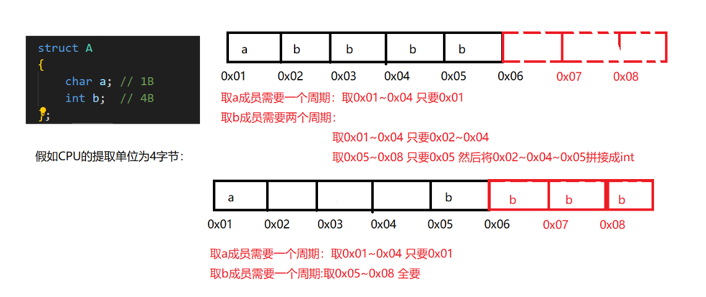

#### 自动对齐规则的步骤

- **确定分配单位**：一行分配多少字节（结构体中 ==最大的基本类型长度就是分配单位==） 
- **成员的偏移量**：相对于结构体的起始位置的偏移字节数（成员自身大小的整数倍）  
- **结构体总大小**：分配单位的整数倍。
- 结构体成员的顺序 可以决定空间大小
- 注意：两个已分配空间的成员之间 哪怕有空间可以分配给其他成员也不会再分配，而是继续向后添加空间

```c
struct A
{
    char a;
    int c;
    short int b;
};

printf("%ld\n", sizeof(struct A)); //12
//尽管 a 占用的四字节空间只使用了1字节，还可以容下b，但是，分配b之前已经分配了c，这个空余的空间在ac之间，因此不再分配给b，所以向后开辟4字节空间，所以总共有12字节
//--------------------------------
struct A
{
    char a;
    short int b;
    int c;
};

printf("%ld\n", sizeof(struct A)); //8
```

#### 存在数组成员

```c
struct A
{
    char a;
    int b;
    char c[5];  //  char c[9]则打印结果为20
};

printf("%ld\n", sizeof(struct A)); //16
//注意：这里最大基本类型成员是int
```

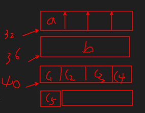


### 结构体嵌套结构体的对齐规则

- 确定分配单位：一行分配多少字节 == 所有结构体中最大的基本类型  
- 成员的偏移量：相对于结构体的起始位置的偏移字节数（成员自身大小的整数倍）  
  - 结构体成员的偏移量 == 该结构体最大基本类型的整数倍  
  - 结构体成员中的成员偏移量 == 相对于结构体成员的偏移量  
- 结构体总大小：分配单位的整数倍。  结构体成员的总大小 == 结构体成员中最大的基本类型整数倍

### 强制对齐

==\#pragma pack (value)==时的指定对齐值value。

 注意：value只能是：1 2 4 8等   【也就是指定分配空间字节】

- 确定分配单位：一行分配多少字节【min(value,结构体中最大的基本类型长度)】【在这两个之间选最小值】
- 成员的偏移量：相对于结构体的起始位置的偏移字节数（成员自身大小的整数倍） 
-  结构体总大小：分配单位的整数倍。

```c
#pragma pack(1)
void main(int argc, char *argv[])
{
    struct A
    {
        char a;
        int b;
    };

    printf("%ld\n", sizeof(struct A));  //5
}
//-----------------------
#pragma pack(8)
void main(int argc, char *argv[])
{
    struct A
    {
        char a;
        int b;
        int  c;
    };

    printf("%ld\n", sizeof(struct A));  //12
}
//因为最小单位是 int  4字节  所以还是按照4字节分配
```


## 结构体的位域

### 位域的概述

结构体中成员所在空间以二进制位计算 称之为位域或位段。

注意：==给位域赋值的时  注意不要超过它所占位的最大值==。

```c
struct A 
{ 
    //a 所占的位数 不能超过 自身类型的二进制位数, 
    unsigned int a : 3; 
    // 位域  a 类型为 unsigned int 只是占空间3 位二进制位 
    //即 000 ~ 111  也就是 0~7
    //所以这里a最多只能等于7
};
```

```c
struct A 
{    unsigned int a : 3; 
 // 位域  a 类型为 unsigned int 只是占空间3 位二进制位 
 //即 000 ~ 111  也就是 0~7
 //所以这里a最多只能等于7
};

struct A obj;
pbj.a=10 ;// 10的二进制 1010  ，这里由于位域只要三位，溢出的是高位，因此只取到010，即为2
printf("%u\n",obj.a)   //2
```


### 相邻位域可以压缩 

- 相邻且相同类型的位域为相邻位域

  - ```c
    struct A 
    {    
        unsigned char a : 4; 
        unsigned char b: 2; 
    };
    //此时 a占4位，b占2位， 因此只占用1个字节
    
    struct A 
    {    
        unsigned char a : 4; 
        unsigned char b: 2; 
        unsigned char c: 2; 
    };
    //此时 a占4位，b,c占2位， 因此只占用1个字节
    
    struct A 
    {    
        unsigned char a : 4; 
        unsigned char b: 2; 
        unsigned char c: 3; 
    };
    //此时 a占4位，b,c占5位，超过8位 因此只占用2个字节
    ```

- 相邻位域可以压缩但是压缩的位数不能超过成员自身类型为位数

### 直接另一个存储单元

```c
struct A {    
    unsigned char a : 4; 
    unsigned char : 0; 
    unsigned char c: 3; 
};
```


### 无意义位宽

```c
struct A {    
    unsigned char a : 4; 
    unsigned char : 1; 
    unsigned char c: 3; 
};
```

### 位域的综合应用 

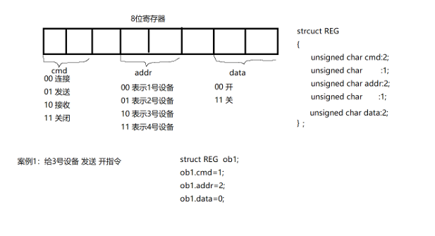

# 共有体

- 共用体 关键字为union，它的所有成员共享同一块空间。
- a b c 共享同一块空间 ==空间的大小由最大的成员大小决定==。
- 成员操作空 间大小 由自身类型大小决定
- 一般用法是只给其中一个成员赋值

```c
union D 
{ 
    char a; 
    short b; 
    int c; 
};

union D ob;
ob.a=10;
ob.b=20;
ob.c=30;
printf("%ld\n",ob.a+ob.b+ob.c);  //90  ,因为共享空间，而且30没有超过一个字节 所以最后取值的内容都是30
```

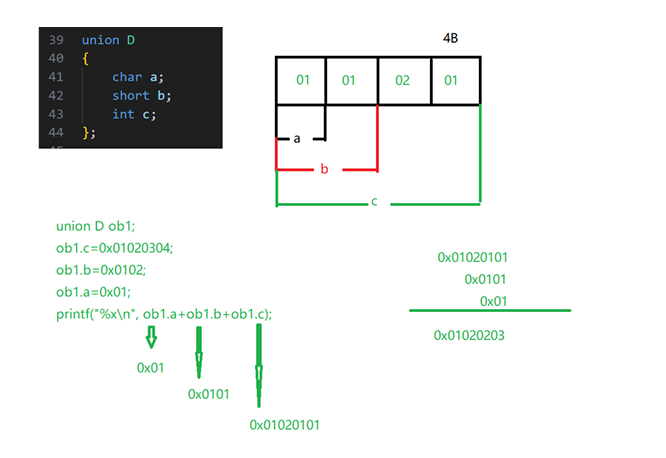


# 枚举

- 枚举：将变量将要赋的值 一一列举出来。关键字为enum 
- 枚举类型枚举列表中的值默认从0开始递增
- 如果有赋值则从赋值除开始递增

```c
// 枚举类型枚举列表中的值默认从e开始递增
enum POOKER
{
    HONGTAO,
    MEIHUA=3,
    FANGKUAI,
    HEITAO
};

enum POOKER pooker_color = HONGTAO;                         // 赋值其他值比如30 没有任何意义
printf("%d %d %d %d\n", HONGTAO, MEIHUA, FANGKUAI, HEITAO); // 0 3 4 5
```

# 链表

## 数组和链表的区别

- 数组遍历、查询数据方便、但是插入、删除数据需要移动大量数据。
-   链表遍历、查询不方便，但是插入、删除数据不需要移动数据。

## 链表节点的概念

- 链表的节点 目的是用来保存数据信息，分为两部分：数据域、指针域  
  - 数据域：存放核心数据  
  - 指针域：存放下一个节点的地址。 

### 链表节点类型定义 

```c
typedef struct stu 
{ 
    //数据域 
    int num; 
    char name[32]; 
    float score; 

    //指针域 
    struct stu *next;  
    //保存的是下一个结构体地址，所以指针类型是struct stu * 
}STU; 
```

## 静态链表-单向链表

```c
typedef struct stu 
{ 
    int num; 
    char name[32]; 
    float score; 

    struct stu *next;  

}STU;
// 局部节点 
STU node1 = {101, "lucy", 99.9f, NULL}; 
STU node2 = {102, "bob", 99.9f, NULL}; 
STU node3 = {103, "tom", 99.9f, NULL}; 
STU node4 = {104, "德玛", 99.9f, NULL}; 
STU node5 = {105, "小炮", 99.9f, NULL};

// 定义一个链表头 
STU *head = &node1; 
node1.next = &node2; 
node2.next = &node3; 
node3.next = &node4; 
node4.next = &node5;

// 遍历一个链表 
STU *pb = head; 
while (pb != NULL) 
{ 
    printf("%d %s %f\n", pb.num, pb.name, pb.score); 
    pb = pb.next; // 指向下一个节点 
} 
return 0; 
} 
```


## 排序

### 选择排序

```c
void sort_int_array02(int *arr, int n) 
{ 
    int i = 0; 
    for (i = 0; i < n - 1; i++) 
    { 
        int min, j; 
        // 寻找最小值的下标 
        for (min = i, j = min + 1; j < n; j++) 
        { 
            if (arr[min] > arr[j]) 
                min = j; 
        } 

        if (min != i) 
        { 
            int tmp = arr[i]; 
            arr[i] = arr[min]; 
            arr[min] = tmp; 
        } 
    } 
}
```


## 双向链表

### 节点定义

```c
struct stu 
{ 
    //数据域 
    int num; 
    char name[32]; 
    float score; 

    //指针域 
    struct stu *next; 
    struct stu *pre; 
};
```

### 插入

```c
STU *insert_double_link(STU *head, STU tmp) 
{ 
    // 1、为插入的节点申请堆区空间 
    STU *pi = (STU *)malloc(sizeof(STU)); 
    if (NULL == pi) 
    { 
        printf("malloc error\n"); 
        return head; 
    } 

    // 2、将tmp的值 赋值给*pi 
    *pi = tmp; 

    // 判断链表是否存在 
    if (NULL == head) 
    { 
        head = pi; 
        head->next = head; 
        head->pre = head; 
        return head; 
    } 
    else 
    { 
        head->pre->next = pi; 
        pi->next = head; 
        pi->pre = head->pre; 
        head->pre = pi; 
    } 
    return head; 
} 
```

### 删除节点

```c
STU *delete_double_link(STU *head, int num) 
{ 
    if (head == NULL) 
    { 
        printf("link not exist\n"); 
        return NULL; 
    } 
    else 
    { 
        STU *pn = head; 
        STU *pr = head->pre; 

        while ((pn->num != num) && (pr->num != num) && (pn != pr) && (pn
                                                                      >next != pr)) 
        { 
            pn = pn->next; 
            pr = pr->pre; 
        } 

        if (pn->num == num) // 头、中删除 
        { 
            if (pn == head) // 头 
            { 
                head = head->next; 
                pn->pre->next = head; 
                head->pre = pn->pre; 
                free(pn); 
            } 
            else // 中 
            { 
                pn->pre->next = pn->next; 
                pn->next->pre = pn->pre; 
                free(pn); 
            } 
            printf("删除指定节点\n"); 
        } 
        else if (pr->num == num) // 中、尾删除 
        { 
            pr->pre->next = pr->next; 
            pr->next->pre = pr->pre; 
            free(pr); 
            printf("删除指定节点\n"); 
        } 
    } 
    return head; 
}
```

# 文件

## 概述

### 文件的分类

**磁盘文件**：（我们通常认识的文件）  

- 指一组相关数据的有序集合,通常存储在外部介质(如磁盘)上，使用时才调入内存。  

**设备文件**： 

-  在操作系统中把每一个与主机相连的输入、输出设备看作是一个文件，把它们的输入、输 出等同于对磁盘文 件的读和写。   
- 键盘：标准输入文件 
- 屏幕：标准输出文件

### 文件的缓冲区

缓冲区的目的：提高访问效率 

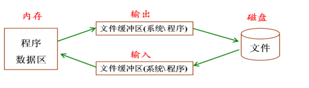

其实就是内存和磁盘并不会一个字节一个字节都读取数据，而是在缓冲区中将想要的数据全部获取后一次性给磁盘或内存，即：

- 减少进出内核的次数，提高效率

### 缓冲区的刷新的方式

- **行刷新**：缓冲区遇到\n将内容刷新 设备  
- **满刷新**：缓冲区放满数据，将内容刷新 设备  
- **强制刷新**：fflush(stdout) 强制将内容刷新 设备  
- **关闭刷新**：关闭文件或进程  将内容刷新 设备 

### 磁盘文件的分类

- 不管任何文件 在物理上都是二进制存储。  
- 从**逻辑**上将磁盘文件分为==**二进制文件**、**文本文件**==。 

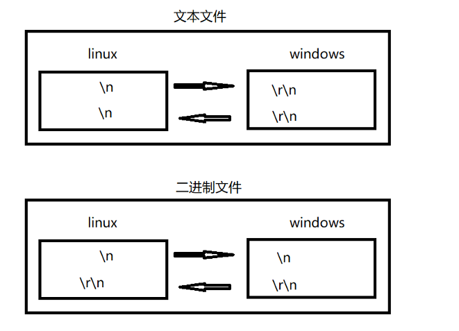

#### 文本文件

基于字符编码 存储的是每个字符的ASCII值 一个字节一个意思  ==**便于查看 ，所占空间大， 效率低**==。  

例如：

- 数 5678
- 系统会将5678当作字符串，5看成字符5，然后以'5'的ASCII值存入磁盘
- 也就是说5678在磁盘中会占4个字节
-  以 ASCII 存储形式为00110101 00110110 00110111 00111000

#### 二进制文件

基于值编码 将数据的内存的二进制 直接放入磁盘   字节数不确定 ==二进制文件一般需要特定的软件才能打开。**不便于查看 空间小  效率高**==【2进制文件行尾是以"\r\n"结尾，可以用这个配合strtok来截取行】

  例如：数 5678 的存储形式为： 二进制码：00010110 00101110


## 文件指针

文件名就是磁盘一段连续空间的别名

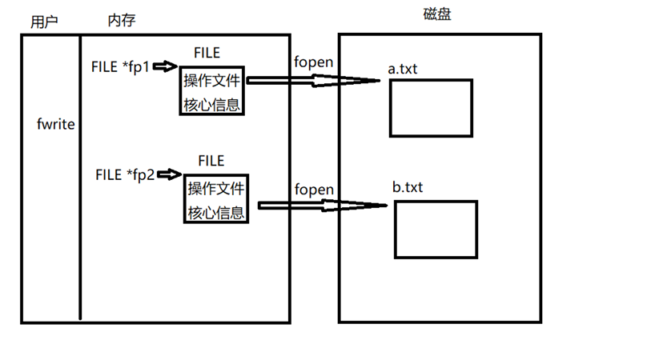

- FILE * 指针变量标识符。  
- FILE 是系统使用 typedef 定义出来的有关文件信息的一种结构体类型，结构中含有文件名、 文件状态和文件当前位置等信息。 

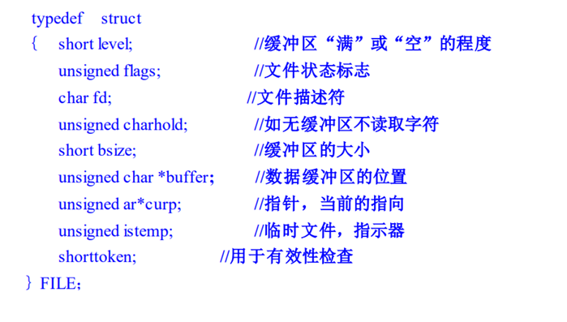

cT语言中有三个特殊的文件指针**无需定义**，在程序中可以直接使用:

- stdin:标准输入默认为当前终端（键盘)
  - 我们使用的scanf、getchar 函数默认从此终端获得数据
- stdout:标准输出默认为当前终端（屏幕)
  - 我们使用的printf、puts 函数默认输出信息到此终端
- stderr:标准错误输出设备文件默认为当前终端（屏幕)
  - 当我们程序出错使用:perror函数时信息打印在此终端

## 文件的API

### fopen打开文件

```c
#include <stdio.h> 
FILE *fopen(const char *path, const char *mode); 
//功能：
//      打开path指定的文件 通过返回值得到文件指针 
//参数： 
//      参数path:文件名的路径 
//      参数mode:打开文件的操作权限 
//返回值： 
//      成功：得到文件指针 
//      失败：NULL
```

打开方式mode的详解：==r 、 w  、a、 +、 t、 b== 。

- **r** ：只读   
- **w**：只写 
- **a** ：追加  
- **+ **：可读可写
- **t** ：打开文本文件（默认省略）
- **b** ：打开二进制文件必须加b 

|  模块   |                             功能                             |
| :-----: | :----------------------------------------------------------: |
|  r或rb  |           以只读方式打开一个文本文件（不创建文件)            |
|  w或wb  |    以写方式打开文件（使文件长度截断为0字节，创建一个文件)    |
|  a或ab  | 以添加方式打开文件，即在末尾添加内容，当文件不存在时，创建文件用于写 |
| r+或rb+ |           以可读、可写的方式打开文件(不创建新文件)           |
| w+或wb+ | 以可读、可写的方式打开文件，（使文件长度为0字节，创建一个文件) |
| a+或ab+ | 以可读可写方式打开文件，打开文件并在末尾更改文件（如果文件不存在，则创建文件) |

### fclose关闭文件 

```c
#include <stdio.h> 
 
int fclose(FILE *stream);
//参数stream：被关闭的文件指针
```


### fputc 一次写一个字符

```c
int fputc(int c, FILE *stream); 
//功能：将字符c写入stream代表的文件 
//参数c:需要写入的字符 
//参数stream：被写的文件指针 
//返回值： 
 //   成功：返回写入的字符 
//    失败：-1 
```

```c
char *file_name = "test.txt";
FILE *fp = fopen(file_name, "w");
if (fp == NULL)
{
    printf("失败\n");
    return;
}

char *text = "hello gz";
while (*text)
{
    fputc(*text, fp);
    text++;
}
fclose(fp);
```


### fgetc从文件读取一个字节 

```c
int fgetc(FILE *stream); 
//功能：从stream指向的文件 读取一个字节 通过返回值返回 
//参数stream:代表读取的文件 
//返回值： 
//    成功：返回读取的字符 
//    失败：读取到文件末尾返回EOF ，EOF其实就是-1
```

```c
char *file_name = "test.txt";
FILE *fp = fopen(file_name, "r");
if (fp == NULL)
{
    printf("失败\n");
    return;
}

char text[128] = "";
int i = 0;
while (1)
{
    text[i] = fgetc(fp);
    if (text[i] == EOF) // EOF只针对文本文件
    {
        break;
    }
    i++;
}

printf("%s\n",text);  //打印末尾处会有一个乱码
//因为读到最后时，返回的是EOF，EOF其实就是-1，由于-1存的是补码，是一个很大的数，所以找不到任何符号与之对应
fclose(fp);
```

```c
//正确写法
while (1)
{   
    char ch=fgetc(fp);
    if (ch == EOF) // EOF只针对文本文件
    {
        break;
    }
    text[i] = ch;
    i++;
}
```

### 字符串读 fgets

```c
char *fgets(char *s, int size, FILE *stream); 
//功能:从stream文件中读取一个字符串 存入s指向内存中，读取的字节数最多为size-1 
//功能：读取文件一行（遇到换行符结束 包含换行符） 
//参数s:指向内存的起始地址 
//参数size：表示一次最多读取size-1个字符 
//参数stream：指向读取的文件 
//返回值： 
//    成功：返回s指向的地址 
//    失败：NULL
```

```c
FILE *fp = fopen("a.txt", "r"); 
if (fp == NULL) 
{ 
    perror("fopen"); 
    return; 
} 

while (1) 
{ 
    char buf[128] = ""; 
    char *ret = fgets(buf, sizeof(buf), fp); 
    if (ret == NULL) 
        break; 
    printf("%s\n", buf); 
} 

fclose(fp);
```


### 字符串写 fputs 

```c
int fputs(const char *s, FILE *stream); 
//功能：将s指向的字符串 写入stream指向的文件中（遇到\0结束输入） 
//参数s:指向被写入的字符串的首元素的地址 
//参数strream：指向的是文件 
//返回值: 
//        成功：非负数 
//        失败：-1
```

```c
FILE *fp = fopen("a.txt", "w"); 
if (fp == NULL) 
{ 
    perror("fopen"); 
    return; 
} 

char *text = "hello\0BK2302 good"; 
int len = fputs(text, fp); 
printf("len=%d\n", len); 

fclose(fp);
```


### fread块读

```c
size_t fread(void *ptr, size_t size, size_t nmemb, FILE *stream); 
//功能：将ptr指定的内存 按照每块size*块数nmemb的字节数从stream执行文件中读取数据 
//注意：将磁盘数据原样 搬运到内存  
//参数ptr：内存的起始地址 
//参数size:每一块的大小 
//参数nmemb：代表的是块数 
//参数stream：指向写入的文件 
//返回值： 
//    成功：返回实际读到的块数（显示整块数） 
 //   失败：返回0 
```

```c
struct hero arr[5]; 

FILE *fp = fopen("hero.txt", "r"); 
if (fp == NULL) 
{ 
    perror("fopen"); 
    return; 
} 

// 将结构体数组的内容写入文件 
size_t ret = fread(arr, sizeof(struct hero), 10, fp); 
printf("ret=%d\n", ret); 

int i = 0; 
for (i = 0; i < 5; i++) 
{ 
    printf("%s %d %d\n", arr[i].name, arr[i].atk, arr[i].def); 
} 

fclose(fp);
```


### fwrite块写 

```c
size_t fwrite(void *ptr, size_t size, size_t nmemb, FILE *stream); 
//功能：将ptr指定的内存 按照每块size大小总共写nmemb块的数据 写入stream指向的文件 
//注意：将内存数据原样 搬运到 磁盘 
//参数ptr：内存的起始地址 
//参数size:每一块的大小 
//参数nmemb：代表的是块数 
//参数stream：指向写入的文件 
//返回值： 
//    成功：返回实际写入的块数 
//    失败：返回0 
```

```c
struct hero{
    char name[16];
    int  num;
    int num2;
}

struct hero arr[5] = {{"德玛", 50, 80}, {"小法", 70, 50}, {"小炮", 90, 60}, {"盲僧", 80, 80}, {"提莫", 90, 80}}; 

FILE *fp = fopen("hero.txt", "w"); 
if (fp == NULL) 
{ 
    perror("fopen"); 
    return; 
} 

// 将结构体数组的内容写入文件 
fwrite(arr, sizeof(struct hero), 5, fp); 

fclose(fp); 
```

==打印结果==：


==原因==：

**由于是将内存数据原样搬到磁盘**。

- "德玛"占用6个字节，后面有10个null加起来总共占用16字节【 char name[16];】，刚好占满分配的空间。
- 而  int  num 占用4字节，所以50后面有3个null ，2的ACSII码值是50 ，之后同理。


### 格式化写fprintf

```c
fprintf ( 文件指针，格式字符串，输出表列）； 
```

```c
struct hero arr[5] = {{"德玛", 50, 80}, {"小法", 70, 50}, {"小炮", 90, 60}, {"盲僧", 80, 80}, {"提莫", 90, 80}}; 

FILE *fp = fopen("hero.txt", "w"); 
if (fp == NULL) 
{ 
    perror("fopen"); 
    return; 
} 

int i = 0; 
for (i = 0; i < 5; i++) 
{ 
    fprintf(fp, "英雄:%s 攻击:%d 防御:%d\n", arr[i].name, arr[i].atk, arr[i].def); 
} 

fclose(fp);
```


### 格式化读fscanf

```c
fscanf( 文件指针，格式字符串，读入表列）； 
```

```c
struct hero arr[5]; 

FILE *fp = fopen("hero.txt", "r"); 
if (fp == NULL) 
{ 
    perror("fopen"); 
    return; 
} 

// 将结构体数组的内容写入文件 
int i = 0; 
for (i = 0; i < 5; i++) 
{ 
    fscanf(fp, "英雄:%s 攻击:%d 防御:%d\n", arr[i].name, &arr[i].atk, &arr[i].def); 
} 

for (i = 0; i < 5; i++) 
{ 
    printf("%s %d %d\n", arr[i].name, arr[i].atk, arr[i].def); 
} 

fclose(fp); 
```

### 文件读写总结

- fopen 打开文件得到文件指针    操作完文件记得fclose关闭文件  
- 一个字节读写  fgetc  fputc  
- 一个字符串读写 fgets fputs  
- 块的读写 fread   fwrite  内存和磁盘原样数据输入或输出 效率高  不便于直接打开查看  
- 格式化读写 fscanf fprintf  效率低 但是方便直接查看

### 顺序读写的问题

在之前的文件读写中，指针在文件打开到关闭的过程中，无法复位。这就会导致当权限位为 "+"时 ，写入后 立马读取 不能读取到数据的原因，如果在这种权限下 ==想要写入后读取写入的数据，只能写入后先关闭文件，再打开文件复位流指针==。

### 随机读写

#### rewind 复位读写位置 

```c
void rewind(FILE *stream); 
```

复位文件流指针  将文件流指针 指向文件的开始位置

```c
FILE *fp = fopen("test.txt", "w+");
char buf[128] = "hello11";
fputs(buf, fp);

//复位文件流指针
rewind(fp);

char buf1[128] = "";
fgets(buf1, sizeof(buf1), fp);
printf("buf=%s", buf1);
fclose(fp);
```


####  ftell 测文件读写位置距文件开始有多少个字节 

```c
long ftell(FILE *stream);
```


#### fseek 定位位置指针（读写位置）

```c
int fseek(FILE *stream, long offset, int whence); 
```

whence 起始位置  

- 文件开头 SEEK_SET              0
- 文件当前位置 SEEK_CUR     1   
- 文件末尾 SEEK_END             2            

```c
//将fp定位到文件尾部: 
fseek(fp,0,2);

//将fp定位到文件头部 向后偏移50字节: 
fseek(fp,50,0); 
```

### 一次性读取文件的数据

```c
void test11() 
{ 
    FILE *fp = fopen("a.txt", "r"); 
    if (NULL == fp) 
    { 
        perror("fopen"); 
        return; 
    } 

    // 得到文件总大小 
    // 将文件指针定位文件的尾部 
    fseek(fp, 0, 2); 
    // 获取文件长度 
    int len = ftell(fp); 
    // 复位文件流指针 
    rewind(fp); 

    // 根据文件总大小申请堆区空间 
    char *msg = (char *)malloc(len + 1); 

    // 读取数据 
    fread(msg, len, 1, fp); 
    printf("len=%d\n", len); 
    printf("msg=%s\n", msg); 
    fclose(fp); 
    free(msg); 
} 

```

# MySQL--C API

所需头文件

```c
#include <mysql/mysql.h>
```

## 获取或初始化MYSQL结构

```c
MYSQL *mysql_init(MYSQL *mysql
```

描述：

-  分配或初始化与mysql_real_connect()相适应的MYSQL对象 

参数：

-  mysql ：MYSQL* 句柄 

返回值： 

- 初始化的MYSQL*句柄。如果无足够内存以分配新的对象，返回NULL。

## 与远程主机上的MySQL数据库建立连接

```c
MYSQL *
 mysql_real_connect(MYSQL *mysql,
 const char *host,
 const char *user,
 const char *passwd,
 const char *db,
 unsigned int port,
 const char *unix_socket,
 unsigned long client_flag)
```

**描述**： 

mysql_real_connect()尝试与运行在主机上的MySQL数据库引擎建立连接。 

**参数**： 

- mysql：MySQL 句柄 
- host ： “host” 的 值 必 须是主机名或 IP 地址. 
  - 如果“host”是 NULL 或字符串 "localhost"、”127.0.0.1”，连接将被视为 与本地主机的连接. 
- user: MySQL 登录的用户名
- passwd: MySQL 登录的密码 
- db：数据库名称 
- port：MySQL 服务器监听客户端连接到来的端口号（默认：3306） 
- unix_socket：如果 unix_socket 不是 NULL，该字符串描述了应使用的套接字或命名管道 （默认为NULL） 
- client_flag: 通常为 0，可以更改其值，以允许特定功能（详情见手册）

 **返回值**： 

- 如果连接成功，返回MYSQL*连接句柄。返回值与第1个参数的值相同。 
- 如果连接失败，返回NULL。

##  执行MySQL语句

```c
int mysql_real_query(MYSQL *mysql,const char *query,unsigned long length)
```

描述： 

- 执行由“query”指向的SQL查询，它应是字符串长度字节“long”。正常情况下，字符串必 须包含1条SQL语句， 
- 而且不应为语句添加终结分号（‘;’）或“\g”。如果允许多语句执行，字符串可包含由分 号隔开的多条语句。 

参数： 

- mysql：MySQL句柄 
- query:需要执行的MySQL语句
-  length：需要执行的MySQL语句的长度 

返回值： 

- 如果查询成功，返回0。 
- 如果查询失败，返回非0值

## 获取执行MySQL语句的结果

```c
MYSQL_RE S*mysql_store_result(MYSQL *mysql)
```

描述： 

- 对于成功检索了数据的每个查询（SELECT、SHOW、DESCRIBE、EXPLAIN、CHECKTABLE 等），**必须调用 mysql_store_result()或mysql_use_result()**。
- 对于其他查询，不需要调用 mysql_store_result()或mysql_use_result()， 但是如果在任何情况下均调用了mysql_store_result()，它也不会导致任何伤害或性能降 低。 
- 通过检查 mysql_store_result()是否返回0，可检测查询是否没有结果集（以后会更多） 

参数： 

- Mysql：MySQL句柄 

返回值： 

- 成功返回具有多个结果的MYSQL_RES结果集合。 
- 失败返回NULL

## 获取结果集中的列数

```c
unsigned int mysql_num_fields(MYSQL_RES *result)
```

描述： 

- 返回结果集中的列数

参数： 

- result：MYSQL_RES结果集句柄 

返回值： 

- 表示结果集中行数的无符号整数


## 获取结果集中的行数

```c
my_ulonglong mysql_num_rows(MYSQL_RES *result)
```

描述： 

- 返回结果集中的行数 

参数：

-  result：MYSQL_RES结果集句柄 

返回值： 

- 结果集中的行数

## 获取结果集中的列名称

```c
MYSQL_FIELD *mysql_fetch_field(MYSQL_RES *result)
```

描述： 

- 返回采用MYSQL_FIELD结构的结果集的列。重复调用该函数，以检索关于结果集中所有 列的信息。
- 未剩余字 段时，mysql_fetch_field()返回NULL。 

参数：

-  result：MYSQL_RES结果集句柄 

返回值： 

- 当前列的MYSQL_FIELD结构。如果未剩余任何列，
- 返回NULL

## 获取结果集中的每行数据（重要）

```c
MYSQL_ROW mysql_fetch_row(MYSQL_RES *result)
```

描述： 

- 检索结果集的下一行。在mysql_store_result()之后使用时，如果没有要检索的行， mysql_fetch_row()返回NULL 

参数： 

- MYSQL_RES结果集句柄 

返回值： 

- 下一行的MYSQL_ROW结构。
- 如果没有更多要检索的行或出现了错误，返回NULL

## 释放结果集

```c
void mysql_free_result(MYSQL_RES *result)
```

描述： 

- 释放由mysql_store_result()、mysql_use_result()、mysql_list_dbs()等为结果集分配的内 存。完成对结果集的操 作后，必须调用mysql_free_result()释放结果集使用的内存 

参数：

-  MYSQL_RES结果集句柄 

返回值： 无

## 释放MySQL句柄

```c
void mysql_close(MYSQL *mysql)
```

描述： 

- 关闭前面打开的连接。如果句柄是由mysql_init()或mysql_connect()自动分配的， mysql_close()还将解除分配 由mysql指向的连接句柄 

参数： 

- MySQL连接句柄 

返回值： 无

## 案例

```c
#include <stdio.h>
#include <stdlib.h>
#include <string.h>
#include <mysql/mysql.h>
intmain(intargc, charconst *argv[])
{
    // 1、创建一个mysql句柄并初始化环境
    MYSQL mysql, *sock;
    mysql_init(&mysql);
    // 2、连接数据库
    sock = mysql_real_connect(&mysql, "10.9.72.2", "root", "111111", "person", 3306, NULL, 0);
    if (NULL == sock)
    {
        printf("连接失败\n");
        return 0;
    }
    printf("连接成功\n");
    // 3、查询数据信息
    char *sql = "select*fromstuwherename=\'lucy\';";
    int ret = mysql_real_query(&mysql, sql, strlen(sql));
    if (ret != 0)
    {
        printf("查询失败\n");
        mysql_close(sock);
        return 0;
    }
    // 4、获取MySQL语句执行的结果
    MYSQL_RES *res = mysql_store_result(&mysql);
    if (res != NULL)
    {
        // 5、获取结果集中行数和列数
        int row = mysql_num_rows(res);
        int col = mysql_num_fields(res);
        printf("row=%d,col=%d\n", row, col);
        // 6、如果行数>0表示有真实的结果
        if (row)
        {
            // 7、遍历列名称
            MYSQL_FIELD *field;
            while ((field = mysql_fetch_field(res)))
            {
                printf("%s", field->name);
            }
            printf("\n");
            // 8、逐行分析查询结果调用一次只能获取一行
            MYSQL_ROW nextRow;
            while (nextRow = mysql_fetch_row(res))
            {
                int j = 0;
                for (j = 0; j < col; j++)
                {
                    // nextRow[j]代表每一行中的第j列单元格内容
                    printf("%s", nextRow[j]);
                }
                printf("\n");
            }
        }
        // 释放结果
        mysql_free_result(res);
    }
    // 、释放MySQL句柄
    mysql_close(sock);
    return 0;
}
```


# GPS相关知识

##     $GPRMC协议格式

**例如**：

- ==$GPRMC,024813.640,A,3158.4608,N,11848.3737,E,10.05,324.27,150706,,,A*50==。

  - 字段0：$GPRMC，语句ID，表明该语句为Recommended Minimum Specific GPS/TRANSIT Data（RMC）推荐最小定位信息

  - 字段1：UTC时间，hhmmss.sss格式(UTC时间是世界统一时间，中国的时间是UTC+8，比如：上面的时间是02:48:13而中国的时间是10:48:13)

  - 字段2：状态，A=定位，V=未定位

  - 字段3：纬度ddmm.mmmm，度分格式（前导位数不足则补0）

  - 
    字段4：纬度N（北纬）或S（南纬）

  - 字段5：经度dddmm.mmmm，度分格式（前导位数不足则补0）

  - 字段6：经度E（东经）或W（西经）

  - 字段7：速度，节，Knots

  - 字段8：方位角，度

  - 字段9：UTC日期，DDMMYY格式

  - 字段10：磁偏角，（000 - 180）度（前导位数不足则补0）

  - 字段11：磁偏角方向，E=东W=西

  - 字段16：校验值
